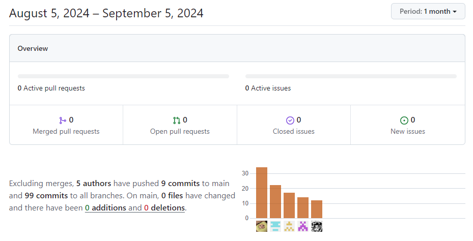
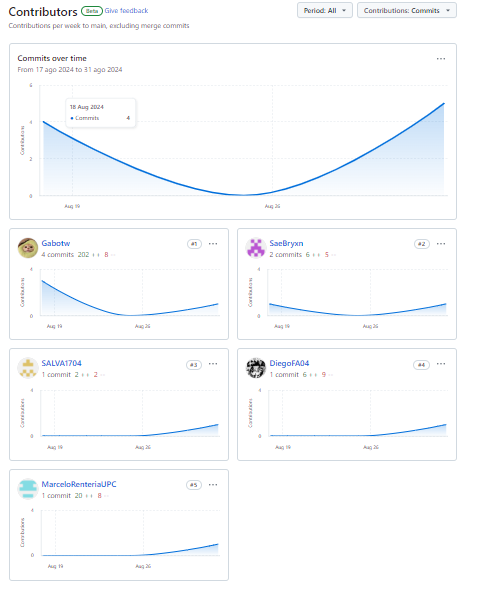
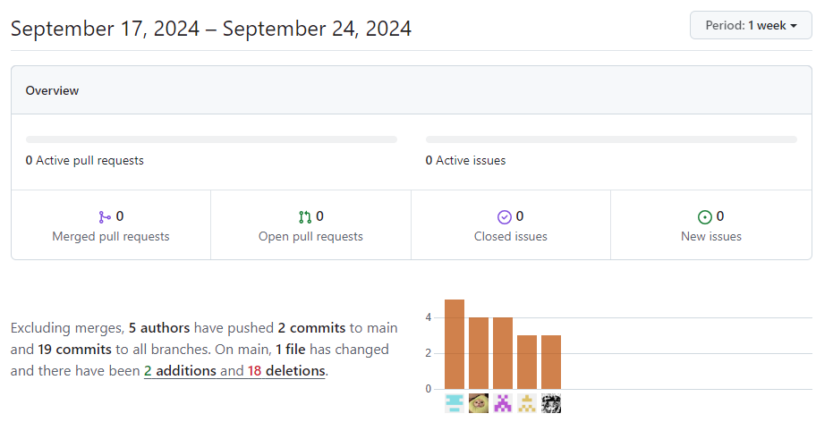
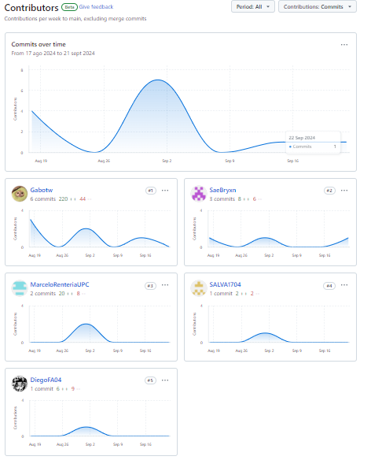
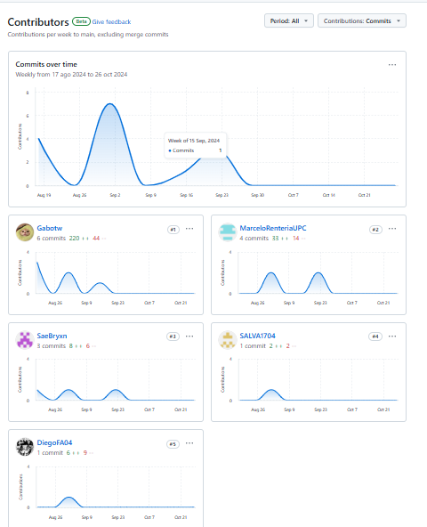

# INFORME DEL TRABAJO FINAL

### UNIVERSIDAD PERUANA DE CIENCIAS APLICADAS

### INGENIERÍA DE SISTEMAS DE INFORMACIÓN Y SOFTWARE

### CICLO 2024-02

Nombre del curso: Desarrollo de Aplicaciones Open-Source  
 Sección: WX55  
 Nombre del Profesor: Angel Augusto Velasquez Nuñez  
 Nombre del StartUp: The Project Chow  
 Nombre del Producto: CraftSync
Relación de Integrantes:

- Chamorro Acero, Salvador Edward - U201914367
- Garcia Rodriguez, Gabriel Stefano - U202018627
- Rentería Puga, Héctor Marcelo - U202216558
- Flores Avalos, Diego - U20221B394
- Bryan Ronald Espejo Gamarra - U202213278

## Historial de Versiones

<table>
<tr>
    <th colspan="3">Version</th>
    <th colspan="3">Fecha</th>
    <th colspan="10">Autores</td>
    <th colspan="5">Descripción de Modificaciones</td>
  <tr>
    <td colspan="3">1era</td>
    <td colspan="3">21/8/2024</td>
    <td colspan="10">Héctor Marcelo Rentería Puga, Gabriel Stefano Garcia Rodriguez, Bryan Ronald Espejo Gamarra, Diego Flores Avalos, Salvador Edward Chamorro Acero.</td>
    <td colspan="5">
     - Primera verison 
     - Creación del informe 
     - Creación de los branch 
     - Creación del esquema de cada Capitulo 
    </td>
  </tr>
  <tr>
    <td colspan="3">2da</td>
    <td colspan="3">25/8/2024</td>
    <td colspan="10">Héctor Marcelo Rentería Puga, Gabriel Stefano Garcia Rodriguez, Bryan Ronald Espejo Gamarra, Diego Flores Avalos, Salvador Edward Chamorro Acero.</td>
    <td colspan="5">- Actualizar el Capitulo 1 con todos los puntos hechos del mismo - Actualizar el Capitulo 2 con todos los puntos hechos del mismo - Agregar la caratula con toda la informacion solicitada</td>
  </tr>
  <tr>
    <td colspan="3">3ra</td>
    <td colspan="3">01/9/2024</td>
    <td colspan="10">Héctor Marcelo Rentería Puga, Gabriel Stefano Garcia Rodriguez, Bryan Ronald Espejo Gamarra, Diego Flores Avalos, Salvador Edward Chamorro Acero.</td>
    <td colspan="5">- Actualizar el Capitulo 3 con todos los puntos hechos del mismo - Actualizar el Capitulo 4 con todos los puntos hechos del mismo - Actualizar el Capitulo 5 con todos los puntos hechos del mismo</td>
  </tr>
  <tr>
    <td colspan="3">4ta</td>
    <td colspan="3">05/9/2024</td>
    <td colspan="10">Héctor Marcelo Rentería Puga, Gabriel Stefano Garcia Rodriguez, Bryan Ronald Espejo Gamarra, Diego Flores Avalos, Salvador Edward Chamorro Acero.</td>
    <td colspan="5">- Actualizar los puntos necesario segun criterio discutido en la reunion </td>
  </tr>
  <tr>
    <td colspan="3">5ta</td>
    <td colspan="3">24/09/2024</td>
    <td colspan="10">Héctor Marcelo Rentería Puga, Gabriel Stefano Garcia Rodriguez, Bryan Ronald Espejo Gamarra, Diego Flores Avalos, Salvador Edward Chamorro Acero.</td>
    <td colspan="5">- Corregir algunas aspectos mencionados por el profesor - Realizar la primera versión del Frontend - Actulizar los puntos pendientes a falta de historial de commits</td>
  </tr>
 <tr>
    <td colspan="3"></td>
    <td colspan="3"></td>
    <td colspan="10"></td>
    <td colspan="5"></td>
  </tr>
 <tr>
    <td colspan="3"></td>
    <td colspan="3"></td>
    <td colspan="10"></td>
    <td colspan="5"></td>
  </tr>
  </table>

## Project Report Collaboration Insights

A continuación, se detalla el proceso de elaboración del informe para cada entrega, junto con capturas de pantalla que muestran los análisis de colaboración y commits en GitHub para el repositorio del informe:

**URL del Repositorio del Informe:** https://github.com/Open-Source-The-Project-Chow/Informe-Final

**Entrega N°1: TB1**

- Todos los miembros del equipo contribuyeron en la redacción del Informe. Se dividió en secciones específicas para cada capítulo, lo que permitió un mayor avance y equidad en el desarrollo del informe.
- Se establecieron fechas límite para la finalización de cada capítulo, lo que facilitó el avance de cada capítulo.

Commits:

**Entrega N°2: TP1**

- Todos los miembros del equipo contribuyeron en las correcciones del Informe. Se dividió según partes y prioridad, lo que permitió un avance más efectivo y equidad en el desarrollo del informe.
- Se establecieron fechas límite para la finalización de cada capítulo, lo que facilitó el avance de cada capítulo.

Commits:

**Entrega N°3: TB2**
- Todos los miembros del equipo contribuyeron en las correcciones del Informe. Se dividió según partes y prioridad, lo que permitió un avance más efectivo y equidad en el desarrollo del informe.

Commits:

**Entrega N°4: TF1**

# Índice

- [Capítulo I: Introducción](https://github.com/Open-Source-The-Project-Chow/Informe-Final/blob/Chapter-01/docs/Chapter-01.md)
  - [1.1. StartUp Profile](#11-startup-profile)
    - [1.1.1. Descripción de la StartUp](#111-descripción-de-la-startup)
    - [1.1.2. Perfiles de Integrantes del equipo](#112-perfiles-de-integrantes-del-equipo)
  - [1.2. Solution Profile](#12-solution-profile)
    - [1.2.1. Antecedentes y Problemática](#121-antecedentes-y-problemática)
    - [1.2.2. Lean UX Process](#122-lean-ux-process)
      - [1.2.2.1. Lean UX Problem Statements](#1221-lean-ux-problem-statements)
      - [1.2.2.2. Lean UX Assumptions](#1222-lean-ux-assumptions)
      - [1.2.2.3. Lean UX Hyphotesis Statements](#1223-lean-ux-hyphotesis-statements)
      - [1.2.2.4. Lean UX Canvas](#1224-lean-ux-canvas)
  - [1.3. Segmentos objetivo](#13-segmentos-objetivo)
- [Capítulo II: Requirements Elicitation & Analysis](https://github.com/Open-Source-The-Project-Chow/Informe-Final/blob/Chapter-02/docs/Chapter-02.md)
  - [2.1. Competidores](#21-competidores)
    - [2.1.1 Análisis competitivo](#211-análisis-competitivo)
    - [2.1.2. Estrategias y tácticas frente a competidores](#212-estrategias-y-tácticas-frente-a-competidores)
  - [2.2. Entrevistas](#22-entrevistas)
    - [2.2.1 Diseño de entrevistas](#221-diseño-de-entrevistas)
    - [2.2.2. Registro de entrevistas](#222-registro-de-entrevistas)
    - [2.2.3. Análisis de entrevistas](#223-análisis-de-entrevistas)
  - [2.3. Needfinding](#23-needfinding)
    - [2.3.1. User Persona](#231-user-persona)
    - [2.3.2. User Task Matrix](#232-user-task-matrix)
    - [2.3.3. User Journey Mapping](#233-user-journey-mapping)
    - [2.3.4. Empathy Mapping](#234-empathy-mapping)
    - [2.3.5. As-is Scenario Mapping](#235-as-is-scenario-mapping)
    - [2.3.6. Ubiquitous Language](#236-ubiquitous-language)
- [Capítulo III: Requirements Specification](https://github.com/Open-Source-The-Project-Chow/Informe-Final/blob/Chapter-03/docs/Chapter-03.md)
  - [3.1. To-Be Scenario Mapping](#31-to-be-scenario-mapping)
  - [3.2. User Stories](#32-user-stories)
  - [3.3. Impact Mapping](#33-impact-mapping)
  - [3.4. Product Backlog](#34-product-backlog)
- [Capítulo IV: Product Design](https://github.com/Open-Source-The-Project-Chow/Informe-Final/blob/Chapter-04/docs/Chapter-04.md)
  - [4.1. Style Guidelines](#41-style-guidelines)
    - [4.1.1. General Style Guidelines](#411-general-style-guidelines)
    - [4.1.2. Web Style Guidelines](#412-web-style-guidelines)
  - [4.2. Information Architecture](#42-information-architecture)
    - [4.2.1. Organization Systems](#421-organization-systems)
    - [4.2.2. Labeling Systems](#422-labeling-systems)
    - [4.2.3. SEO Tags and Meta Tags](#423-seo-tags-and-meta-tags)
    - [4.2.4. Searching Systems](#424-searching-systems)
    - [4.2.5. Navigation Systems](#425-navigation-systems)
  - [4.3. Landing Page UI Design](#43-landing-page-ui-design)
    - [4.3.1. Landing Page Wireframe](#431-landing-page-wireframe)
    - [4.3.2. Landing Page Mock-up](#432-landing-page-mock-up)
  - [4.4. Web Applications UX/UI Design](#44-web-applications-uxui-design)
    - [4.4.1. Web Applications Wireframes](#441-web-applications-wireframes)
    - [4.4.2. Web Applications Wireflow Diagrams](#442-web-applications-wireflow-diagrams)
    - [4.4.3. Web Applications Mock-ups](#443-web-applications-mock-ups)
    - [4.4.4. Web Applications User Flow Diagrams](#444-web-applications-user-flow-diagrams)
  - [4.5. Web Applications Prototyping](#45-web-applications-prototyping)
  - [4.6. Domain-Driven Software Architecture](#46-domain-driven-software-architecture)
    - [4.6.1. Software Architecture Context Diagram](#461-software-architecture-context-diagram)
    - [4.6.2. Software Architecture Container Diagrams](#462-software-architecture-container-diagrams)
    - [4.6.3. Software Architecture Components Diagrams](#463-software-architecture-components-diagrams)
  - [4.7. Software Object-Oriented Design](#47-software-object-oriented-design)
    - [4.7.1. Class Diagrams](#471-class-diagrams)
    - [4.7.2. Class Dictionary](#472-class-dictionary)
  - [4.8. Database Design](#48-database-design)
    - [4.8.1. Database Diagram](#481-database-diagram)
- [Capítulo V: Product Implementation, Validation & Deployment](https://github.com/Open-Source-The-Project-Chow/Informe-Final/blob/Chapter-05/docs/Chapter-05.md)
  - [5.1. Software Configuration Management](#51-software-configuration-management)
    - [5.1.1. Software Development Environment Configuration](#511-software-development-environment-configuration)
    - [5.1.2. Source Code Management](#512-source-code-management)
    - [5.1.3. Source Code Style Guide & Conventions](#513-source-code-style-guide--conventions)
    - [5.1.4. Software Deployment Configuration](#514-software-deployment-configuration)
  - [5.2. Landing Page, Services & Applications Implementation](#52-landing-page-services--applications-implementation)
    - [5.2.1. Sprint 1](#521-sprint-1)
      - [5.2.1.1. Sprint Planning 1](#5211-sprint-planning-1)
      - [5.2.1.2. Sprint Backlog 1](#5212-sprint-backlog-1)
      - [5.2.1.3. Development Evidence for Sprint Review](#5213-development-evidence-for-sprint-review)
      - [5.2.1.4. Testing Suite Evidence for Sprint Review](#5214-testing-suite-evidence-for-sprint-review)
      - [5.2.1.5. Execution Evidence for Sprint Review](#5215-execution-evidence-for-sprint-review)
      - [5.2.1.6. Services Documentation Evidence for Sprint Review](#5216-services-documentation-evidence-for-sprint-review)
      - [5.2.1.7. Software Deployment Evidence for Sprint Review](#5217-software-deployment-evidence-for-sprint-review)
      - [5.2.1.8. Team Collaboration Insights during Sprint](#5218-team-collaboration-insights-during-sprint)
- [Conclusiones](#conclusiones)
  - [Conclusiones y recomendaciones](#conclusiones-y-recomendaciones)
- [Bibliografía](#bibliografía)
- [Anexos](#anexos)

# Student Outcome

<table> <tr> <th colspan="2">Criterio Específico</th> <th colspan="10">Acciones Realizadas</th> <th colspan="2">Conclusiones</th> </tr> <tr> <td colspan="2">Comunica oralmente con efectividad a diferentes rangos de audiencia.</td> <td colspan="10"><b>Héctor Marcelo Rentería Puga</b>  TB1: Participación y liderazgo activos en todas las reuniones de equipo. Comunicación constante sobre el avance de las tareas asignadas. TP: Participación y liderazgo activos en todas las reuniones de equipo. Comunicación constante sobre el avance de las tareas asignadas. TB2: Participación y liderazgo activos en todas las reuniones de equipo. Comunicación constante sobre el avance de las tareas asignadas. <b>Gabriel Stefano Garcia Rodriguez</b>  TB1: Presentaciones sobre Lean UX Hypothesis Statements, Análisis competitivo, y estrategias frente a competidores en reuniones grupales. TP: Presentaciones sobre avance, merge y deployment del Frontend. TB2: Presentaciones sobre avance, merge y deployment del Backend <b>Diego Flores Avalos</b> TB1: Participación activa en las discusiones del equipo, asegurando una comunicación clara y efectiva. TP: Participación activa en las discusiones del equipo, asegurando una comunicación clara y efectiva. TB2: Participación activa en las discusiones del equipo, asegurando una comunicación clara y efectiva.</b> <b>Salvador Edward Chamorro Acero</b>  TB1: Participación activa en todas las reuniones de equipo. Comunicación constante sobre el avance de las tareas asignadas. TP: Participación activa en todas las reuniones de equipo. Comunicación constante sobre el avance de las tareas asignadas TB2: Participación activa en todas las reuniones de equipo. Comunicación constante sobre el avance de las tareas asignadas. <b>Bryan Ronald Espejo Gamarra</b>  TB1: Participación activa en la exposición del proyecto durante las revisiones parciales. Explicación clara de las funcionalidades de la plataforma ante los docentes. TP:Participación activa en la corrección del proyecto final, asegurando que las funcionalidades explicadas en las revisiones fueran implementadas correctamente y ajustando las áreas señaladas por los docentes. TB2:Participación activa en la corrección del proyecto, y el desarrollo del backend, asegurando que las funcionalidades explicadas en las revisiones fueran implementadas correctamente y ajustando las áreas señaladas por los docentes. </b></td> <td colspan="2">La elaboración de este proyecto nos llevó a comunicarnos constantemente entre nosotros para determinar distintas partes del desarrollo del informe y el Landing Page, ayudándonos a adaptarnos a distintos tipos de oyentes de lo que proponemos.</td> </tr> <tr> <td colspan="2">Comunica por escrito con efectividad a diferentes rangos de audiencia.</td> <td colspan="10"><b>Héctor Marcelo Rentería Puga</b>  TB1: Participación y liderazgo activos en el desarrollo del informe del proyecto. Entrega a tiempo de las tareas asignadas en el proyecto. TP: Participación y liderazgo activos en el desarrollo del informe del proyecto. Entrega a tiempo de las tareas asignadas en el proyecto. TB2: Participación y liderazgo activos en el desarrollo del informe del proyecto. Entrega a tiempo de las tareas asignadas en el proyecto. <b>Gabriel Stefano Garcia Rodriguez</b>  TB1: Redacción de Lean UX Hypothesis Statements, Análisis competitivo y estrategias, contribuyendo al informe final. TP: Corrección de Lean UX Hypothesis Statements, User Task Matrix, contribuyendo al informe final. TB2: Desarrollo de endpoints de Posts y Comments, y deployment del backend. <b>Diego Flores Avalos</b>  TB1: Contribución efectiva en la redacción del informe, asegurando claridad y coherencia en el contenido. TP: Contribución efectiva en la redacción del informe, asegurando claridad y coherencia en el contenido. TB1: Contribución efectiva en la redacción del informe, asegurando claridad y coherencia en el contenido. <b>Salvador Edward Chamorro Acero</b>  TB1: Participación activa en el desarrollo del informe del proyecto. Entrega a tiempo de las tareas asignadas en el proyecto. TP: Participación activa en el desarrollo del informe del proyecto. Entrega a tiempo de las tareas asignadas en el proyecto. TB2: Participación activa en el desarrollo del informe del proyecto. Entrega a tiempo de las tareas asignadas en el proyecto. <b>Bryan Ronald Espejo Gamarra</b>  TB1: Redacción de los informes técnicos para las entregas parciales. Elaboración del documento final con correcciones. TP:Participación activa en la revisión y corrección del informe final del proyecto, asegurando que los comentarios de las revisiones fueran correctamente incorporados. TB2:Participación activa en la revisión y corrección del informe final del proyecto, asegurando que los comentarios de las revisiones fueran correctamente incorporados.</b></td> <td colspan="2">La elaboración de este proyecto nos hizo plasmar las ideas que teníamos de forma fiel en el contenido del informe y en el Landing Page, buscando alcanzar a varios tipos de personas que podrían leerlo en el futuro.</td> </tr> </table>
