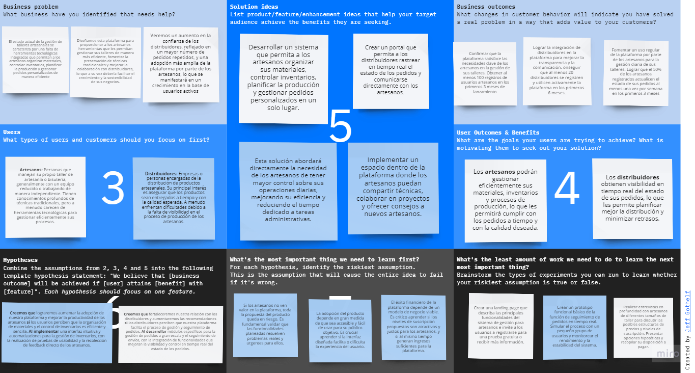

# Capítulo I: Introducción

## 1.1. StartUp Profile

The Project Chow es una empresa independiente formada por 5 estudiantes de la Universidad Peruana de Ciencias Aplicadas, que, con las competencias logradas en los distintos cursos de Ingeniería, crea soluciones de código abierto, que buscan el mayor beneficio posible para los usuarios de estas.

### 1.1.1. Descripción de la StartUp

Nuestra plataforma ofrece herramientas tecnológicas para que artesanos gestionen eficientemente sus talleres de artesanía y bisutería. Permite organizar materiales, controlar inventarios, planificar la producción y gestionar pedidos personalizados. Además, fomenta la preservación de técnicas tradicionales a través de un espacio colaborativo para la comunidad artesanal. Los niveles de suscripción están diseñados para ajustarse al tamaño del taller, facilitando la optimización del trabajo con distribuidores.

### Misión

Brindar a los artesanos soluciones tecnológicas que mejoren la gestión de sus talleres y preserven las técnicas tradicionales, fortaleciendo sus vínculos con distribuidores.

### Visión

Ser la plataforma líder en gestión artesanal, destacando por promover la productividad y la preservación del patrimonio cultural artesanal.

### 1.1.2. Perfiles de Integrantes del equipo

| Nombre Completo del integrante   | Descripcion de Carrera                                                                      | Fotografía                                       | Conocimientos y Habilidades a apuntar                                                                                                                                                                              |
| -------------------------------- | ------------------------------------------------------------------------------------------- | ------------------------------------------------ | ------------------------------------------------------------------------------------------------------------------------------------------------------------------------------------------------------------------ |
| Héctor Marcelo Rentería Puga     | Ingeniería de Software   2024-2 Universidad Peruana de Ciencias Aplicadas          |    | - Conocimiento Básico de C++ y Python. - Experiencia en trabajo rápido y en equipo. - Habilidad decente de ilustración y diseño. - Capacidad de idear y trabajar en situaciones emergentes.               |
| Bryan Ronald Espejo Gamarra      | Ingeniería de Software 5to ciclo  2024-2 Universidad Peruana de Ciencias Aplicadas |          | - Conocimientos en lenguajes de programación como Python, C++, y desarrollo de aplicaciones con Git y GitHub.  - Habilidades en desarrollo de interfaces gráficas, trabajo en equipo, y capacidad de liderazgo. |
| Garcia Rodriguez Gabriel Stefano | Ingeniería de Software  6to Ciclo 2024-2 Universidad Peruana de Ciencias Aplicadas |         | - Conocimientos de lenguajes de programación c++, typeScript, python, html y css. - Habilidades de liderazgo y contribución en equipo.                                                                          |
| Flores Avalos Diego              | Ingeniería de Software    2024-02   Universidad Peruana de Ciencias aplicadas      |          | - Conocimientos de programación en los lenguajes C++, Python, y JavaScript.  - Considero que soy una persona responsable y que se esfuerza en lograr un buen desempeño en los trabajos grupales.                |
| Chamorro Acero,Salvador Edward   | Ingeniería de Software   2024-2 Universidad Peruana de Ciencias Aplicadas          |  | - Conocimiento en desarrollo con diferentes lenguajes de programacion tales como c++, c# y Javascript.  - Considero que tengo habilidades para trabajar bajo presion y comunicarme correctamente                |

## 1.2. Solution Profile

### 1.2.1. Antecedentes y Problemática

Para comprender mejor la problemática que enfrentan los artesanos en la gestión de sus talleres, hemos aplicado la técnica de las "5W 2H":

**What (Qué):**

- ¿Qué dificultades enfrentan los artesanos al organizar y gestionar sus materiales?
- ¿Qué desafíos surgen al controlar los inventarios de insumos y piezas producidas?
- ¿Qué aspectos de la planificación de la producción resultan complicados para los artesanos?

**Where (Dónde):**

- ¿Dónde suelen presentarse estos problemas de gestión dentro de los talleres artesanales (en el almacenamiento, producción, distribución, etc.)?
- ¿Dónde podrían los artesanos encontrar recursos o soluciones tecnológicas para mejorar la organización de sus talleres?

**When (Cuándo):**

- ¿Cuándo los artesanos suelen experimentar problemas de gestión que afectan la producción y la entrega de pedidos?
- ¿Cuándo se hace evidente la necesidad de una planificación más eficiente en el flujo de trabajo artesanal?

**Who (Quién):**

- ¿Quiénes son los artesanos más afectados por la falta de herramientas de gestión eficaces (pequeños talleres, colectivos, artesanos individuales, etc.)?
- ¿Quiénes se beneficiarían de un sistema que facilite la gestión de pedidos personalizados y la planificación de la producción?

**Why (Por qué):**

- ¿Por qué los artesanos suelen tener dificultades para organizar sus materiales y llevar un control preciso de sus inventarios?
- ¿Por qué es importante preservar y compartir técnicas tradicionales dentro de la comunidad artesanal?
- ¿Por qué una plataforma tecnológica puede marcar una diferencia en la productividad de los talleres artesanales?

**How (Cómo):**

- ¿Cómo puede una plataforma digital ayudar a los artesanos a mejorar la gestión de sus materiales y optimizar la producción?
- ¿Cómo se pueden integrar herramientas de planificación y control de inventarios en la vida diaria de los artesanos para facilitar su trabajo?
- ¿Cómo puede una comunidad colaborativa en línea apoyar la preservación y difusión de técnicas tradicionales?

**How Much (Cuánto):**

- ¿Cuánto tiempo y esfuerzo podrían ahorrar los artesanos con la implementación de un sistema eficiente de gestión de talleres?
- ¿Cuánto impacto económico tendría una mejor organización de los talleres en la rentabilidad y sostenibilidad del negocio artesanal?
- ¿Cuántos artesanos podrían verse beneficiados a través de la adopción de un sistema que optimice la planificación de la producción y el control de inventarios?

### 1.2.2. Lean UX Process

#### 1.2.2.1. Lean UX Problem Statements

**Problem Statement**

Nuestra plataforma de gestión de talleres de artesanía y bisutería busca proporcionar a los artesanos herramientas especializadas que optimicen la organización de materiales, el control de inventarios, la planificación de la producción y la gestión de pedidos personalizados. Además, pretendemos crear un espacio colaborativo que fomente la preservación y difusión de técnicas artesanales tradicionales, fortaleciendo así la comunidad artesanal. Sin embargo, enfrentamos una serie de desafíos significativos, tales como la reticencia de algunos artesanos a adoptar soluciones tecnológicas, la competencia con plataformas generalistas de gestión empresarial, y la necesidad de garantizar que nuestra plataforma se mantenga accesible, intuitiva y eficaz para talleres de diversos tamaños y niveles de complejidad.

Para superar estos desafíos, es esencial identificar y aprovechar las oportunidades del mercado, enfocándonos en ofrecer herramientas de gestión que se adapten específicamente a las necesidades de los artesanos, diferenciándonos de las soluciones más amplias y menos especializadas. La integración de automatizaciones en la gestión de inventarios y en la planificación de la producción permitirá aumentar la eficiencia operativa de los talleres. Al colaborar estrechamente con expertos en técnicas tradicionales, aseguraremos la autenticidad y la relevancia de nuestra propuesta, mientras que la implementación de niveles de suscripción ajustados al tamaño de los talleres garantizará que la plataforma sea accesible y adaptable para una amplia variedad de usuarios.

Nuestra estrategia de mejora se centrará en la actualización continua de las funcionalidades de la plataforma, garantizando que evolucionen conforme a las demandas cambiantes de los artesanos y a los avances tecnológicos. Asimismo, se desarrollará contenido educativo especializado que contribuya a la preservación del conocimiento artesanal. A su vez, se priorizará la optimización de la experiencia del usuario mediante una interfaz amigable e intuitiva, y se diseñará una estrategia de marketing enfocada en las necesidades de la comunidad artesanal. Para asegurar el éxito de la plataforma, se implementarán métricas de evaluación claras, como el aumento de la adopción por parte de los usuarios y la satisfacción de los clientes, con revisiones periódicas que permitan realizar ajustes estratégicos según sea necesario.

#### 1.2.2.2. Lean UX Assumptions

**User Assumptions**

- _¿Quién es el usuario?_

El usuario es el artesano que requiere herramientas de gestión para sus talleres de artesanía y bisutería, que le permitan trabajar más eficientenmente.

- _¿Dónde encaja nuestro producto, en su trabajo o vida?_

Nuestro producto encaja en la vida profesional de los artesanos, sea en la realización de pedidos, o gestión de su inventario en general. Para ellos, nuestro producto le ayudaría a ser más eficiente, y evitar la mayor cantidad de problemas durante la producción de sus trabajos.

- _¿Qué problemas tiene nuestro producto y cómo se pueden resolver?_

  - Problema 1: Dificultad para gestionar los procesos de creación en artesanía.

    - Solución: Nosotros ofrecemos una plataforma donde los usuarios puedan gestionar y agilizar cada etapa del proceso de creación.

  - Problema 2: Dificultad para contabilizar los elementos disponibles.

    - Solución: El sistema puede manejar la cantidad de los elementos de inventario de forma rápida y fácil de usar.

- _¿Cuándo y cómo es usado nuestro producto?_

Nuestro producto podría ser utilizado por los artesanos en su día a día, pues le serviría para gestionar todos las etapas y procesos de producción de forma fácil y conveniente. El producto sería utilizado a través de la plataforma en línea, donde los usuarios pueden acceder a los servicios de gestión de sus talleres de artesanía.

- _¿Qué características son importantes?_

Características importantes pueden incluir control de inventarios, actualización de estado de etapas de proceso, opciones de suscripción para acceder a diferentes niveles de servicios y una interfaz fácil de usar y navegación intuitiva.

- _¿Cómo debe verse nuestro producto y cómo debe comportarse?_

El producto debe tener una apariencia profesional, pero simple, con un diseño limpio y fácil de entender. Debe comportarse de manera eficiente, brindando acceso rápido y fácil a las herramientas necesarias para los usuarios. La plataforma debe ser intuitiva y fácil de navegar, con opciones claras y concisas para acceder a diferentes funciones.

**User Outcomes**

- Nuestros usuarios podrán agilizar e incrementar la eficiencia de sus procesos de trabajo, mediante las herramientas de gestión que nuestra plataforma proporciona.

- Nuestros usuarios podrán monitorear el progreso de los distintos progresos de creación de artesanía, sean los mismos artesanos o los distribuidores relacionados.

- El contar con herramientas que pueden facilitar la información a los distribuidores y artesanos por igual, la relación de estos puede fortalecerse, pues el distribuidor estaría al tanto del progreso en todo momento.

**Business Assumptions**

- _¿Cuál es nuestro mercado objetivo y cómo podemos alcanzarlo?_

Nuestro mercado objetivo son los artesanos que necesitan herramientas para gestionar el progreso de su producción de trabajo, y el inventario que tienen disponible; y los distribuidores que quieren monitorear los pedidos que realizan a los artesanos. Podemos alcanzarlos mediante campañas de marketing en redes sociales, talleres de artesanía y bisutería, tiendas de artesanía, y en la cercanía de estos.

- _¿Cuál es nuestra estrategia de monetización y cómo podemos garantizar la rentabilidad?_

Nuestra estrategia de monetización se basa en ofrecer planes de suscripción para acceder a los servicios de la plataforma. Además, podemos generar ingresos a través de asociaciones con con talleres y distribuidoras particulares, obteniendo una parte de su ganancia. Para garantizar la rentabilidad, debemos asegurar que nuestros planes de suscripción están estratégicamente diseñados para atraer a los usuarios y ofrecer un valor significativo.

- _¿Cuáles son nuestros costos operativos y cómo podemos mantenerlos bajo control?_

Nuestros costos operativos incluirían el desarrollo y mantenimiento de la plataforma web, que cada vez más estaría creciendo, así como los costos asociados con las campañas de marketing usadas para atraer clientes. Para mantener estos costos bajo control, podemos considerar la externalización de ciertas funciones y la optimización de nuestros procesos internos.

- _¿Cuál es nuestra estrategia de crecimiento a corto y largo plazo?_

A corto plazo, nuestra estrategia de crecimiento puede centrarse en atraer más usuarios con marketing más eficaz y la mejora de la plataforma para garantizar la retención. A largo plazo, podemos expandir nuestros servicios para incluir otras herramientas que podrían ser indispensables para el trabajo de los artesanos, o incluso para ayudar al distribuidor a tener relaciones más estrechas con el artesano.

- _¿Cómo vamos a diferenciarnos de la competencia y crear una propuesta de valor única?_

La diferencia más grande de nuestro producto con la competencia es nuestro enfoque directo con la industria de la artesanía, creando herramientas específicas para ellos, que haga nuestra plataforma una necesidad para mejorar sus procesos de producción de forma directa. Para crear una propuesta de valor única, trabajaremos fuertemente con nuestros contactos en la industria para asegurar que la plataforma sea lo más útil que les pueda ser.

**Business Outcomes**

- Nosotros al proporcionar un servicio valioso y especializado que ayuda a los artesanos a gestionar mejor su producción, la aplicación puede aumentar la lealtad de los clientes hacia nuestra empresa por desarrollarla.

- Si nuestra aplicación ofrece un servicio de suscripción, puede generar ingresos recurrentes a través de las tarifas de suscripción pagadas por los artesanos y distribuidores que desean acceder a las herramientas que ofrecemos.

- A medida que los artesanos encuentren valor a nuestra aplicación y compartan sus experiencias positivas, la base de clientes puede expandirse a través de referencias y recomendaciones boca a boca.

**Features**

- _¿Que características son importantes?_

- Un gestor de procesos, para poder administrar el tiempo y avance de cada etapa de producción en la artesanía.
- Herramientas para manejar inventario, con un manejo de cantidad y búsqueda por filtros.
- Monitoreo de progreso para los distribuidores, que quieren revisar sus pedidos.
- Suscripciones convenientes para talleres de distintos tamaños.

- _¿Cómo debería verse y comportarse nuestro servicio?_

  - Debería ser fácil de navegar y usar, con diseño y funciones intuitivas. La información de nuestro servicio debe presentarse de manera clara y concisa, asegurando el agrado del usuario.
  - Debe haber actualizaciones automáticas y notificaciones para ayudar a mantener a nuestros usuarios informados.
  - Debería haber una interfaz clara que muestre la información de cada etapa de producción, opciones de monitoreo y posibles acciones a tomar.
  - Debe mantenerse la información de progreso actualizada para todos los usuarios relacionados, sean artesanos o distribuidores.

#### 1.2.2.3. Lean UX Hypothesis Statements

1. **Creemos que** aumentaremos la satisfacción de los artesanos  
   **sabremos que** lo hemos logrado  
   **cuando** recibamos un 20% más de comentarios positivos sobre la gestión de inventarios tras implementar recordatorios automáticos de reposición.

2. **Creemos que** incrementaremos la tasa de adopción de nuestra plataforma  
   **sabremos que** hemos tenido éxito  
   **cuando** al menos el 30% de los nuevos usuarios utilicen la función de calendario para la planificación de entregas en sus primeras dos semanas.

3. **Creemos que** mejoraremos la retención de usuarios  
   **sabremos que** hemos logrado este objetivo  
   **cuando** la tasa de cancelación de suscripciones se reduzca en un 15% después de ofrecer planes de suscripción adaptados a diferentes tipos de talleres.

4. **Creemos que** lograremos una mayor fidelización de los artesanos  
   **sabremos que** esto ha ocurrido  
   **cuando** más del 40% de los usuarios activos utilicen la función de etiquetado y categorización de materiales regularmente.

5. **Creemos que** aumentaremos la satisfacción del usuario  
   **sabremos que** hemos conseguido esto  
   **cuando** al menos el 50% de los artesanos generen y revisen reportes automáticos de ventas y producción mensualmente.

#### 1.2.2.4. Lean UX Canvas

## 1.3. Segmento Objetivo

Nuestra plataforma se dirige hacia personas, tanto hombre como mujeres, sin importar el nivel socioeconómico, residentes en Lima, de entre 18 y 60 años, y que posean acceso a algún dispositivo móvil e internet.

**Segmento 1:** Nuestro primer segmento objetivo incluye a artesanos, estudiantes o cualquier persona dentro del mundo de la artesanía. En este grupo se considera a todas las personas activas en el rubro, tanto a aquellos que tengan una amplia experiencia como a quienes están en proceso de formación, y que buscan de alguna herramienta que los ayude a mejorar tanto la eficacia como la eficiencia en su espacio de trabajo.

**Segmento 2:** Nuestro segundo segmento objetivo son distribuidores que trabajen directamente con artesanos. En este grupo se considera a todas aquellas personas con experiencia en el rubro, ya que es necesario encontrar distribuidores confiables y reconocidos en el mercado para ofrecer la mayor seguridad posible a nuestro primer segmento objetivo.
