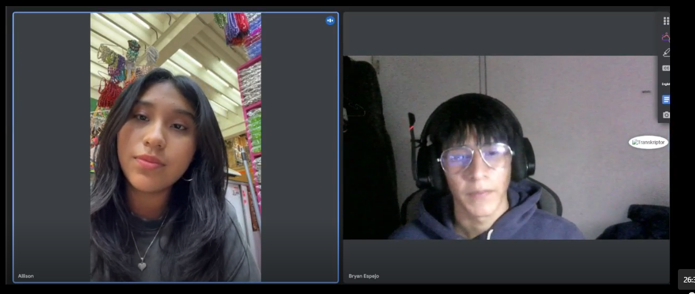
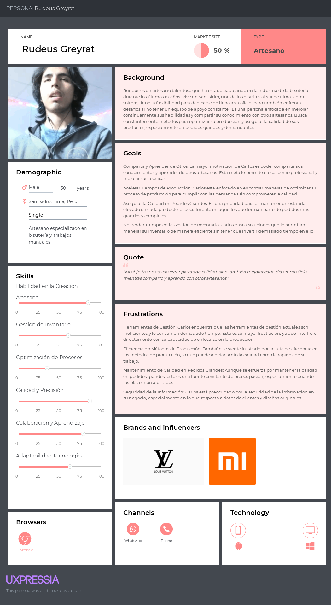
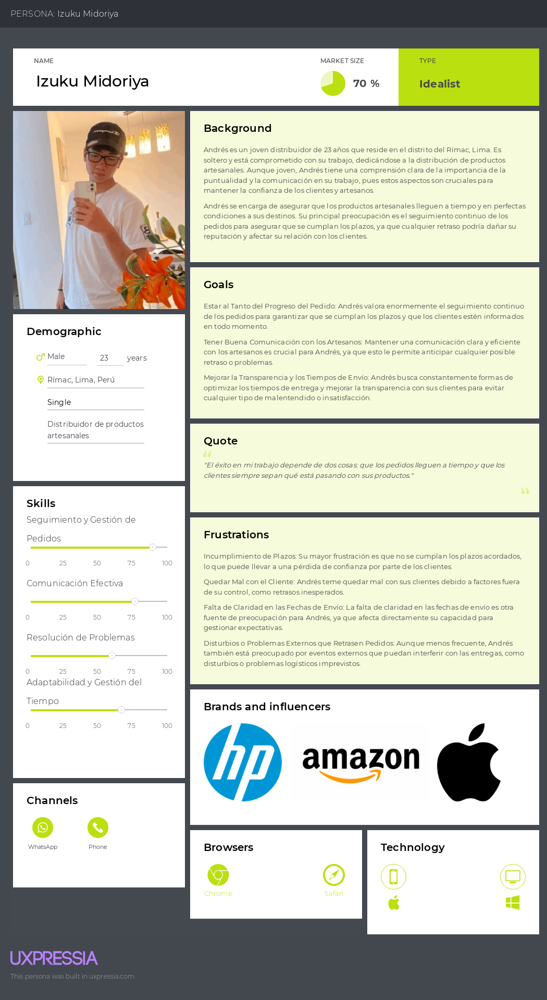

# Capítulo II: Requirements Elicitation & Analysis

## 2.1. Competidores

En esta sección realizaremos la identificación y descripción de los principales
competidores directos.

### 2.1.1 Análisis Competitivo

<table>
    <tr> 
     <th colspan="22">Competitive Analysis Landscape</th> 
    </tr> 
    <tr> 
     <td colspan="1">¿Por qué llevar a cabo el análisis?</td> 
     <td colspan="17">Este análisis nos ayuda a entender las particularidades de cada sitio web o aplicación, identificar la competencia en el mercado y planificar cómo abordar las oportunidades. También nos permite trabajar en la mejora continua de nuestras áreas de desarrollo.</td> 
    </tr> 
    <tr> 
     <td colspan="2">(En la cabecera colocar por cada competidor nombre y logo)</td> <td>Etsy </td> 
     <td>Craftybase </td> 
     <td>Katana MRP </td>
     <td>CraftSync </td>
     </tr> 
     <tr> 
        <td rowspan="2">Perfil</td> 
        <td>Overview</td> 
        <td>Una plataforma global que permite a artesanos y pequeños empresarios vender sus productos a una audiencia internacional.</td> 
        <td>Un software de gestión de inventarios diseñado específicamente para artesanos y fabricantes de productos hechos a mano.</td> 
        <td>Un software de planificación de recursos de manufactura (MRP) para pequeñas y medianas empresas, enfocado en la gestión de producción e inventarios.</td> 
        <td>Nuestra plataforma ofrece herramientas tecnológicas para que artesanos gestionen eficientemente sus talleres de artesanía y bisutería, facilitando la preservación de técnicas tradicionales a través de un espacio colaborativo.</td> 
        </tr> 
    <tr> 
        <td>Ventaja Competitiva</td> 
        <td>Gran visibilidad y acceso a un amplio mercado global, lo que facilita a los artesanos vender sus productos en todo el mundo.</td> 
        <td>Especialización en las necesidades de los artesanos, con herramientas precisas para la gestión de materiales y costos de producción.</td> 
        <td>Funcionalidades avanzadas de MRP adaptadas a pequeñas empresas, con integración de inventarios, producción y órdenes de trabajo en una sola plataforma.</td> <td>Integración de la gestión de producción, inventarios, y pedidos personalizados, con un enfoque en la preservación de técnicas tradicionales y la colaboración dentro de la comunidad artesanal.</td> 
        </tr> 
    <tr> 
        <td rowspan="2">Perfil de Marketing</td> 
        <td>Mercado Objetivo</td> 
        <td>Artesanos, creativos y pequeños empresarios que buscan vender productos hechos a mano en un mercado global.</td> 
        <td>Artesanos y fabricantes de productos manuales que necesitan una herramienta para gestionar inventarios y costos.</td> 
        <td>Pequeñas y medianas empresas manufactureras que necesitan optimizar su producción e inventarios.</td> 
        <td>Artesanos y bisuteros que buscan una solución integral para gestionar su taller, preservar técnicas tradicionales y colaborar con distribuidores y otros artesanos.</td> 
        </tr> 
    <tr> 
        <td>Estrategias de Marketing</td> 
        <td>Marketing digital enfocado en la comunidad creativa y el comercio global, con un fuerte énfasis en la visibilidad en línea.</td> 
        <td>Marketing dirigido a artesanos a través de blogs, tutoriales y asociaciones con la comunidad artesanal.</td> 
        <td>Marketing orientado a pequeñas y medianas empresas a través de demostraciones de productos, webinars y contenido educativo.</td> 
        <td>Marketing enfocado en la preservación de técnicas artesanales, colaboración comunitaria y eficiencia operativa, dirigido a artesanos en crecimiento y distribuidores.</td> 
        </tr> 
    <tr> 
        <td rowspan="3">Perfil de Producto</td> 
        <td>Productos y Servicios</td> 
        <td>Marketplace en línea, herramientas de marketing, soluciones de pago y envíos.</td> 
        <td>Gestión de inventarios, seguimiento de costos de producción, informes de ventas.</td> 
        <td>MRP, gestión de inventarios, planificación de producción, órdenes de trabajo.</td> 
        <td>Gestión de inventarios, planificación de producción, gestión de pedidos personalizados, espacio colaborativo para la comunidad artesanal.</td> 
        </tr> 
    <tr> 
        <td>Precios y Costos</td> 
        <td>Tarifas de listado de productos, comisiones por venta, tarifas de procesamiento de pagos.</td> 
        <td>Planes de suscripción mensual con precios que varían según las características y tamaño del negocio.</td> 
        <td>Precios basados en suscripción mensual o anual, con planes escalables según el tamaño de la empresa.</td> 
        <td>Modelos de suscripción escalables adaptados al tamaño del taller artesanal, con opciones de precios accesibles para pequeños artesanos.</td> 
        </tr> 
    <tr> 
        <td>Canales de distribución (Web y/o Móvil)</td> 
        <td>Plataforma web y aplicaciones móviles (iOS y Android).</td> 
        <td>Plataforma web, sin aplicación móvil dedicada.</td> 
        <td>Plataforma web, sin aplicación móvil dedicada.</td> 
        <td>Plataforma web y aplicación móvil (proyectada).</td> 
        </tr> 
    <tr> 
        <td rowspan="4">Análisis SWOT</td> 
        <td>Fortalezas</td> 
        <td>Acceso a un mercado global y herramientas de comercio electrónico bien desarrolladas.</td> 
        <td>Especialización en la gestión artesanal con un enfoque profundo en inventarios y costos.</td> 
        <td>Funcionalidades avanzadas de MRP con integración completa de procesos de manufactura.</td> 
        <td>Solución integral diseñada específicamente para artesanos, con un fuerte enfoque en la comunidad y la preservación de técnicas tradicionales.</td> 
        </tr> 
    <tr> 
        <td>Debilidades</td> 
        <td>Altas comisiones y tarifas pueden ser una barrera para algunos artesanos.</td> <td>No tiene una aplicación móvil, lo que puede limitar su accesibilidad.</td> <td>Orientado principalmente a manufactura, no específicamente a artesanía, lo que puede limitar su atractivo para artesanos.</td> 
        <td>Es una plataforma nueva que aún está construyendo su base de usuarios y reputación en el mercado.</td> 
        </tr> 
    <tr> 
        <td>Oportunidades</td> 
        <td>Expansión en mercados emergentes y aumento de la demanda de productos artesanales únicos.</td> 
        <td>Posibilidad de expansión de funcionalidades para abarcar más aspectos del negocio artesanal.</td> 
        <td>Crecimiento en mercados emergentes donde las empresas buscan digitalizar sus operaciones.</td> 
        <td>Penetración en mercados donde la artesanía es una parte importante de la cultura y la economía, ofreciendo una solución única.</td> 
        </tr> 
    <tr> 
        <td>Amenazas</td> 
        <td>Creciente competencia de otras plataformas globales de comercio electrónico.</td> 
        <td>Competencia de plataformas más generales de gestión empresarial con más funcionalidades.</td> 
        <td>Competencia de software más especializado o personalizado para ciertos tipos de manufactura.</td> 
        <td>La competencia de plataformas establecidas que ofrecen soluciones parciales pero con una mayor base de usuarios.</td> 
        </tr> 
    </table>
    
### 2.1.2. Estrategias y tácticas frente a competidores

**Diferenciación en la Preservación Cultural:**

**Táctica:** Posiciona la plataforma como defensora de las técnicas tradicionales de artesanía, ofreciendo talleres en línea y contenido educativo que enseñe y preserve estas prácticas. Esto atraerá a artesanos interesados en mantener su patrimonio cultural.
Personalización y Flexibilidad en las Herramientas:

**Táctica:** Ofrece opciones de personalización en los flujos de trabajo y paneles de control, permitiendo que cada artesano adapte la plataforma a sus necesidades específicas. Implementa módulos específicos para diferentes tipos de artesanía, aumentando la relevancia y usabilidad de la plataforma.
Fortalecimiento de la Comunidad Artesanal:

**Táctica:** Crea un espacio dentro de la plataforma para el intercambio de conocimientos, experiencias y colaboración entre artesanos. Organiza eventos virtuales y desafíos de proyectos conjuntos, promoviendo una comunidad activa y comprometida.
Integración con Marketplaces de Comercio Electrónico:

**Táctica:** Desarrolla integraciones con grandes marketplaces como Etsy y Shopify, permitiendo a los usuarios gestionar sus inventarios y pedidos de forma centralizada. Ofrece guías y soporte técnico para que los artesanos puedan aprovechar al máximo estas integraciones.
Innovación Continua en la Plataforma:

**Táctica:** Implementa un sistema de retroalimentación donde los usuarios puedan sugerir mejoras y nuevas funcionalidades. Mantén una hoja de ruta pública que muestre las próximas actualizaciones y mejoras planeadas, garantizando que la plataforma evolucione constantemente según las necesidades del usuario.

## 2.2. Entrevistas

### 2.2.1 Diseño de entrevistas

**Preguntas Generales**

- ¿Cuál es su nombre?
- ¿Qué edad tiene?
- ¿En qué distrito vive?
- ¿Estado civil?
- ¿Cuál es su ocupación? ¿Estudia y/o trabaja?
- Vamos relacionandonos un poco mas al tema tecnologico ¿Cuál es la herramienta tecnologica que mas usa? Entre PC y/o Celular, especificar si es Windows, Mac, Android o Iphone.
- ¿Cuales son los navegadores de internet que mas usa a dia de hoy? (Edge, Chrome, Firefox, Opera o Safari)
- ¿Qué canal de comunicación prefiere usar: Reuniones presenciales, llamadas telefónicas o mensajes de texto (WhatsApp, SMS, Redes Sociales)?
  -¿Qué marcas y/o influencias han tenido mayor impacto en usted?

**Preguntas para Artesanos**

- ¿Cómo organizas actualmente los materiales y el inventario en tu taller?
- ¿Qué desafíos enfrentas al planificar la producción y cumplir con los pedidos personalizados?
- ¿Utilizas alguna herramienta digital para gestionar tu taller? ¿Cuáles son sus ventajas y desventajas?
- ¿Te gustaría tener un espacio para compartir tus conocimientos y aprender de otros artesanos? ¿Cómo debería ser ese espacio?
- ¿Con qué frecuencia necesitas actualizar el estado de un pedido? ¿Cómo lo haces actualmente?
- ¿Qué aspectos de la gestión de tu taller te resultan más frustrantes?
- ¿Qué mejorarías en tu proceso de trabajo diario si tuvieras acceso a mejores herramientas?
- ¿Qué temores tienes respecto al uso de tecnología en tu trabajo?

**Preguntas para distribuidores**

- ¿Cómo prefieres hacer el seguimiento del progreso de los pedidos que realizas a los artesanos?
- ¿Qué tan importante es para ti recibir actualizaciones en tiempo real sobre el estado de un pedido?
- ¿Qué desafíos enfrentas al coordinar la producción y entrega con los artesanos?
- ¿Te gustaría tener un sistema donde puedas ver y comentar sobre el progreso de un pedido? ¿Qué características debería tener?
- ¿Qué mejorarías en tu relación de trabajo con los artesanos?
- ¿Cómo crees que la tecnología puede mejorar la cadena de suministro entre distribuidores y artesanos?

### 2.2.2. Registro de entrevistas

Durante el proceso de investigación para nuestro proyecto, realizamos entrevistas con el público objetivo. Cada una de estas entrevistas fue documentada en video, y se registraron los siguientes detalles:
[Link de la entrevista](https://upcedupe-my.sharepoint.com/:v:/g/personal/u202213278_upc_edu_pe/EXiSUSiYDW5GqGS4PDdn_uEBukdsoybed9deXxLdZ6Mkdg?e=FUVypK&nav=eyJyZWZlcnJhbEluZm8iOnsicmVmZXJyYWxBcHAiOiJTdHJlYW1XZWJBcHAiLCJyZWZlcnJhbFZpZXciOiJTaGFyZURpYWxvZy1MaW5rIiwicmVmZXJyYWxBcHBQbGF0Zm9ybSI6IldlYiIsInJlZmVycmFsTW9kZSI6InZpZXcifX0%3D)

**Entrevista 1: (Seg1)**

**Nombre y Apellido:** Milagros Maciel Tejada Banto

**Edad:** 30

**Distrito:** Rímac, Lima

**Screenshot de la Entrevista:**

**URL del Video:**

**Timing de Inicio y Duración:** [Inicio: 00:00, Duración: 06:48]

**Resumen de la Entrevista:**

Milagros Maciel Tejada Banto, una artesana dedicada al ámbito de la bisutería, se encuentra actualmente inmersa en la organización de sus materiales e inventarios mediante métodos tradicionales, como el etiquetado y empaquetado manual. Uno de los principales desafíos que enfrenta es cumplir con los plazos establecidos para la entrega de pedidos personalizados, asegurando que los productos sean entregados conforme a las expectativas de los clientes.

En cuanto a la utilización de herramientas tecnológicas, Milagros emplea predominantemente un teléfono móvil con sistema operativo Android y una computadora personal con Windows. Su navegador de preferencia es Chrome, que utiliza para la realización de sus actividades en línea. La comunicación con sus clientes se efectúa principalmente a través de llamadas telefónicas y la aplicación de mensajería WhatsApp.

Milagros expresó su interés en contar con un espacio colaborativo donde pudiera compartir sus conocimientos y aprender de otros artesanos. Propuso la creación de una asociación que facilite la gestión y promoción de productos de bisutería, lo cual podría contribuir a una mayor eficiencia y visibilidad en su labor.

Actualmente, la gestión de pedidos se lleva a cabo mediante la herramienta Excel, la cual, según Milagros, presenta ciertas limitaciones, especialmente debido a la necesidad de realizar actualizaciones frecuentes, lo que puede consumir un tiempo valioso que podría ser destinado a la producción.

Finalmente, Milagros manifestó sus preocupaciones en torno al uso de la tecnología, particularmente por la brecha generacional y el temor a posibles robos de información. No obstante, reconoce la importancia de mantenerse al día con las nuevas tecnologías para optimizar y mejorar sus procesos de trabajo.

**Entrevista 2: (Seg1)**

**Nombre y Apellido:** Francisco Torres

**Edad:** 30 años

**Distrito:** San Isidro, Lima

**Screenshot de la Entrevista:**

**URL del Video:**

**Timing de Inicio y Duración:** [Inicio: 06:48, Duración: 13:39]

**Resumen de la Entrevista:**

Francisco Torres es un artesano que combina técnicas tradicionales de trabajo en cuero con diseños modernos. Además de su trabajo artesanal, está aprendiendo marketing digital para expandir su negocio. Utiliza una computadora pequeña para gestionar su inventario y un teléfono Android para comunicarse con clientes y manejar redes sociales, prefiriendo el navegador Chrome por su compatibilidad.

Francisco organiza sus materiales con un software de gestión que sincroniza con su tienda en línea, lo que le ayuda a mantener todo actualizado. Sin embargo, enfrenta desafíos al manejar grandes pedidos personalizados, lo que puede complicar la planificación. A pesar de utilizar herramientas digitales, reconoce la necesidad de una inversión inicial y tiempo para aprender a usarlas de manera efectiva.

Prefiere la comunicación a través de WhatsApp por su rapidez, pero también reconoce la importancia de las reuniones presenciales. Francisco expresó preocupaciones sobre la seguridad de los datos y las posibles fallas tecnológicas que podrían afectar su trabajo, pero valora la tecnología por su capacidad de mejorar la eficiencia en su proceso productivo.

**Entrevista 3: (Seg1)**

**Nombre y Apellido:** Darío Tello

**Edad:** 28 años

**Distrito:** Surquillo, Lima

**Screenshot de la Entrevista:**

**Timing de Inicio y Duración:** [Inicio: 13:39, Duración: 21:02]

**Resumen de la Entrevista:**

Darío Tello es un artesano que se especializa en joyería moderna y administra su propia tienda en línea. Utiliza una laptop con Windows para diseñar y gestionar su tienda, mientras que emplea un iPhone para manejar redes sociales y comunicarse con sus clientes. Su navegador preferido es Chrome, debido a su rapidez y capacidad de sincronización.

Para la gestión de materiales e inventario, Darío recurre a aplicaciones móviles y hojas de cálculo en Google, las cuales se actualizan automáticamente según sus necesidades. Uno de sus principales desafíos es coordinar los tiempos para cumplir con los pedidos personalizados, especialmente cuando se superponen varios pedidos.

Darío utiliza herramientas digitales como Trello para la gestión de tareas y Google Sheets para el inventario. Aunque aprecia la centralización de la información, encuentra frustrante la falta de integración entre las diferentes herramientas, lo que puede dificultar su flujo de trabajo. Expresó preocupaciones sobre la seguridad de la información, especialmente los datos de los clientes, y teme que las herramientas tecnológicas se vuelvan obsoletas rápidamente, requiriendo constantes actualizaciones.

Finalmente, Darío manifestó su interés en un espacio en línea donde artesanos puedan compartir técnicas y experiencias, así como un mercado para vender sus productos y recibir retroalimentación de expertos.

**Entrevista 4: (Seg2)**

**Nombre y Apellido:** Andrés Roman

**Edad:** 22 años

**Distrito:** Rímac, Lima

**Screenshot de la Entrevista:**

**Timing de Inicio y Duración:** [Inicio: 21:02, Duración: 24:54]

**Resumen de la Entrevista:**

Andrés es un joven de 22 años que combina sus estudios con el apoyo en el negocio familiar. Utiliza una computadora con Windows en la oficina y un iPhone para gestionar tareas relacionadas con el negocio, mientras que su padre usa un dispositivo Android. En cuanto a la comunicación, prefiere usar WhatsApp debido a su facilidad para coordinar con clientes y proveedores.

Andrés destaca la importancia de recibir actualizaciones en tiempo real sobre el estado de los pedidos, especialmente para evitar múltiples viajes y garantizar la puntualidad en las entregas. Considera que uno de los principales desafíos es cumplir con los plazos de entrega, evitando fallos que puedan afectar la relación con los clientes.

También mencionó que sería útil contar con un sistema que permita visualizar y comentar el progreso de los pedidos, lo que mejoraría la coordinación con los artesanos. Andrés sugiere que la tecnología podría optimizar la cadena de suministros, mejorando los tiempos y la transparencia en el proceso logístico.

Finalmente, enfatiza la necesidad de mayor puntualidad y claridad en las fechas de envío para facilitar una mejor organización y planificación en su trabajo.
**Entrevista 5: (Seg2)**

**Nombre y Apellido:** Alison Mamani

**Edad:** 15 años

**Distrito:** Rímac, Lima

**Screenshot de la Entrevista:**

**Timing de Inicio y Duración:** [Inicio: 21:02, Duración: 29:57]

**Resumen de la Entrevista:**

Alison es una joven de 15 años que participa activamente en un negocio familiar de artesanía. Utiliza un iPhone como su principal herramienta tecnológica, especialmente para gestionar redes sociales y otras actividades del negocio. Su navegador preferido es Chrome, y para la comunicación, emplea WhatsApp para mensajes breves, mientras que para reuniones utiliza Zoom.

Alison prefiere utilizar Google Forms para hacer el seguimiento de los pedidos realizados, lo que le permite gestionar las solicitudes de manera eficiente. Considera crucial recibir actualizaciones en tiempo real sobre el estado de los pedidos para asegurar que todo se esté manejando correctamente.

Uno de los desafíos que enfrenta es mantener la puntualidad en la producción y entrega de los pedidos, especialmente cuando surgen imprevistos. Expresó su interés en contar con un sistema que permita ver y comentar el progreso de los pedidos, mejorando así la comunicación con los artesanos.

Finalmente, Alison sugiere que la tecnología podría mejorar la cadena de suministros mediante la implementación de una aplicación que facilite el intercambio de ideas entre artesanos, lo que resultaría en un mejor producto final para el público.

**Entrevista 6: (Seg2)**

**Nombre y Apellido:** Marcelo Lopez

**Edad:** 24 años

**Distrito:** San Juan de Lurigancho, Lima

**Screenshot de la Entrevista:**

**Timing de Inicio y Duración:** [Inicio: 29:57, Duración: 32:19]

**Resumen de la Entrevista:**

Marcelo es un distribuidor de 24 años que utiliza principalmente un iPhone para su trabajo. Su navegador preferido es Safari, y prefiere comunicarse a través de redes sociales, especialmente Instagram, y WhatsApp para coordinar con artesanos.

Marcelo enfatiza la importancia de recibir actualizaciones en tiempo real sobre los pedidos, ya que esto le permite mantener una buena relación con los clientes y evitar retrasos en las entregas. Para hacer el seguimiento de los pedidos, prefiere llamar o enviar mensajes a través de WhatsApp.

Uno de los principales desafíos que enfrenta en su trabajo son los retrasos en la producción y entrega. Marcelo expresó que mejorar la comunicación con los artesanos sería clave para superar estos desafíos y que la tecnología podría optimizar la cadena de suministros, haciendo que todo el proceso sea más rápido y eficiente.

Finalmente, mostró interés en un sistema que facilite la visualización y comentarios sobre el estado de los pedidos, lo que ayudaría a mejorar la coordinación y la gestión del trabajo.

### 2.2.3. Análisis de entrevistas

**Segmento 1: Artesanos**
Para la elaboración del arquetipo del Artesano, se usa como referencia las respuestas de las 3 primeras entrevistas. Empecemos analizando la frecuencia de cada tipo de respuesta:

_Edad:_

- 30 años: 2, 66.6%
- 28 años: 1, 33.3%
  De esto, se puede notar que todos los entrevistados tienen edad entre 28 a 30 años. Sin embargo, el 66.6% tiene 30 años.

_Distrito:_

- Rimac: 1, 33.3%
- San Isidro: 1, 33.3%
- Surquillo: 1, 33.3%
  De esto, se puede ver que todos viven en distritos distintos. Sin embargo, San Isidro y Surquillo son distritos al sur de lima, así que se puede determinar que el 66.6% vive en esa área.

_Estado Civil:_

- Soltero o Soltera: 3, 100%
  De esto, se determina que el 100% de los entrevistados tiene la soltería como su estado civil.

_Dispositivos:_

- Celular Android: 2, 66.6% en celulares, 33.3% en general
- Celular iPhone: 1, 33.3% en celulares, 16.67% en general
- PC Windows: 3, 100% en computadoras, 50% en general
  De esto, se hace notar que todos los entrevistados tienen computadoras Windows, siendo el 50% de todos los dispositivos, y también que la la mayoría tiene celulares Android.

_Navegadores:_

- Google Chrome: 3, 100%
  De esto, se determina que el 100% de los entrevistados usan Google Chrome.

_Canales de Comunicación:_

- Llamadas Telefónicas: 1, 20%
- WhatsApp: 3, 60%
- Instagram: 1, 20%
  De esto, se puede ver que la mayoría usa WhatsApp como su método de comunicación preferido, aparte de que todos los entrevistados lo usan.

_Marcas que le influencian:_

- LG: 1, 25%
- Redmi: 1, 25%
- Louis Vuitton: 1, 25%
- Etzy: 1, 25%
  De esto, se puede ver que a todos les influencia marcas diferentes, aunque el 50% son de tecnología.

_Metas:_

- No perder tiempo en la gestión de inventario: 2, 20%
- Acelerar los tiempos de producción: 2, 20%
- Compartir y aprender de los conocimientos de otros: 3, 30%
- Asegurar la calidad en pedidos demandantes: 2, 20%
- Automatizar procesos administrativos: 1, 10%
  De esto, se puede notar que todos quieren compartir los suyos y aprender de los conocimientos de otros, y que la mayoría busca acelerar los procesos de gestión y producción, y asegurar la calidad en pedidos demandantes.

_Frustraciones:_

- El desafío de hacer todo en el plazo de tiempo acordado: 16.67%
- No poder satisfacer al cliente: 1, 16.67%
- Que las herramientas de gestión tomen mucho tiempo en manejar y actualizar: 3, 50%
- Tener que mantener la calidad en pedidos grandes: 1, 16.67%
- Que los métodos de producción no sean eficientes: 2, 33.3%
- La falta de seguridad de la información: 1, 16.67%
  De esto, se puede ver que todos los entrevistados tienen problemas con el manejo de las herramientas de gestión actuales, pero que la mayoría también tiene problemas con la falta de eficiencia en los métodos de producción.

**Segmento 2: Distribuidores**
Para la elaboración del arquetipo del Distribuidor, se usa como referencia las respuestas de las 3 últimas entrevistas. Empecemos analizando la frecuencia de cada tipo de respuesta:

_Edad:_

- 22 años: 1, 33.3%
- 15 años: 1, 33.3%
- 24 años: 1, 33.3%
  De esto, se puede notar que los entrevistados tienen edades diferentes. Sin embargo, el 66.6% tiene enter 22 a 24 años, así que determinamos 23 años como su media.

_Distrito:_

- Rimac: 2, 33.3%
- San Juan de Lurigancho: 1, 66.6%
  De esto, se puede ver que el 66.6% vive en Rímac.

_Estado Civil:_

- Soltero o Soltera: 3, 100%
  De esto, se determina que el 100% de los entrevistados tiene la soltería como su estado civil.

_Dispositivos:_

- Celular Android: 1, 33.3% en celulares, 25% en general
- Celular iPhone: 2, 66.6% en celulares, 50% en general
- PC Windows: 1, 100% en computadoras, 25% en general
  De esto, se hace notar que la mayoría de los entrevistados tienen un iPhone, pues es el 50% de los dispositivos.

_Navegadores:_

- Google Chrome: 2, 66.6%
- Safari: 1, 33.3%
  De esto, se ve que el 66.6% usa Google Chrome.

_Canales de Comunicación:_

- Meet: 1, 16.67%
- WhatsApp: 2, 33.3%
- Messenger: 1, 16.67%
- Zoom: 1, 16.67%
- Instagram: 1, 16.67%
  De esto, se puede ver que hay muchas respuestas variadas, pero el 33.3% usa WhatsApp.

_Marcas que le influencian:_

- HP: 2, 25%
- Samsung: 2, 25%
- Apple: 2, 25%
- Amazon: 2, 25%
  De esto, se puede ver que las respuestas son todas variadas y equitativas, así que se considera todas.

_Metas:_

- Estar al tanto del progreso del pedido: 3, 50%
- Mejorar la transparencia y los tiempos de envío: 1, 16.67%
- Tener buena comunicación con los artesanos: 2, 33.3%
  De esto, se puede notar que todos quieren estar al tanto del progreso del pedido, y que la mayoría busca tener buena comunicación con los artesanos.

_Frustraciones:_

- Que no se cumplan los plazos: 2, 40%
- Quedar mal con el cliente: 1, 20%
- Que las fechas de envío no sean claras: 1, 20%
- Que hayan disturbios que puedan retrasar los pedidos: 1, 20%
  De esto, se puede ver que la mayoría, en el 40%, tiene frustraciones con el incumplimiento de plazos.

## 2.3. Needfinding

Posteriormente a las entrevistas, pudimos obtener la información sobre sus deseos, frustraciones, situación y múltiples datos que nos van a servir para satisfacer sus necesidades, mejorando la experiencia a nuestros usuarios. Esta información también nos ayudará a realizar los esquemas para las secciones de User Personas, User Task Matrix, User Journey Maps y el Empathy Mapping.

### 2.3.1. User Persona

Para el desarrollo de nuestra solución digital, hemos elaborado fichas de User Persona basadas en entrevistas realizadas a dos segmentos clave: Artesanos y Distribuidores. Estas fichas se construyeron a partir del análisis de las respuestas obtenidas y un estudio de la competencia, destacando las principales características, metas y frustraciones de cada grupo.

Las fichas proporcionan una visión clara de quiénes son nuestros usuarios y cómo podemos diseñar un producto que se ajuste a sus necesidades específicas. Mientras que los Artesanos se centran en optimizar la gestión de inventarios y mejorar la producción, los Distribuidores priorizan el seguimiento eficiente de pedidos y la comunicación con los artesanos. Estos insights guiarán el desarrollo de nuestra solución para asegurar que sea efectiva y relevante para ambos segmentos.

_**Segmento Objetivo 1: Artesanos**_

_**Segmento Objetivo 2: Distribuidores**_

### 2.3.2. User Task Matrix

### 2.3.3. User Journey Mapping

### 2.3.4. Empathy Mapping

### 2.3.5. As-is Scenario Mapping

## 2.4. Ubiquitous Language

- **Workshop (Taller)**
  Espacio donde el artesano realiza sus actividades.

- **Inventory (Inventario)**
  Conjunto de materiales y productos que el artesano gestiona.

- **Raw Materials (Materias Primas)**
  Insumos naturales o básicos que los artesanos utilizan para crear sus productos, como madera, arcilla, metales, telas, entre otros.

- **Bespoke Craft (Artesanía a Medida)**
  Producto artesanal creado específicamente según las preferencias o necesidades del cliente.

- **Conceptualization (Conceptualización)**
  Primera etapa, donde el artesano diseña el producto.

- **Material Preparation (Preparación de Materiales)**
  Etapa en la que se seleccionan, preparan y acondicionan los materiales para la creación del producto.

- **Crafting (Elaboración)**
  Etapa principal, donde el artesano trabaja manualmente la pieza de artesania.

- **Detailing (Detalles)**
  Fase donde se añaden elementos específicos como adornos o acabados planteados en la conceptualizacion.

- **Finishing (Acabado)**
  Última etapa del proceso, donde se aplican técnicas como pulir, lijar, o aplicar un barniz para mejorar la apariencia y calidad del producto.
