# Capítulo IV: Product Design

## 4.1. Style Guidelines

Las guías de estilo serán la base para dar forma a nuestro producto, utilizando patrones que consideren los aspectos de arquitectura de la información y accesibilidad necesarios para la implementación exitosa de UrProvider tanto en una Landing Page como en una Aplicación Web.

### 4.1.1. General Style Guidelines

**Branding:**

**Brand Overview:**

CraftSync es una plataforma desarrollada por The Project Chow, que tiene como principal objetivo servir de herramienta para artesanos o personas incluidas en el mundo de la artesania.

- Nombre: CraftSync surge de fusionar las palabras en ingles Craft y synchronic.
- Logo: Para el logo de la marca se escogio representar a nuestro principal segmento objetivo que son los artesanos y de esta forma buscar generar un vinculo con el usuario.

  

**Tipografia:**

La tipografia es importante porque ayuda al usuario a entender mejor la informacion mediante la legibilidad y uso de la jerarquia. Para el proyecto se escogio Lato con estilos medium y regular, y distintos tamaños para mantener la jerarquia.

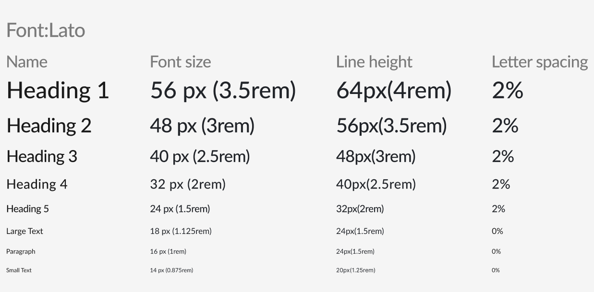

**Colores:**

Escoger los colores adecuados es importante ya que estos se encargan de captar la atencion de los usuarios.
Para nuestra marca se escogieron 2 colores primarios y 2 colores secundarios con sus respectivos colores alternos:

- Marron: Representa autenticidad, tradición y esta asociado fuertemente con la naturaleza.
- Blanco: Representa simpleza, claridad y es un perfecto complemento del marron.
- Naranja: Es un perfecto colo para guiar la atencion del cliente.
- Amarillo: Es un perfecto colo para guiar la atencion del cliente.

**Spacing:**

**Tono de comunicación y lenguaje aplicado:**

Nuestra plataforma busca generarle confianza al usuario , por lo que se decidio en utilizar un enfoque comunicativo serio, formal, respetuoso, sereno.

### 4.1.2. Web Style Guidelines

CraftSync ofrece una plataforma enfocada en la eficiencia de esta, ya que nuestro objetivo ademas de captar la atencion del cliente es ofrecer la mejor experiencia a los usuarios.

Componentes elegidos que se adaptan al diseño responsive:

- Tarjetas: Las tarjetas permiten a los usuarios escanear y procesar información de manera rápida, y son ideales para mostrar resúmenes de contenido, perfiles o productos de forma modular y flexible.

  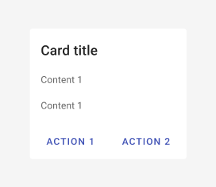

- Botones: Los botones son elementos interactivos diseñados para captar la atención del usuario y facilitar la realización de acciones específicas, como enviar un formulario.

  

- InputBox: Los InputBox son campos de entrada que permiten a los usuarios introducir información, como texto o números.

  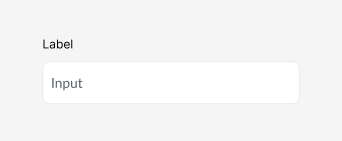

- Imagenes: Las imágenes son elementos visuales que enriquecen el contenido y apoyan la comunicación de mensajes.

## 4.2. Information Architecture

La sección de arquitectura de información tiene como objetivo organizar el contenido tanto de la aplicación web como de la página de inicio de UrProvider. Se abordarán los siguientes temas: Organization Systems, Labeling Systems, SEO
Tags and Meta Tags, Searching Systems y Navigation Systems.

### 4.2.1. Organization Systems

En nuestra plataforma para la gestión de talleres de artesanos, utilizaremos varios sistemas de organización para optimizar la experiencia del usuario:

**Jerarquía visual (Visual Hierarchy):** Se aplicará en la organización del tablero principal (dashboard), donde se presentarán los elementos más importantes de manera destacada, como el estado de los pedidos, inventarios críticos, y notificaciones urgentes. Los elementos de mayor relevancia se colocarán en la parte superior o con tamaños y colores que los diferencien claramente.

**Organización secuencial (Step-by-Step):** Se utilizará en los procesos de planificación de producción y gestión de pedidos. Los usuarios seguirán pasos claramente definidos, desde la entrada de un nuevo pedido hasta su finalización y entrega. Este enfoque ayudará a los artesanos a seguir un flujo de trabajo lógico y ordenado, minimizando errores.

**Organización matricial (Matrix Organization):** Se aplicará en la visualización de datos como inventarios y materiales, donde los usuarios podrán cruzar diferentes categorías, como tipo de material y estado del inventario. Esto permitirá a los usuarios ver las relaciones entre diferentes aspectos de su inventario de manera clara y funcional.

**Categorización alfabética:** Se utilizará en el listado de materiales y herramientas, facilitando la búsqueda rápida de ítems específicos.

**Categorización por tópicos:** Se aplicará en la sección de tutoriales y recursos educativos, organizando el contenido en función de temas específicos como "Técnicas de bisutería", "Gestión de pedidos", etc.

**Categorización cronológica:** Se usará para organizar el historial de pedidos, permitiendo a los usuarios ver y gestionar pedidos pasados en orden de fecha.

**Categorización según audiencia:** En la sección de configuración de la plataforma, los artesanos y distribuidores tendrán opciones y vistas personalizadas según su rol, asegurando que cada tipo de usuario vea solo la información relevante para ellos.

### 4.2.2. Labeling Systems

Para asegurar claridad y simplicidad en la representación de datos dentro de nuestra plataforma, adoptaremos los siguientes sistemas de etiquetado:

**Etiquetas de inventario:** Usaremos etiquetas simples como "Bajo Stock", "En Proceso", y "Finalizado" para categorizar el estado de los materiales y pedidos. Estas etiquetas serán visibles en la pantalla de gestión de inventarios y en el panel principal.

**Etiquetas de planificación:** Para la planificación de la producción, utilizaremos etiquetas como "Pendiente", "En Producción", y "Listo para Enviar". Esto permitirá a los usuarios identificar rápidamente en qué etapa se encuentra cada pedido.

**Etiquetas de usuario:** Los diferentes roles de usuario, como "Artesano" y "Distribuidor", se representarán claramente en las interfaces de usuario para garantizar que cada grupo acceda a la información adecuada sin confusión.

**Asociaciones de etiquetas:** Las etiquetas relacionadas se agruparán para ofrecer contexto. Por ejemplo, un pedido etiquetado como "En Producción" también mostrará la etiqueta de "Materiales Listos", si todos los materiales necesarios están en inventario.

### 4.2.3. SEO Tags and Meta

Para mejorar la visibilidad y accesibilidad de nuestra plataforma tanto en el sitio web estático como en la aplicación web, se aplicarán los siguientes SEO Tags y Meta Tags:

**Title Tags:**

Landing Page: "Plataforma Integral para Artesanos - Gestiona tu Taller con Eficiencia"
Web Application: "Gestión de Talleres de Artesanos - Panel de Control"

**Meta Tags Description:**

Landing Page: "Optimiza la gestión de tu taller de artesanía con nuestra plataforma integral. Organiza materiales, controla inventarios, y gestiona pedidos personalizados de forma eficiente."
Web Application: "Accede al panel de control de tu taller de artesanía. Gestiona inventarios, pedidos, y producción desde un solo lugar."

**Keywords:**

Landing Page: "plataforma artesanos, gestión de talleres, control de inventarios, planificación de producción, pedidos personalizados"
Web Application: "gestión de talleres, panel de control, inventarios, producción artesanía, pedidos personalizados"

**Author:**

"Equipo de Desarrollo de la Plataforma para Artesanos"

### 4.2.4. Searching Systems

Para guiar a los usuarios a través de nuestra plataforma de manera efectiva, se implementarán los siguientes sistemas de navegación:

**Navegación por menús:** Se utilizará un menú de navegación principal ubicado en la parte superior de la pantalla, que permitirá a los usuarios acceder rápidamente a las secciones principales como "Inventarios", "Pedidos", "Producción", y "Configuración".

**Breadcrumbs:** Implementaremos breadcrumbs en las subpáginas para que los usuarios puedan rastrear fácilmente su ubicación dentro de la plataforma y navegar de regreso a secciones anteriores sin perderse.

**Botones de acción rápida:** En el tablero principal, los usuarios tendrán acceso a botones de acción rápida para realizar tareas frecuentes, como "Agregar Pedido Nuevo", "Actualizar Inventario", o "Ver Reportes". Estos botones estarán siempre visibles en el dashboard.

**Navegación contextual:** En secciones específicas, como la gestión de pedidos, se ofrecerán opciones de navegación relacionadas directamente con la tarea en curso, permitiendo a los usuarios acceder a funciones adicionales sin abandonar su flujo de trabajo.

### 4.2.5. Navigation Systems

Para facilitar la búsqueda de información dentro de nuestra plataforma, se implementarán los siguientes sistemas de búsqueda:

**Barra de búsqueda global:** Una barra de búsqueda estará disponible en la parte superior de todas las páginas de la aplicación, permitiendo a los usuarios buscar materiales, pedidos, y otros datos clave rápidamente.

**Filtros de búsqueda:** Los usuarios podrán aplicar filtros avanzados como "Fecha", "Estado", "Categoría", y "Prioridad" para refinar los resultados de búsqueda y encontrar exactamente lo que necesitan.

**Autocompletado:** La barra de búsqueda incluirá una función de autocompletado que sugerirá opciones relevantes a medida que el usuario escribe, agilizando el proceso de búsqueda.

**Resultados visuales:** Los resultados de búsqueda se mostrarán en un formato claro y visual, con opciones para agrupar o destacar resultados relevantes, facilitando la identificación rápida de la información deseada.

## 4.3. Landing Page UI Design

### 4.3.1. Landing Page Wireframe

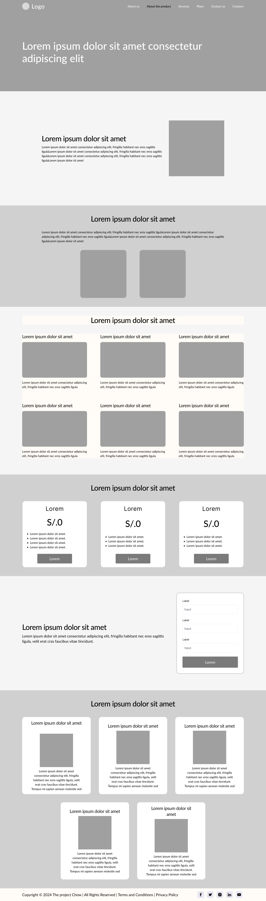

### 4.3.2. Landing Page Mock-up

## 4.4. Web Applications UX/UI Design

### 4.4.1. Web Applications Wireframes

En este apartado se muestran los Wireframes de la Aplicación Web. Cada pantalla tiene un nombre y propósito específico.

**Ingreso a la Plataforma:**
Estos son las partes del Wireframe dedicadas al ingreso a la plataforma, abarcando el Inicio de Sesión, el registro, la recuperación de contraseña, y la adquisición de suscripción:

**Pedidos:**
Estas son las partes del Wireframe dedicadas a la lista y visualización de pedidos, abarcando la lista de pedidos, sus filtros, los pedidos en sí, y la interacción con estos.

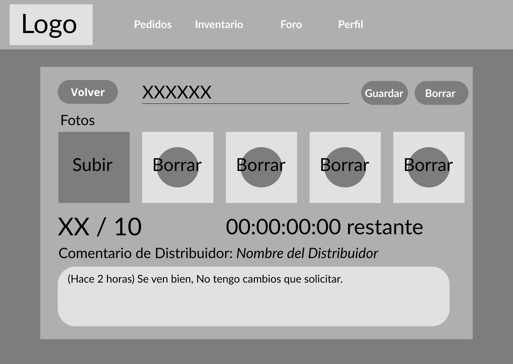

**Inventario:**
Estas son las partes del Wireframe dedicadas al inventario y su manipulación, abarcando la lista de estantes e inventarios, sus detalles, los filtros, y la interacción con estos.
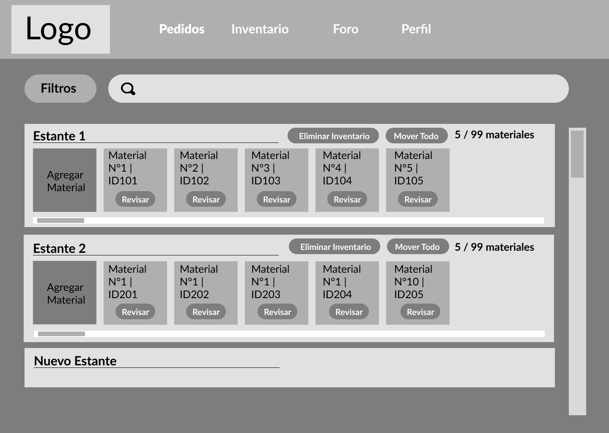

**Distribución:**
Estas son las partes del Wireframe dedicadas a la distribución de pedidos ya listos, abarcando la lista de compradores y pedidos, sus detalles, los filtros y la interacción con estos.

**Foro:**
Estas son las partes del Wireframe dedicadas al foro y sus publicaciones, abarcando la lista de publicaciones, sus comentarios, y la creación de estos 2.

**Perfil:**
Estas son las partes del Wireframe dedicadas al perfil propio y de otros, abarcando el perfil propio de un artesano, el de otro artesano, el del distribuidor y las funciones relacionadas.

### 4.4.2. Web Applications Wireflow Diagrams

**User Flow Goal 1 (Como artesano quiero registrarme)**

User Task: El usuario abre CraftSync, ingresa sus datos y registra su cuenta en la aplicación.

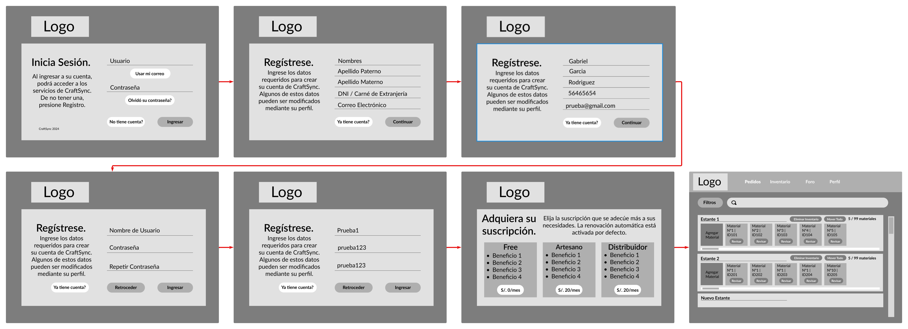

**User Flow Goal 2 (Como artesano quiero cambiar mis datos registrados)**

User Task: El usuario dentro CraftSync, ingresa a la seccion perfil y le da click al boton editar lo que le permitira modificar cualquier dato que desee.

**User Flow Goal 3 (como artesano quiero agregar un nuevo material a mi inventario)**

User Task: El usuario dentro CraftSync, ingresa a la seccion inventario, le da click a agregar material y podra agregar el material que quiera.

**User Flow Goal 4 (Como distribuidor quiero solicitar un artesano para que realice el pedido publicado)**

User Task: El usuario dentro CraftSync, ingresa a la seccion foro, buscara un artesano que comentó su publicación y le solicitará el pedido publicado.

**User Flow Goal 5 (Como artesano quiero solicitar trabajo a un distribuidor)**

User Task: El usuario dentro CraftSync, ingresa a foro, busca las publicaciones de los distribuidores, entra al perfil y solicitará el trabajo deseado.

**User Flow Goal 6 (Como artesano quiero editar los pedidos que tengo)**

User Task: El usuario dentro CraftSync, ingresara a pedidos, modificara el pedido dependiendo en la situacion del pedido actualmente.

### 4.4.3. Web Applications Mock-ups

En este apartado se muestra el Mock-Up de la Aplicación Web. Cada pantalla tiene un nombre y propósito específico.

**Ingreso a la Plataforma:**
Estos son las partes del Wireframe dedicadas al ingreso a la plataforma, abarcando el Inicio de Sesión, el registro, la recuperación de contraseña, y la adquisición de suscripción:

**Pedidos Artesano:**
Estas son las partes del Mock-Up dedicadas a la lista y visualización de pedidos desde el punto de vista del Artesano, abarcando la lista de pedidos, sus filtros, los pedidos en sí, y la interacción con estos.

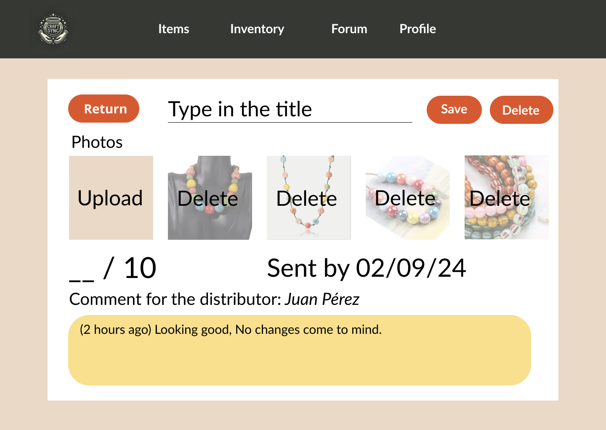

**Pedidos Distribuidor:**
Estas son las partes del Mock-Up dedicadas a la lista y visualización de pedidos desde el punto de vista del Distribuidor, abarcando la lista de pedidos, sus filtros, los pedidos en sí, y la interacción con estos.

**Inventario:**
Estas son las partes del Mock-Up dedicadas al inventario y su manipulación, abarcando la lista de estantes e inventarios, sus detalles, los filtros, y la interacción con estos.

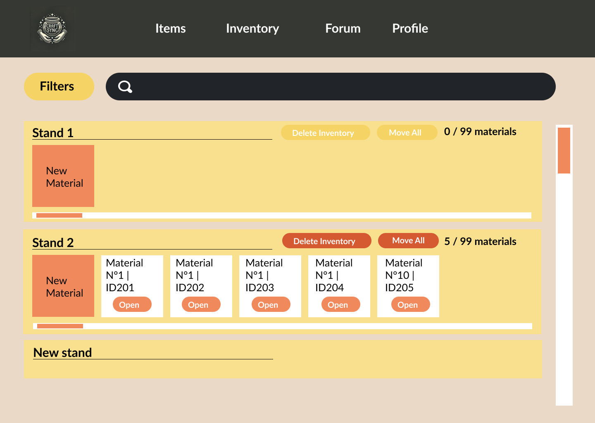

**Distribución:**
Estas son las partes del Mock-Up dedicadas a la distribución de pedidos ya listos, abarcando la lista de compradores y pedidos, sus detalles, los filtros y la interacción con estos.

**Foro Artesano:**
Estas son las partes del Mock-Up dedicadas al foro y sus publicaciones desde el punto de vista del Artesano, abarcando la lista de publicaciones, sus comentarios, y la creación de estos 2.

**Foro Distribuidor:**
Estas son las partes del Mock-Up dedicadas al foro y sus publicaciones desde el punto de vista del Distribuidor, abarcando la lista de publicaciones, sus comentarios, y la creación de estos 2.

**Perfil Artesano:**
Estas son las partes del Mock-Up dedicadas al perfil propio y de otros desde el punto de vista del Artesano, abarcando el perfil propio de un artesano, el de otro distribuidor y las funciones relacionadas.

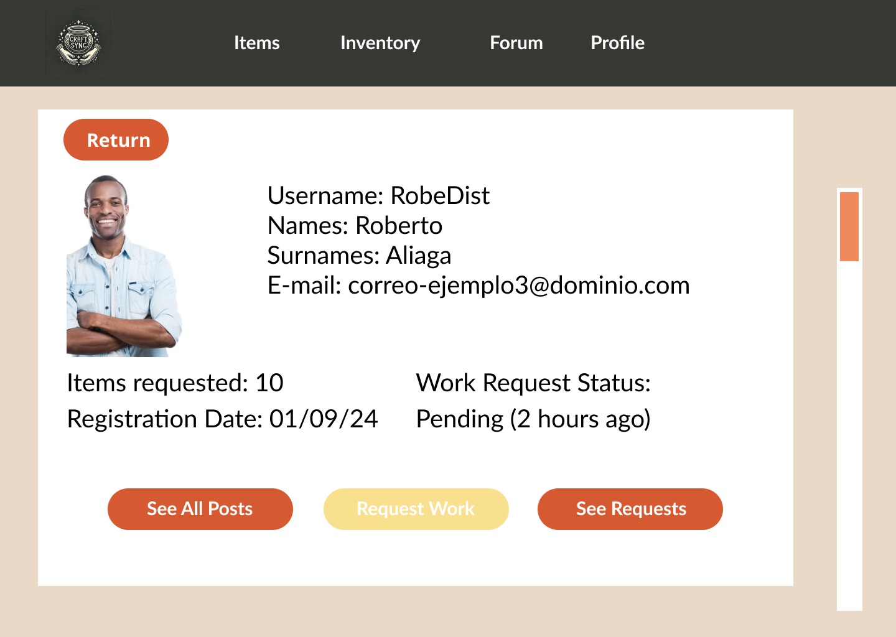

**Perfil Distribuidor:**
Estas son las partes del Mock-Up dedicadas al perfil propio y de otros desde el punto de vista del Distribuidor, abarcando el perfil propio de un distribuidor, el de otro artesano y las funciones relacionadas.

### 4.4.4. Web Applications User Flow Diagrams

**User Flow Goal 1 (Como artesano quiero registrarme)**

User Task: El usuario abre CraftSync, ingresa sus datos y registra su cuenta en la aplicación.

Unhappy paths:

- El correo ya esta en uso, puede volver a intentarlo.
- El dni no es valido, puede volver a intentarlo.
- El usuario ya esta en uso, puede volver a intentarlo.
- La contraseña repetida no coincide con la contraseña, puede volver a intentarlo.

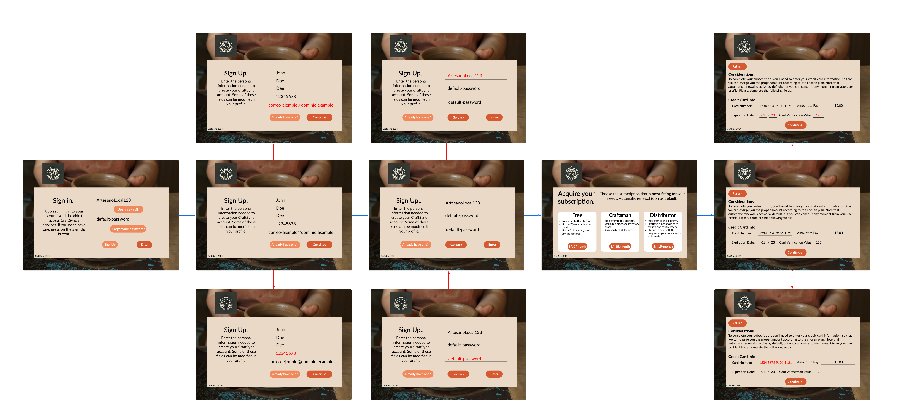

**User Flow Goal 2 (Como artesano quiero cambiar mis datos registrados)**

User Task: El usuario dentro CraftSync, ingresa a la seccion perfil y le da click al boton editar lo que le permitira modificar cualquier dato que desee.

Unhappy paths:

- El usuario ya esta en uso, puede volver a intentarlo.
- El correo ya esta en uso, puede volver a intentarlo.
- La contraseña repetida no coincide con la contraseña, puede volver a intentarlo.
- El dni no es valido, puede volver a intentarlo.

**User Flow Goal 3 (como artesano quiero agregar un nuevo material a mi inventario)**

User Task: El usuario dentro CraftSync, ingresa a la seccion inventario, le da click a agregar material y podra agregar el material que quiera.

Unhappy paths:

- El nombre no es aceptado, puede volver a intentarlo.
- la cantidad no es aceptada, puede volver a intentarlo.

**User Flow Goal 4 (Como distribuidor quiero solicitar un artesano para que realice el pedido publicado)**

User Task: El usuario dentro CraftSync, ingresa a la seccion foro, buscara un artesano que comentó su publicación y le solicitará el pedido publicado.

Unhappy paths:
La imagen falló durante la verificación, puede volver a intentarlo.
La descripción no es valida, puede volver a intentarlo.
La fecha no es valida, puede volver a intentarlo.

**User Flow Goal 5 (Como artesano quiero solicitar trabajo a un distribuidor)**

User Task: El usuario dentro CraftSync, ingresa a foro, busca las publicaciones de los distribuidores, entra al perfil y solicitará el trabajo deseado.

Unhappy paths:

- La descripción no es valida, puede volver a intentarlo.
- La opción no es valida, puede volver a intentarlo.

**User Flow Goal 6 (Como artesano quiero editar los pedidos que tengo)**

User Task: El usuario dentro CraftSync, ingresara a pedidos, modificara el pedido dependiendo en la situacion del pedido actualmente.

Unhappy paths:

- La descripción no es valida, puede volver a intentarlo.
- La actualizacion del estado del pedido no es valida, puede volver a intentarlo.
- El guardado no es valida, puede volver a intentarlo.

## 4.5. Web Applications Prototyping

En esta sección, se presenta el link del prototipo de la Aplicación Web, mediante la herramienta de prototipado de Figma.

https://www.figma.com/proto/va6WlnDEYIuYOGxzimk1bm/Project-Chow?node-id=152-214&node-type=CANVAS&t=TaYfDd20hKsu9ACP-0&scaling=scale-down&content-scaling=fixed&page-id=152%3A213&starting-point-node-id=152%3A214

## 4.6. Domain-Driven Software Architecture

### 4.6.1. Software Architecture Context Diagram

### Context Diagram

### 4.6.2. Software Architecture Container Diagrams

### 4.6.3. Software Architecture Components Diagrams

Bounded Context Access Diagram

## 4.7. Software Object-Oriented Design

### 4.7.1. Class Diagrams

**Access Bounded Context**
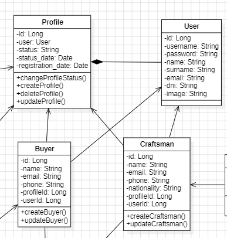

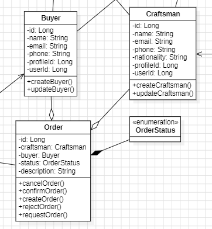

### 4.7.2. Class Dictionary

<table>
  <tr>
    <th colspan="1">#</th>
    <th colspan="2">Entidad</th>
    <th colspan="2">Nombre de atributos</th>
    <th colspan="4">Definición</th>
    <th colspan="2">Tipo de dato</th>
  </tr>
  <tr>
    <td rowspan="5" colspan="1">1</td>
    <td rowspan="5" colspan="2">User</td>
    <td colspan="2">username</td>
    <td colspan="4">es el nombre de usuario</td>
    <td colspan="2">string</td>
    <tr>
      <td colspan="2">password</td>
      <td colspan="4">es la contraseña del usuario</td>
      <td colspan="2">string</td>
    </tr>
    <tr>
      <td colspan="2">role</td>
      <td colspan="4">es el rol del usuario</td>
      <td colspan="2">string</td>
    </tr>
    <tr>
      <td colspan="2"></td>
      <td colspan="4"></td>
      <td colspan="2"></td>
    </tr>
    <tr>
      <td colspan="2"></td>
      <td colspan="4"></td>
      <td colspan="2"></td>
    </tr>
  </tr>
  <tr>
    <td rowspan="5" colspan="1">2</td>
    <td rowspan="5" colspan="2">Craftsman</td>
    <td colspan="2">name</td>
    <td colspan="4">nombre del artesano</td>
    <td colspan="2">string</td>
    <tr>
      <td colspan="2">email</td>
      <td colspan="4">email del artesano</td>
      <td colspan="2">string</td>
    </tr>
    <tr>
      <td colspan="2">phone</td>
      <td colspan="4">numero telefónico del artesano</td>
      <td colspan="2">string</td>
    </tr>
    <tr>
      <td colspan="2">address</td>
      <td colspan="4">direccion del taller del artesano</td>
      <td colspan="2">string</td>
    </tr>
    <tr>
      <td colspan="2">workshop</td>
      <td colspan="4">nombre del taller del artesano</td>
      <td colspan="2">string</td>
    </tr>
  </tr>
  <tr>
    <td rowspan="4" colspan="1">3</td>
    <td rowspan="4" colspan="2">Material</td>
    <td colspan="2">name</td>
    <td colspan="4">nombre del material</td>
    <td colspan="2">string</td>
    <tr>
      <td colspan="2">description</td>
      <td colspan="4">descripción del material</td>
      <td colspan="2">string</td>
    </tr>
    <tr>
      <td colspan="2">stock</td>
      <td colspan="4">cantidad disponible del material</td>
      <td colspan="2">int</td>
    </tr>
    <tr>
      <td colspan="2">type</td>
      <td colspan="4">tipo material</td>
      <td colspan="2">string</td>
    </tr>
  </tr>
  <tr>
    <td rowspan="2" colspan="1"></td>
    <td rowspan="2" colspan="2"></td>
    <td colspan="2"></td>
    <td colspan="4"></td>
    <td colspan="2"></td>
    <tr>
      <td colspan="2"></td>
      <td colspan="4"></td>
      <td colspan="2"></td>
    </tr>
  </tr>
  <tr>
    <td rowspan="3" colspan="1"></td>
    <td rowspan="3" colspan="2"></td>
    <td colspan="2"></td>
    <td colspan="4"></td>
    <td colspan="2"></td>
    <tr>
      <td colspan="2"></td>
      <td colspan="4"></td>
      <td colspan="2"></td>
    </tr>
    <tr>
      <td colspan="2"></td>
      <td colspan="4"></td>
      <td colspan="2"></td>
    </tr>
  </tr>
  <tr>
    <td rowspan="5" colspan="1"></td>
    <td rowspan="5" colspan="2"></td>
    <td colspan="2"></td>
    <td colspan="4"></td>
    <td colspan="2"></td>
    <tr>
      <td colspan="2"></td>
      <td colspan="4"></td>
      <td colspan="2"></td>
    </tr>
    <tr>
      <td colspan="2"></td>
      <td colspan="4"></td>
      <td colspan="2"></td>
    </tr>
    <tr>
      <td colspan="2"></td>
      <td colspan="4"></td>
      <td colspan="2"></td>
    </tr> 
    <tr>
      <td colspan="2"></td>
      <td colspan="4"></td>
      <td colspan="2"></td>
    </tr>
  </tr>
  <tr>
    <td rowspan="3" colspan="1"></td>
    <td rowspan="3" colspan="2"></td>
    <td colspan="2"></td>
    <td colspan="4"></td>
    <td colspan="2"></td>
    <tr>
      <td colspan="2"></td>
      <td colspan="4"></td>
      <td colspan="2"></td>
    </tr>
    <tr>
      <td colspan="2"></td>
      <td colspan="4"></td>
      <td colspan="2"></td>
    </tr>
  </tr>
  <tr>
    <td rowspan="3" colspan="1"></td>
    <td rowspan="3" colspan="2"></td>
    <td colspan="2"></td>
    <td colspan="4"></td>
    <td colspan="2"></td>
    <tr>
      <td colspan="2"></td>
      <td colspan="4"></td>
      <td colspan="2"></td>
    </tr>
    <tr>
      <td colspan="2"></td>
      <td colspan="4"></td>
      <td colspan="2"></td>
    </tr>
  </tr>
  <tr>
    <td rowspan="5" colspan="1"></td>
    <td rowspan="5" colspan="2"></td>
    <td colspan="2"></td>
    <td colspan="4"></td>
    <td colspan="2"></td>
    <tr>
      <td colspan="2"></td>
      <td colspan="4"></td>
      <td colspan="2"></td>
    </tr>
    <tr>
      <td colspan="2"></td>
      <td colspan="4"></td>
      <td colspan="2"></td>
    </tr>
    <tr>
      <td colspan="2"></td>
      <td colspan="4"></td>
      <td colspan="2"></td>
    </tr>
    <tr>
      <td colspan="2"></td>
      <td colspan="4"></td>
      <td colspan="2"></td>
    </tr>
  </tr>
  <tr>
    <td rowspan="3" colspan="1"></td>
    <td rowspan="3" colspan="2"></td>
    <td colspan="2"></td>
    <td colspan="4"></td>
    <td colspan="2"></td>
    <tr>
      <td colspan="2"></td>
      <td colspan="4"></td>
      <td colspan="2"></td>
    </tr>
    <tr>
      <td colspan="2"></td>
      <td colspan="4"></td>
      <td colspan="2"></td>
    </tr>
  </tr>
</table>

## 4.8. Database Design

### 4.8.1. Database Diagram

