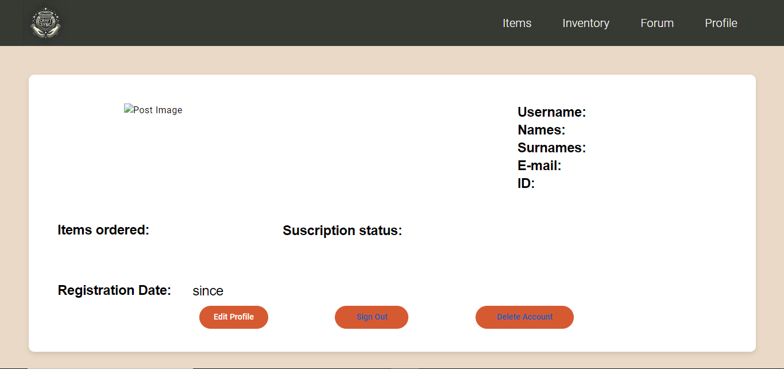
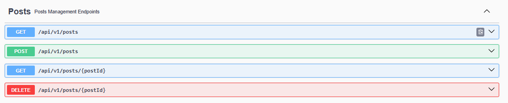
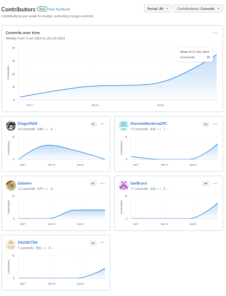
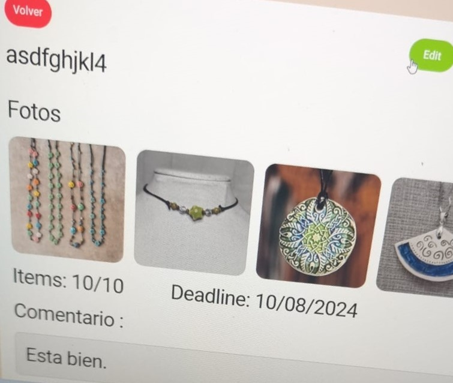
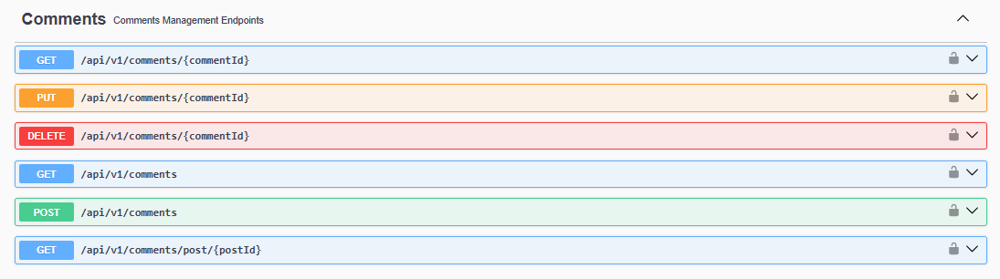

# Capítulo V: Product Implementation, Validation & Deployment

## 5.1. Software Configuration Management

En esta sección como equipo establecimos las decisiones y convenciones que nos permitirán mantener la consistencia durante el ciclo de vida.

### 5.1.1. Software Development Environment Configuration

En la siguiente sección se describe la ruta de referencia de cada uno de los productos de software para que cualquier miembro del equipo pueda desarrollar cada punto del trabajo.

- **UXPressia:** Plataforma que nos permitirá crear los user stories y también realizar múltiples mapas para evaluar sus prioridades. Además, ofrece opciones gráficas para mejorar el aspecto de nuestro trabajo. Puedes acceder a la plataforma en el siguiente enlace: [UXPressia](https://www.uxpressia.com/)
- **Figma:** Herramienta colaborativa que nos permitirá desarrollar los respectivos Wireframes y Mockups de nuestra Landing Page. Se puede acceder a la plataforma en el siguiente enlace: [Figma](https://www.figma.com/).
- **Vertabelo:** Plataforma que nos permitirá crear nuestro Diagrama de Base de Datos. Se puede acceder a la plataforma en el siguiente enlace: [Vertabelo](https://www.vertabelo.com/).
- **LucidChart:** Aplicación web destinada a la elaboración de Wireflows, Lean UX Canvas, User Flows y Diagramas de clases. Se puede acceder a la plataforma en el siguiente enlace: [LucidChart](https://www.lucidchart.com/).
- **GitHub:** Repositorio colaborativo en la nube utilizado para almacenar los avances de nuestro proyecto. Se puede acceder a la plataforma en el siguiente enlace: [Github](https://github.com/).
- **Visual Studio Code:** Entorno de desarrollo utilizado por nuestro equipo para el desarrollo del proyecto en general, incluido el Informe. Se puede acceder a la plataforma en el siguiente enlace: [Visual Studio Code](https://code.visualstudio.com/).
- **GitHub Pages:** Plataforma que permite hacer deployments sencillos y rápidos para nuestras páginas web. Se puede acceder a la plataforma en el siguiente enlace: [Github Pages](https://pages.github.com/).
- **Netlify:** Plataforma que permite hacer deployments de páginas web, y otros servicios relacionados. Se puede acceder a la plataforma en el siguiente enlace: [Netlify](https://www.netlify.com/)

- **HTML5:** Lenguaje para la elaboración de nuestra página web.
- **CSS3:** Tecnología para darle estilos a nuestra página web.
- **JavaScript:** Lenguaje de programación orientado a objetos que nos sirvió para implementar funcionalidades en nuestra Landing Page.
- **TypeScript:** Lenguaje de programación que nos sirvió durante la elaboración del Frontend.

### 5.1.2. Source Code Management

Para gestionar las modificaciones en nuestro proyecto, emplearemos GitHub como plataforma y sistema de control de versiones. A continuación, se detallan los repositorios de GitHub para cada uno de nuestros productos:

- Organización del Equipo: https://github.com/Open-Source-The-Project-Chow
- Repositorio del Informe: https://github.com/Open-Source-The-Project-Chow/Informe-Final
- Repositorio del Landing Page: https://github.com/Open-Source-The-Project-Chow/Landing-page
- Enlace del Landing Page: https://open-source-the-project-chow.github.io/Landing-page/
- Repositorio del Frontend: https://github.com/Open-Source-The-Project-Chow/tpc-front-end
- Enlace del Frontend: https://develop--tpc-front-end-app.netlify.app/
- Enlace del Fake API: https://github.com/Open-Source-The-Project-Chow/fake-api
- Repositorio del Backend: https://github.com/Open-Source-The-Project-Chow/tpc-back-end

Para estructurar nuestro control de versiones, implementaremos el modelo GitFlow como nuestro flujo de trabajo estándar. Este modelo se basa en dos ramas principales: main (rama principal) y develop (rama de desarrollo), y varias ramas auxiliares, incluyendo feature, release, y hotfix, cada una con un propósito específico:

#### Ramas Principales:

- Main Branch (Rama Principal): Esta rama contiene siempre el código en producción, es decir, el código que ha sido liberado y que es estable. No se realizan cambios directos en esta rama, excepto para la integración de release branches o hotfix branches.

- Develop Branch (Rama de Desarrollo): Esta rama sirve como base para el desarrollo continuo. Aquí se integran los cambios provenientes de las feature branches. La rama develop contiene la última versión del código con nuevas funcionalidades que aún no han sido liberadas.

- Release Branches: Antes de lanzar una nueva versión, crearemos una rama de release para realizar pruebas finales y correcciones.
- Hotfix Branches: En caso de surgir problemas en el desarrollo, se crearán branches de hotfix para poder solucionarlos sin afectar la rama principal.

#### Ramas Auxiliares:

- Feature Branches: Estas ramas se utilizan para desarrollar nuevas funcionalidades o mejoras específicas. Cada funcionalidad se desarrolla en su propia rama, que se deriva de develop y se fusiona de nuevo en develop una vez que la funcionalidad ha sido completada y probada.

- Release Branches: Estas ramas se utilizan para preparar una nueva versión de producción. Una vez que develop ha alcanzado un estado estable, se crea una release branch para realizar ajustes finales y pruebas antes de fusionarla en main.

- Hotfix Branches: Estas ramas se utilizan para corregir rápidamente problemas en producción. Se derivan de main y, una vez corregido el problema, se fusionan tanto en main como en develop para asegurar que la corrección se mantenga en el desarrollo futuro.

Además, los mensajes de commit seguirán el formato de Conventional Commits, que estandariza los mensajes para que sean claros y útiles. Este formato sigue la estructura:

tipo(<área opcional>): <descripción>

Ejemplos de tipos comunes:

- feat: para nuevas funcionalidades.
- fix: para corrección de errores.
- docs: para cambios en la documentación.
- style: para cambios que no afectan la lógica del código (espacios, formateo, etc.).

### 5.1.3. Source Code Style Guide & Conventions

A continuación, se detallan las referencias y convenciones que adoptaremos para programar en los diferentes lenguajes utilizados en nuestro proyecto:

Utilizaremos las siguientes referencias para establecer nuestras convenciones.
1. **HTML**:
- "HTML Style Guide and Coding Conventions"
- "Google HTML/CSS Style Guide"

2. **CSS**:
- "Google HTML/CSS Style Guide"

3. **JavaScript**:
- "Google JavaScript Style Guide"
- "MDN JavaScript guidelines"
- "W3C JavaScript Style Guide"
- "Angular coding style guide".

4. **Gherkin**:
- "Gherkin Conventions for Readable Specifications".

Es importante destacar que todas las convenciones y referencias mencionadas están en inglés, siguiendo las prácticas comunes en el desarrollo de software. De tal modo que, al seguir estas referencias nos ayudará a mantener un código claro, coherente y fácilmente comprensible para todo el equipo de desarrollo.

### 5.1.4. Software Deployment Configuration

Para desplegar nuestra landing page en la plataforma de GitHub, seguimos los siguientes pasos:

1. Creación del Repositorio Remoto en GitHub:

- Creamos un nuevo repositorio en GitHub de nuestro proyecto, el cual se utilizará para el desarrollo y deployment.

2. Inicialización del Repositorio:

- Se utilza el comando "*git init*" para inicializar el repositorio.

3. Subida de Archivos al Repositorio Remoto:

- Añadimos los archivos de nuestra landing page al repositorio local.
- Subimos los archivos al repositorio de GitHub con el comando "*git push -u origin master*" o sino utilizando Github Desktop.

4. Configuración de GitHub Pages:

- Accedemos a la sección de configuración del repositorio en GitHub y entramos a la sección de Github Pages.

- Seleccionamos la rama de GitHub Pages (main) como fuente para el deployment de nuestra Landing Page

5. Despliegue:

- Accedemos a la URL proporcionada por GitHub Pages para verificar que nuestra landing page se haya desplegado correctamente.

De tal modo, nuestra Landing Page estará inicializada utilizando Github Pages y podrá ser visible para cualquier usuario que tenga el enlace.

Enlace del Landing Page: https://open-source-the-project-chow.github.io/Landing-page/

## 5.2. Landing Page, Services & Applications Implementation

En esta sección se explicará y evidenciará el proceso de implementación, pruebas,
documentación y despliegue del Landing Page.

### 5.2.1. Sprint 1

### 5.2.1.1. Sprint Planning 1

Para este primer sprint nos enfocaremos en los tasks para la
elaboración del Landing Page. Nos dividiremos entre nosotros cada
una de las tareas identificadas para el sprint.
<table>
<tr>
    <th colspan="5">Sprint #</th>
    <th colspan="9">Sprint 1</th>
  </tr>
      <tr>
    <td colspan="13">Sprint Planning Background</td>
  </tr>
  <tr>
    <td colspan="5">Date</td>
    <td colspan="8">2024-08-25</td>
</tr>
  <tr>
    <td colspan="5">Time</td>
    <td colspan="8">10:38 PM</td>
  </tr>
  <tr>
    <td colspan="5">Location</td>
    <td colspan="8">Via Discord y Google Meet</td>
<tr>
    <td colspan="5">Prepared By</td>
    <td colspan="8">Gabriel Garcia</td>
</tr>
<tr>
    <td colspan="5">Attendees (to planning meeting)</td>
    <td colspan="8">Gabriel Garcia, Diego Flores, Salvador Chamorro, Héctor Rentería, Bryan Espejo</td>
</tr>
<tr>
    <td colspan="5">Sprint n – 1 Review Summary</td>
    <td colspan="8">En esta seccion se planteo el desarrollo del landing page para nuestro proyecto llamado CraftSync</td>
</tr>
<tr>
    <td colspan="5">Sprint n – 1 Retrospective Summary</td>
    <td colspan="8">En esta seccion todos los integrantes mencionaron tener aciertos en partes del codigo y en otras partes poder mejorar sus habilidades realizando landing pages</td>
</tr>
<tr>
    <td colspan="13">Sprint Goal & User Stories</td>
</tr>
<tr>
    <td colspan="5">Sprint n Goal</td>
    <td colspan="8">Nuestro enfoque está en completar el diseño del Landing Page, mostrando información de los creadores, sus formas de contacto, los servicios, los planes y el producto. Creemos que brinda una mejor experiencia de usuario a los visitantes del Landing Page, que verán la información del producto para interesarse en su futura plataforma. Esto se confirmará cuando la Landing Page esté desplegada y se muestre todo satisfactoriamente.</td>
</tr>
<tr>
    <td colspan="5">Sprint n Velocity</td>
    <td colspan="8">5 story points</td>
</tr>
<tr>
    <td colspan="5">Sum of Story Points</td>
    <td colspan="8">6 Story Points</td>
</tr>
</table>

### 5.2.1.2. Sprint Backlog 1

El enlace a la herramienta de gestión es este:
https://trello.com/b/A7Pbd0Sc/the-project-chow-202402-wx64-sprint-backlog

<table>
<tr>
    <th colspan="3">Sprint #</th>
    <th colspan="10">Sprint 1</th>
  </tr>
      <tr>
    <td colspan="3">User Story</td>
    <td colspan="10">Work-Item/Task</td>
  </tr>
  <tr>
    <td colspan="1">Id</td>
    <td colspan="2">Title</td>
    <td colspan="1">Id</td>
    <td colspan="2">Title</td>
    <td colspan="3">Description</td>
    <td colspan="1"> Estimation</td>
    <td colspan="2">Assigned To</td>
    <td colspan="1">Status(To-do /InProcess /To-Review /Done)</td>
</tr>
  <tr>
    <td colspan="1">US01</td>
    <td colspan="2">Sección About Us</td>
    <td colspan="1">T01</td>
    <td colspan="2">Añadir sección About Us en el Landing Page</td>
    <td colspan="3">Yo, como distribuidor visitante del Landing Page, quiero una sección About Us para informarme sobre la empresa y sus detalles.</td>
    <td colspan="1">1</td>
    <td colspan="2">Diego</td>
    <td colspan="1">Done</td>
  </tr>
  <tr>
    <td colspan="1">US25</td>
    <td colspan="2">Visualización de los servicios disponibles</td>
    <td colspan="1">T01</td>
    <td colspan="2">Añadir sección Services en el Landing Page</td>
    <td colspan="3">Como Artesano/Distribuidor visitante del Landing page de CraftSync, quiero una sección “Services” para informarme sobre los servicios que ofrece la plataforma.</td>
    <td colspan="1">1</td>
    <td colspan="2">Salvador</td>
    <td colspan="1">Done</td>
<tr>
    <td colspan="1">US24</td>
    <td colspan="2">Visualización de lista de tipos de suscripción</td>
    <td colspan="1">T01</td>
    <td colspan="2">Añadir sección Plans en el Landing Page</td>
    <td colspan="3">Como Artesano/Distribuidor visitante del Landing page de CraftSync, quiero visitar la lista de tipos de suscripción para seleccionar alguno.</td>
    <td colspan="1">1</td>
    <td colspan="2">Marcelo</td>
    <td colspan="1">Done</td>
</tr>
<tr>
    <td colspan="1">US23</td>
    <td colspan="2">Visualización de la sección Contact Us</td>
    <td colspan="1">T01</td>
    <td colspan="2">Añadir sección Contact Us al Landing Page</td>
    <td colspan="3">Como Artesano/Distribuidor visitante del Landing page de CraftSync, quiero una sección “Contact us” para solicitar información acerca de la plataforma</td>
    <td colspan="1">1</td>
    <td colspan="2">Gabriel</td>
    <td colspan="1">Done</td>
</tr>
<tr>
    <td colspan="1">US22</td>
    <td colspan="2">Visualización de los desarrolladores</td>
    <td colspan="1">T01</td>
    <td colspan="2">Añadir sección Creators al Landing Page</td>
    <td colspan="3">Como Artesano/Distribuidor visitante del Landing page de CraftSync, quiero una sección “Creadores” para informarme sobre los desarrolladores de la plataforma.</td>
    <td colspan="1">1</td>
    <td colspan="2">Bryan</td>
    <td colspan="1">Done</td>
</tr>
<tr>
    <td colspan="1">US02</td>
    <td colspan="2">Selector de Idioma</td>
    <td colspan="1">T01</td>
    <td colspan="2">Añadir un botón que cambie el idioma del texto mostrado</td>
    <td colspan="3">Yo, como distribuidor visitante del Landing Page, quiero un selector de idioma para leer el contenido en mi idioma de preferencia.</td>
    <td colspan="1">1</td>
    <td colspan="2">Marcelo</td>
    <td colspan="1">InProcess</td>
</tr>
</table>

### 5.2.1.3. Development Evidence for Sprint Review

<table>
    <tr>
        <th colspan="2">Repository</th>
        <th colspan="2">Branch</th>
        <th colspan="2">Commit Id</th>
        <th colspan="2">Commit Message</th>
        <th colspan="2">Commit Message Body</th>
        <th colspan="2">Commited on (Date)</th>
    </tr>
        <tr>
        <td colspan="2">Open-Source-The-Project-Chow/Landing-page</td>
        <td colspan="2">Main</td>
        <td colspan="2">f5d9fcc58f6fd2d8427bdba752fd785f6320917c</td>
        <td colspan="2">Initial commit</td>
        <td colspan="2">-</td>
        <td colspan="2">25/08/2024</td>
    </tr>
        <tr>
        <td colspan="2">Open-Source-The-Project-Chow/Landing-page</td>
        <td colspan="2">Main</td>
        <td colspan="2">b7b42a92091922d250317487e5a217839520b21b</td>
        <td colspan="2">feat: added contact us section.</td>
        <td colspan="2">-</td>
        <td colspan="2">02/09/2024</td>
    </tr>
     <tr>
        <td colspan="2">Open-Source-The-Project-Chow/Landing-page</td>
        <td colspan="2">Main</td>
        <td colspan="2">c4d528fcb2b49e0139ee2c102ca42c6ed43ff6de</td>
        <td colspan="2">feat: added contact us section styles.</td>
        <td colspan="2">-</td>
        <td colspan="2">02/09/2024</td>
    </tr>
    <tr>
        <td colspan="2">Open-Source-The-Project-Chow/Landing-page</td>
        <td colspan="2">Main</td>
        <td colspan="2">f03d4381e72b5b5e63ca81f27092c64ac0ddec8e</td>
        <td colspan="2">feat(header): added navbar.</td>
        <td colspan="2">-</td>
        <td colspan="2">03/09/2024</td>
    </tr>
    <tr>
        <td colspan="2">Open-Source-The-Project-Chow/Landing-page</td>
        <td colspan="2">Main</td>
        <td colspan="2">be8e8eda97562ec0d04fed20d8b6fe4ed9e396a1</td>
        <td colspan="2">feat(header): added javascript function for the menu.</td>
        <td colspan="2">-</td>
        <td colspan="2">03/09/2024</td>
    </tr>
    <tr>
        <td colspan="2">Open-Source-The-Project-Chow/Landing-page</td>
        <td colspan="2">Main</td>
        <td colspan="2">5b06567cb71a165535b3a7345a5668f4d9ff10c9</td>
        <td colspan="2">faet(header): added background image and logo.</td>
        <td colspan="2">-</td>
        <td colspan="2">03/09/2024</td>
    </tr>
    <tr>
        <td colspan="2">Open-Source-The-Project-Chow/Landing-page</td>
        <td colspan="2">Main</td>
        <td colspan="2">7d0f7d76293d10f9daa4a95e791fa06544714cd2</td>
        <td colspan="2">feat(plans): Added Plans section index.</td>
        <td colspan="2">-</td>
        <td colspan="2">04/09/2024</td>
    </tr>
    <tr>
        <td colspan="2">Open-Source-The-Project-Chow/Landing-page</td>
        <td colspan="2">Main</td>
        <td colspan="2">b217183d00b244b72869bee16853fe1ba8d2f48f</td>
        <td colspan="2">feat(plans): Added Plans section styles.</td>
        <td colspan="2">-</td>
        <td colspan="2">04/09/2024</td>
    </tr>
    <tr>
        <td colspan="2">Open-Source-The-Project-Chow/Landing-page</td>
        <td colspan="2">Main</td>
        <td colspan="2">77672962d0d4d5825b6adcfb5fe5362b2620c7e1</td>
        <td colspan="2">feat(services): Added services section</td>
        <td colspan="2">-</td>
        <td colspan="2">04/09/2024</td>
    </tr>
    <tr>
        <td colspan="2">Open-Source-The-Project-Chow/Landing-page</td>
        <td colspan="2">Main</td>
        <td colspan="2">7d4fb5e6d73ba415a58159c94196f6f8a9d64a3c</td>
        <td colspan="2">feat(services): Added services section styles</td>
        <td colspan="2">-</td>
        <td colspan="2">04/09/2024</td>
    </tr>
    <tr>
        <td colspan="2">Open-Source-The-Project-Chow/Landing-page</td>
        <td colspan="2">Main</td>
        <td colspan="2">b22e13a9389f6db6a1753d2d69d3a98f695bcf98</td>
        <td colspan="2">feat(services):added images</td>
        <td colspan="2">-</td>
        <td colspan="2">04/09/2024</td>
    </tr>
    <tr>
        <td colspan="2">Open-Source-The-Project-Chow/Landing-page</td>
        <td colspan="2">Main</td>
        <td colspan="2">0669b4ce80e7f6593c6729f24fbd46459a74e0cc</td>
        <td colspan="2">feat: added section index and styels</td>
        <td colspan="2">-</td>
        <td colspan="2">04/09/2024</td>
    </tr>
    <tr>
        <td colspan="2">Open-Source-The-Project-Chow/Landing-page</td>
        <td colspan="2">Main</td>
        <td colspan="2">1eeb8e46faac2db4b075e2313327fdd02a112eca</td>
        <td colspan="2">fix: fixed little mistakes.</td>
        <td colspan="2">-</td>
        <td colspan="2">05/09/2024</td>
    </tr>
    <tr>
        <td colspan="2">Open-Source-The-Project-Chow/Landing-page</td>
        <td colspan="2">Main</td>
        <td colspan="2">c9a095f5d0fb73dfc77705c65b51dab1db795b63</td>
        <td colspan="2">feat: added footer section.</td>
        <td colspan="2">-</td>
        <td colspan="2">05/09/2024</td>
    </tr>
    <tr>
        <td colspan="2">Open-Source-The-Project-Chow/Landing-page</td>
        <td colspan="2">Main</td>
        <td colspan="2">f203b4c4f5b0ad52cd0e475eb64753bca289c656</td>
        <td colspan="2">feat: added footer styles.</td>
        <td colspan="2">-</td>
        <td colspan="2">05/09/2024</td>
    </tr>
    <tr>
        <td colspan="2">Open-Source-The-Project-Chow/Landing-page</td>
        <td colspan="2">Main</td>
        <td colspan="2">9e3782330ac3a7a08dd2c3b4e2c85e9435f42712</td>
        <td colspan="2">fix: fixed mistake points.</td>
        <td colspan="2">-</td>
        <td colspan="2">05/09/2024</td>
    </tr>
    <tr>
        <td colspan="2">Open-Source-The-Project-Chow/Landing-page</td>
        <td colspan="2">Main</td>
        <td colspan="2">358ac140118a051d77bf0e8d42b5bfdec54233b7</td>
        <td colspan="2">fix: fixed bad calling to image.</td>
        <td colspan="2">-</td>
        <td colspan="2">05/09/2024</td>
    </tr>
</table>

### 5.2.1.4. Testing Suite Evidence for Sprint Review

En este sprint, no se desarrollaron Web Services, por lo que no hubo ningpun Unit Testing relacionado a estos.

### 5.2.1.5. Execution Evidence for Sprint Review

Para esta primera entrega, nuestro equipo a conseguido elaborar la Landing Page del proyecto "CraftSync". De tal modo, se podrá visualizar la información necesaria de lo que ofrece nuestro proyecto.

**Sección de Inicio**: Se implementó el Header y About Us de nuestra Landing Page.

**Sección de Servicios**: Se implementó la sección de los servicios ofrecidos.

**Sección de Planes**: Se implementó la sección de ver los tipos de suscripción.

**Sección de Contacto**:  la sección de contacto para facilitar la comunicación con los usuarios.

**Sección de Creadores**: Se agregaron secciones de información sobre los creadores del proyecto

**Sección de Footer**: Se añadió un footer para la navegación y contacto.

### 5.2.1.6. Services Documentation Evidence for Sprint Review

### 5.2.1.7. Software Deployment Evidence for Sprint Review

Para el despliegue del Landing Page, hemos utilizado la herramienta de Github Pages para poder hacer un deployment. Para eso, hemos creado un repositorio donde hemos colocado el código de desarrollo de nuestra Landing Page.

Una vez creado el repositorio, entraremos a configuración del repositorio y escogemos el apartado de Pages. Se coloca la información necesaria, como la fuente del branch a utilizar para realizar el deployment. Luego de eso, Github Pages nos brindará el link y desplegará nuestra landing page en la Web.

### 5.2.1.8. Team Collaboration Insights during Sprint

Para el desarrollo de este primer sprint, todos los miembros del equipo desarrollaron y colaboraron de manera activa y continua. De tal modo, se muestra como evidencia los insights de cada miembro del equipo.

Commits:

Analiticas de Colaboración:

### 5.2.2. Sprint 2

### 5.2.2.1. Sprint Planning 2

Para este segundo sprint nos enfocaremos en los tasks para la
primera versión del Frontend Web Application. Nos dividiremos entre nosotros cada
una de las tareas identificadas para el sprint.
<table>
<tr>
    <th colspan="5">Sprint #</th>
    <th colspan="9">Sprint 2</th>
  </tr>
      <tr>
    <td colspan="13">Sprint Planning Background</td>
  </tr>
  <tr>
    <td colspan="5">Date</td>
    <td colspan="8">2024-09-15</td>
</tr>
  <tr>
    <td colspan="5">Time</td>
    <td colspan="8">03:42 PM</td>
  </tr>
  <tr>
    <td colspan="5">Location</td>
    <td colspan="8">Via Discord</td>
<tr>
    <td colspan="5">Prepared By</td>
    <td colspan="8">Marcelo Rentería</td>
</tr>
<tr>
    <td colspan="5">Attendees (to planning meeting)</td>
    <td colspan="8">Gabriel Garcia, Diego Flores, Salvador Chamorro, Marcelo Rentería, Bryan Espejo</td>
</tr>
<tr>
    <td colspan="5">Sprint n – 2 Review Summary</td>
    <td colspan="8">En esta seccion se planteó el desarrollo inicial del Frontend Web App para nuestro proyecto llamado CraftSync</td>
</tr>
<tr>
    <td colspan="5">Sprint n – 2 Retrospective Summary</td>
    <td colspan="8">En esta seccion todos los integrantes mencionaron tener aciertos en partes del codigo, aunque no se lograron a implementar todas las funcionalidades necesarias.</td>
</tr>
<tr>
    <td colspan="13">Sprint Goal & User Stories</td>
</tr>
<tr>
    <td colspan="5">Sprint n Goal</td>
    <td colspan="8">Nuestro enfoque está en completar la integración y mejora del Landing Page con el Frontend, y la implementación en este último de funcionalidades de perfil, pedidos, inventario, y foro. Creemos que brinda una mejor experiencia de usuario a los visitantes del Landing Page, que se volverán artesanos y compradores que verán la primera versión del Frontend, mostrando el atractivo de swus funciones principales. Esto se confirmará cuando la Landing Page muestre el Call-to-Action para la conexión con el Frontend, el cual esté desarrollado al 45%, y funcione con datos de un Fake API.</td>
</tr>
<tr>
    <td colspan="5">Sprint n Velocity</td>
    <td colspan="8">15 story points</td>
</tr>
<tr>
    <td colspan="5">Sum of Story Points</td>
    <td colspan="8">23 Story Points</td>
</tr>
</table>

### 5.2.2.2. Sprint Backlog 2

El enlace a la herramienta de gestión es este:
https://trello.com/b/zfLCmdBw/the-project-chow-202402-wx64-sprint-backlog-2 

<table>
<tr>
    <th colspan="3">Sprint #</th>
    <th colspan="10">Sprint 1</th>
  </tr>
      <tr>
    <td colspan="3">User Story</td>
    <td colspan="10">Work-Item/Task</td>
  </tr>
  <tr>
    <td colspan="1">Id</td>
    <td colspan="2">Title</td>
    <td colspan="1">Id</td>
    <td colspan="2">Title</td>
    <td colspan="3">Description</td>
    <td colspan="1"> Estimation</td>
    <td colspan="2">Assigned To</td>
    <td colspan="1">Status(To-do /InProcess /To-Review /Done)</td>
</tr>
  <tr>
    <td colspan="1">US27</td>
    <td colspan="2">Visualización de Pedidos</td>
    <td colspan="1">T01</td>
    <td colspan="2">Crear entidad de Pedidos</td>
    <td colspan="3">Yo, como desarrollador, quiero una entidad de Pedidos para relacionarla con las funciones del Frontend.</td>
    <td colspan="1">1</td>
    <td colspan="2">Bryan</td>
    <td colspan="1">Done</td>
  </tr>
<tr>
    <td colspan="1"></td>
    <td colspan="2"></td>
    <td colspan="1">T02</td>
    <td colspan="2">Crear servicio de Pedidos</td>
    <td colspan="3">Yo, como desarrollador, quiero un servicio de Pedidos para conectar con el Fake-API.</td>
    <td colspan="1">1</td>
    <td colspan="2">Bryan</td>
    <td colspan="1">Done</td>
  </tr>
<tr>
    <td colspan="1"></td>
    <td colspan="2"></td>
    <td colspan="1">T03</td>
    <td colspan="2">Crear componente de Lista de Pedidos</td>
    <td colspan="3">Yo, como desarrollador, quiero un componente de lista de Pedidos para implementar el comportamiento de esta.</td>
    <td colspan="1">3</td>
    <td colspan="2">Bryan</td>
    <td colspan="1">Done</td>
  </tr>
<tr>
    <td colspan="1"></td>
    <td colspan="2"></td>
    <td colspan="1">T04</td>
    <td colspan="2">Diseñar página de Pedidos</td>
    <td colspan="3">Yo, como artesano, quiero una página de Pedidos para ver los Pedidos asignados.</td>
    <td colspan="1">5</td>
    <td colspan="2">Bryan</td>
    <td colspan="1">Done</td>
  </tr>
<tr>
    <td colspan="1"></td>
    <td colspan="2"></td>
    <td colspan="1">T05</td>
    <td colspan="2">Conectar Fake API</td>
    <td colspan="3">Yo, como desarrollador, quiero conectar el Frontend con el Fake API, para comprobar las acciones CRUD.</td>
    <td colspan="1">3</td>
    <td colspan="2">Bryan</td>
    <td colspan="1">To-Do</td>
  </tr>
<tr>
    <td colspan="1"></td>
    <td colspan="2"></td>
    <td colspan="1">T06</td>
    <td colspan="2">Conectar enrutamiento</td>
    <td colspan="3">Yo, como desarrollador, quiero conectar el routerlink con la página de lista de pedidos, para hacerla accesible.</td>
    <td colspan="1">1</td>
    <td colspan="2">Bryan</td>
    <td colspan="1">Done</td>
  </tr>
  <tr>
    <td colspan="1">US05</td>
    <td colspan="2">Actualizar Progreso</td>
    <td colspan="1">T01</td>
    <td colspan="2">Crear entidad de Pedidos</td>
    <td colspan="3">Yo, como desarrollador, quiero una entidad de Pedidos para relacionarla con las funciones del Frontend.</td>
    <td colspan="1">1</td>
    <td colspan="2">Bryan</td>
    <td colspan="1">Done</td>
  </tr>
<tr>
    <td colspan="1"></td>
    <td colspan="2"></td>
    <td colspan="1">T02</td>
    <td colspan="2">Crear servicio de Pedidos</td>
    <td colspan="3">Yo, como desarrollador, quiero un servicio de Pedidos para conectar con el Fake-API.</td>
    <td colspan="1">1</td>
    <td colspan="2">Bryan</td>
    <td colspan="1">Done</td>
  </tr>
<tr>
    <td colspan="1"></td>
    <td colspan="2"></td>
    <td colspan="1">T03</td>
    <td colspan="2">Crear componente de Pedido</td>
    <td colspan="3">Yo, como desarrollador, quiero un componente de Pedidos para implementar las funciones de interacción.</td>
    <td colspan="1">5</td>
    <td colspan="2">Bryan</td>
    <td colspan="1">Done</td>
  </tr>
<tr>
    <td colspan="1"></td>
    <td colspan="2"></td>
    <td colspan="1">T04</td>
    <td colspan="2">Diseñar página de Pedido</td>
    <td colspan="3">Yo, como artesano, quiero una página de un Pedido en particular para interactuar con él.</td>
    <td colspan="1">3</td>
    <td colspan="2">Bryan</td>
    <td colspan="1">InProcess</td>
  </tr>
<tr>
    <td colspan="1"></td>
    <td colspan="2"></td>
    <td colspan="1">T05</td>
    <td colspan="2">Conectar Fake API</td>
    <td colspan="3">Yo, como desarrollador, quiero conectar el Frontend con el Fake API, para comprobar las acciones CRUD.</td>
    <td colspan="1">3</td>
    <td colspan="2">Bryan</td>
    <td colspan="1">To-Do</td>
  </tr>
    <tr>
    <td colspan="1"></td>
    <td colspan="2"></td>
    <td colspan="1">T06</td>
    <td colspan="2">Conectar enrutamiento</td>
    <td colspan="3">Yo, como desarrollador, quiero conectar el routerlink con la página de pedido, para hacerla accesible.</td>
    <td colspan="1">1</td>
    <td colspan="2">Bryan</td>
    <td colspan="1">InProcess</td>
  </tr>
    <tr>
    <td colspan="1">US11</td>
    <td colspan="2">Visualización de la sección de inventarios</td>
    <td colspan="1">T01</td>
    <td colspan="2">Crear entidad de Materiales</td>
    <td colspan="3">Yo, como desarrollador, quiero una entidad de Materiales para relacionarla con las funciones del Frontend.</td>
    <td colspan="1">1</td>
    <td colspan="2">Diego</td>
    <td colspan="1">Done</td>
  </tr>
<tr>
    <td colspan="1"></td>
    <td colspan="2"></td>
    <td colspan="1">T02</td>
    <td colspan="2">Crear servicio de Materiales</td>
    <td colspan="3">Yo, como desarrollador, quiero un servicio de Materiales para conectar con el Fake-API.</td>
    <td colspan="1">1</td>
    <td colspan="2">Diego</td>
    <td colspan="1">Done</td>
  </tr>
<tr>
    <td colspan="1"></td>
    <td colspan="2"></td>
    <td colspan="1">T03</td>
    <td colspan="2">Crear componente de Materiales</td>
    <td colspan="3">Yo, como desarrollador, quiero un componente de Materiales para implementar su comportamiento.</td>
    <td colspan="1">3</td>
    <td colspan="2">Diego</td>
    <td colspan="1">Done</td>
  </tr>
<tr>
    <td colspan="1"></td>
    <td colspan="2"></td>
    <td colspan="1">T04</td>
    <td colspan="2">Diseñar página de Inventario</td>
    <td colspan="3">Yo, como artesano, quiero una página de Inventario para ver los Materiales.</td>
    <td colspan="1">3</td>
    <td colspan="2">Diego</td>
    <td colspan="1">Done</td>
  </tr>
<tr>
    <td colspan="1"></td>
    <td colspan="2"></td>
    <td colspan="1">T05</td>
    <td colspan="2">Conectar Fake API</td>
    <td colspan="3">Yo, como desarrollador, quiero conectar el Frontend con el Fake API, para comprobar las acciones CRUD.</td>
    <td colspan="1">3</td>
    <td colspan="2">Diego</td>
    <td colspan="1">Done</td>
  </tr>
    <tr>
    <td colspan="1"></td>
    <td colspan="2"></td>
    <td colspan="1">T06</td>
    <td colspan="2">Conectar enrutamiento</td>
    <td colspan="3">Yo, como desarrollador, quiero conectar el routerlink con la página de Inventario, para hacerla accesible.</td>
    <td colspan="1">1</td>
    <td colspan="2">Diego</td>
    <td colspan="1">Done</td>
  </tr>
    <tr>
    <td colspan="1">US12</td>
    <td colspan="2">Crear inventario</td>
    <td colspan="1">T01</td>
    <td colspan="2">Crear entidad de Inventario</td>
    <td colspan="3">Yo, como desarrollador, quiero una entidad de Inventario para relacionarla con las funciones del Frontend.</td>
    <td colspan="1">1</td>
    <td colspan="2">Diego</td>
    <td colspan="1">To-Do</td>
  </tr>
<tr>
    <td colspan="1"></td>
    <td colspan="2"></td>
    <td colspan="1">T02</td>
    <td colspan="2">Crear servicio de Inventario</td>
    <td colspan="3">Yo, como desarrollador, quiero un servicio de Inventario para conectar con el Fake-API.</td>
    <td colspan="1">1</td>
    <td colspan="2">Diego</td>
    <td colspan="1">To-Do</td>
  </tr>
<tr>
    <td colspan="1"></td>
    <td colspan="2"></td>
    <td colspan="1">T03</td>
    <td colspan="2">Crear componente de Inventario</td>
    <td colspan="3">Yo, como desarrollador, quiero un componente de Inventario para implementar su comportamiento.</td>
    <td colspan="1">3</td>
    <td colspan="2">Diego</td>
    <td colspan="1">InProcess</td>
  </tr>
<tr>
    <td colspan="1"></td>
    <td colspan="2"></td>
    <td colspan="1">T04</td>
    <td colspan="2">Diseñar página de Inventario</td>
    <td colspan="3">Yo, como artesano, quiero una página de Inventario para ver los Inventarios</td>
    <td colspan="1">3</td>
    <td colspan="2">Diego</td>
    <td colspan="1">Done</td>
  </tr>
<tr>
    <td colspan="1"></td>
    <td colspan="2"></td>
    <td colspan="1">T05</td>
    <td colspan="2">Conectar Fake API</td>
    <td colspan="3">Yo, como desarrollador, quiero conectar el Frontend con el Fake API, para comprobar las acciones CRUD.</td>
    <td colspan="1">3</td>
    <td colspan="2">Diego</td>
    <td colspan="1">To-Do</td>
  </tr>
    <tr>
    <td colspan="1"></td>
    <td colspan="2"></td>
    <td colspan="1">T06</td>
    <td colspan="2">Conectar enrutamiento</td>
    <td colspan="3">Yo, como desarrollador, quiero conectar el routerlink con la página de Inventario, para hacerla accesible.</td>
    <td colspan="1">1</td>
    <td colspan="2">Diego</td>
    <td colspan="1">Done</td>
  </tr>
    <tr>
    <td colspan="1">US17</td>
    <td colspan="2">Visualización de la sección de foro</td>
    <td colspan="1">T01</td>
    <td colspan="2">Crear entidad de Publicación</td>
    <td colspan="3">Yo, como desarrollador, quiero una entidad de Publicación para relacionarla con las funciones del Frontend.</td>
    <td colspan="1">1</td>
    <td colspan="2">Gabriel</td>
    <td colspan="1">Done</td>
  </tr>
<tr>
    <td colspan="1"></td>
    <td colspan="2"></td>
    <td colspan="1">T02</td>
    <td colspan="2">Crear servicio de Publicación</td>
    <td colspan="3">Yo, como desarrollador, quiero un servicio de Publicación para conectar con el Fake-API.</td>
    <td colspan="1">1</td>
    <td colspan="2">Gabriel</td>
    <td colspan="1">Done</td>
  </tr>
<tr>
    <td colspan="1"></td>
    <td colspan="2"></td>
    <td colspan="1">T03</td>
    <td colspan="2">Crear componente de Publicación</td>
    <td colspan="3">Yo, como desarrollador, quiero un componente de Publicación para implementar su comportamiento.</td>
    <td colspan="1">3</td>
    <td colspan="2">Gabriel</td>
    <td colspan="1">Done</td>
  </tr>
<tr>
    <td colspan="1"></td>
    <td colspan="2"></td>
    <td colspan="1">T04</td>
    <td colspan="2">Diseñar página de Publicación</td>
    <td colspan="3">Yo, como artesano, quiero una página de Publicación para ver las publicaciones</td>
    <td colspan="1">3</td>
    <td colspan="2">Gabriel</td>
    <td colspan="1">Done</td>
  </tr>
<tr>
    <td colspan="1"></td>
    <td colspan="2"></td>
    <td colspan="1">T05</td>
    <td colspan="2">Conectar Fake API</td>
    <td colspan="3">Yo, como desarrollador, quiero conectar el Frontend con el Fake API, para comprobar las acciones CRUD.</td>
    <td colspan="1">3</td>
    <td colspan="2">Gabriel</td>
    <td colspan="1">Done</td>
  </tr>
    <tr>
    <td colspan="1"></td>
    <td colspan="2"></td>
    <td colspan="1">T06</td>
    <td colspan="2">Conectar enrutamiento</td>
    <td colspan="3">Yo, como desarrollador, quiero conectar el routerlink con la página de Inventario, para hacerla accesible.</td>
    <td colspan="1">1</td>
    <td colspan="2">Gabriel</td>
    <td colspan="1">Done</td>
  </tr>
    <tr>
    <td colspan="1">US18</td>
    <td colspan="2">Crear publicación</td>
    <td colspan="1">T01</td>
    <td colspan="2">Crear entidad de Publicación</td>
    <td colspan="3">Yo, como desarrollador, quiero una entidad de Publicación para relacionarla con las funciones del Frontend.</td>
    <td colspan="1">1</td>
    <td colspan="2">Gabriel</td>
    <td colspan="1">Done</td>
  </tr>
<tr>
    <td colspan="1"></td>
    <td colspan="2"></td>
    <td colspan="1">T02</td>
    <td colspan="2">Crear servicio de Publicación</td>
    <td colspan="3">Yo, como desarrollador, quiero un servicio de Publicación para conectar con el Fake-API.</td>
    <td colspan="1">1</td>
    <td colspan="2">Gabriel</td>
    <td colspan="1">Done</td>
  </tr>
<tr>
    <td colspan="1"></td>
    <td colspan="2"></td>
    <td colspan="1">T03</td>
    <td colspan="2">Crear componente de Crear Publicación</td>
    <td colspan="3">Yo, como desarrollador, quiero un componente de Crear Publicación para implementar su comportamiento.</td>
    <td colspan="1">3</td>
    <td colspan="2">Gabriel</td>
    <td colspan="1">InProcess</td>
  </tr>
<tr>
    <td colspan="1"></td>
    <td colspan="2"></td>
    <td colspan="1">T04</td>
    <td colspan="2">Diseñar Diálogo de Crear Publicación</td>
    <td colspan="3">Yo, como artesano, quiero un diálogo de Crear Publicación para añadir una publicación.</td>
    <td colspan="1">3</td>
    <td colspan="2">Gabriel</td>
    <td colspan="1">Done</td>
  </tr>
<tr>
    <td colspan="1"></td>
    <td colspan="2"></td>
    <td colspan="1">T05</td>
    <td colspan="2">Conectar Fake API</td>
    <td colspan="3">Yo, como desarrollador, quiero conectar el Frontend con el Fake API, para comprobar las acciones CRUD.</td>
    <td colspan="1">3</td>
    <td colspan="2">Gabriel</td>
    <td colspan="1">To-Do</td>
  </tr>
    <tr>
    <td colspan="1"></td>
    <td colspan="2"></td>
    <td colspan="1">T06</td>
    <td colspan="2">Conectar enrutamiento</td>
    <td colspan="3">Yo, como desarrollador, quiero conectar el routerlink con la página de Inventario, para hacerla accesible.</td>
    <td colspan="1">1</td>
    <td colspan="2">Gabriel</td>
    <td colspan="1">Done</td>
  </tr>
    <tr>
    <td colspan="1">US06</td>
    <td colspan="2">Visualización de perfil de usuario propio.</td>
    <td colspan="1">T01</td>
    <td colspan="2">Crear entidad de Perfil</td>
    <td colspan="3">Yo, como desarrollador, quiero una entidad de Perfil para relacionarla con las funciones del Frontend.</td>
    <td colspan="1">1</td>
    <td colspan="2">Marcelo</td>
    <td colspan="1">Done</td>
  </tr>
<tr>
    <td colspan="1"></td>
    <td colspan="2"></td>
    <td colspan="1">T02</td>
    <td colspan="2">Crear servicio de Perfil</td>
    <td colspan="3">Yo, como desarrollador, quiero un servicio de Perfil para conectar con el Fake-API.</td>
    <td colspan="1">1</td>
    <td colspan="2">Marcelo</td>
    <td colspan="1">Done</td>
  </tr>
<tr>
    <td colspan="1"></td>
    <td colspan="2"></td>
    <td colspan="1">T03</td>
    <td colspan="2">Crear componente de Perfil</td>
    <td colspan="3">Yo, como desarrollador, quiero un componente de Perfil para implementar su comportamiento.</td>
    <td colspan="1">3</td>
    <td colspan="2">Marcelo</td>
    <td colspan="1">To-Review</td>
  </tr>
<tr>
    <td colspan="1"></td>
    <td colspan="2"></td>
    <td colspan="1">T04</td>
    <td colspan="2">Diseñar Página de Perfil</td>
    <td colspan="3">Yo, como artesano, quiero una página de Perfil para ver mi Perfil</td>
    <td colspan="1">3</td>
    <td colspan="2">Marcelo</td>
    <td colspan="1">Done</td>
  </tr>
<tr>
    <td colspan="1"></td>
    <td colspan="2"></td>
    <td colspan="1">T05</td>
    <td colspan="2">Conectar Fake API</td>
    <td colspan="3">Yo, como desarrollador, quiero conectar el Frontend con el Fake API, para comprobar las acciones CRUD.</td>
    <td colspan="1">3</td>
    <td colspan="2">Marcelo</td>
    <td colspan="1">InProcess</td>
  </tr>
    <tr>
    <td colspan="1"></td>
    <td colspan="2"></td>
    <td colspan="1">T06</td>
    <td colspan="2">Conectar enrutamiento</td>
    <td colspan="3">Yo, como desarrollador, quiero conectar el routerlink con la página de Inventario, para hacerla accesible.</td>
    <td colspan="1">1</td>
    <td colspan="2">Marcelo</td>
    <td colspan="1">Done</td>
  </tr>
    <tr>
    <td colspan="1">US26</td>
    <td colspan="2">Manejo de Distribución de Pedidos</td>
    <td colspan="1">T01</td>
    <td colspan="2">Crear entidad de Pedido</td>
    <td colspan="3">Yo, como desarrollador, quiero una entidad de Pedido para relacionarla con las funciones del Frontend.</td>
    <td colspan="1">1</td>
    <td colspan="2">Salvador</td>
    <td colspan="1">Done</td>
  </tr>
<tr>
    <td colspan="1"></td>
    <td colspan="2"></td>
    <td colspan="1">T02</td>
    <td colspan="2">Crear servicio de Pedido</td>
    <td colspan="3">Yo, como desarrollador, quiero un servicio de Pedido para conectar con el Fake-API.</td>
    <td colspan="1">1</td>
    <td colspan="2">Salvador</td>
    <td colspan="1">Done</td>
  </tr>
<tr>
    <td colspan="1"></td>
    <td colspan="2"></td>
    <td colspan="1">T03</td>
    <td colspan="2">Crear componente de Distribución</td>
    <td colspan="3">Yo, como desarrollador, quiero un componente de Distribución para implementar su comportamiento.</td>
    <td colspan="1">3</td>
    <td colspan="2">Salvador</td>
    <td colspan="1">Done</td>
  </tr>
<tr>
    <td colspan="1"></td>
    <td colspan="2"></td>
    <td colspan="1">T04</td>
    <td colspan="2">Diseñar página de Distribución</td>
    <td colspan="3">Yo, como distribuidor, quiero una página de Distribución para ver la Distribución de Pedidos</td>
    <td colspan="1">3</td>
    <td colspan="2">Salvador</td>
    <td colspan="1">Done</td>
  </tr>
<tr>
    <td colspan="1"></td>
    <td colspan="2"></td>
    <td colspan="1">T05</td>
    <td colspan="2">Conectar Fake API</td>
    <td colspan="3">Yo, como desarrollador, quiero conectar el Frontend con el Fake API, para comprobar las acciones CRUD.</td>
    <td colspan="1">3</td>
    <td colspan="2">Salvador</td>
    <td colspan="1">To-Review</td>
  </tr>
    <tr>
    <td colspan="1"></td>
    <td colspan="2"></td>
    <td colspan="1">T06</td>
    <td colspan="2">Conectar enrutamiento</td>
    <td colspan="3">Yo, como desarrollador, quiero conectar el routerlink con la página de Inventario, para hacerla accesible.</td>
    <td colspan="1">1</td>
    <td colspan="2">Salvador</td>
    <td colspan="1">To-Review</td>
  </tr>
</table>

### 5.2.2.3. Development Evidence for Sprint Review

<table>
    <tr>
        <th colspan="2">Repository</th>
        <th colspan="2">Branch</th>
        <th colspan="2">Commit Id</th>
        <th colspan="2">Commit Message</th>
        <th colspan="2">Commit Message Body</th>
        <th colspan="2">Commited on (Date)</th>
    </tr>
        <tr>
        <td colspan="2">Open-Source-The-Project-Chow/tpc-front-end</td>
        <td colspan="2">Main</td>
        <td colspan="2">f5d9fcc58f6fd2d8427bdba752fd785f6320917c</td>
        <td colspan="2">initial commit</td>
        <td colspan="2">-</td>
        <td colspan="2">17/09/2024</td>
    </tr>
        <tr>
        <td colspan="2">Open-Source-The-Project-Chow/tpc-front-end</td>
        <td colspan="2">Main</td>
        <td colspan="2">6b930c22d5f7668dd7343713725c06504b3a8eb7</td>
        <td colspan="2">chore: initial commit.</td>
        <td colspan="2">-</td>
        <td colspan="2">17/09/2024</td>
    </tr>
    <tr>
        <td colspan="2">Open-Source-The-Project-Chow/tpc-front-end</td>
        <td colspan="2">Main</td>
        <td colspan="2">3c1264309b437713cf5aa2445e5cef050f9a2e15</td>
        <td colspan="2">feat: added ngx-translate/http-loader dependency.</td>
        <td colspan="2">-</td>
        <td colspan="2">17/09/2024</td>
    </tr>
    <tr>
        <td colspan="2">Open-Source-The-Project-Chow/tpc-front-end</td>
        <td colspan="2">develop</td>
        <td colspan="2">4e51d664a38814b7a4357f22927cd300c506b909</td>
        <td colspan="2">feat(i18n): add internationalization support dependencies and configuration.</td>
        <td colspan="2">-</td>
        <td colspan="2">17/09/2024</td>
    </tr>
    <tr>
        <td colspan="2">Open-Source-The-Project-Chow/tpc-front-end</td>
        <td colspan="2">develop</td>
        <td colspan="2">7df0c9043034392c013c0ff602075dd648d038d3</td>
        <td colspan="2">feat(fake-api): add dependency and configuration files to implement a fake api.</td>
        <td colspan="2">-</td>
        <td colspan="2">17/09/2024</td>
    </tr>
    <tr>
        <td colspan="2">Open-Source-The-Project-Chow/tpc-front-end</td>
        <td colspan="2">develop</td>
        <td colspan="2">d95be401e1d9a763fd3504cd13ad932d3447b943</td>
        <td colspan="2">chore: add base form component with common error handling behavior.</td>
        <td colspan="2">-</td>
        <td colspan="2">17/09/2024</td>
    </tr>
    <tr>
        <td colspan="2">Open-Source-The-Project-Chow/tpc-front-end</td>
        <td colspan="2">develop</td>
        <td colspan="2">d29ec45a67854036dae824d2eec60bc8879fe219</td>
        <td colspan="2">chore: add environment variable configuration files.</td>
        <td colspan="2">-</td>
        <td colspan="2">17/09/2024</td>
    </tr>
    <tr>
        <td colspan="2">Open-Source-The-Project-Chow/tpc-front-end</td>
        <td colspan="2">develop</td>
        <td colspan="2">91877876b08e71df836c3d56574783b1c758fdb5</td>
        <td colspan="2">chore: add base service with common behavior.</td>
        <td colspan="2">-</td>
        <td colspan="2">17/09/2024</td>
    </tr>
    <tr>
        <td colspan="2">Open-Source-The-Project-Chow/tpc-front-end</td>
        <td colspan="2">develop</td>
        <td colspan="2">e5e31d96505bd9bb22e5a35875089384da24a48e</td>
        <td colspan="2">feat(posts): add post entity.</td>
        <td colspan="2">-</td>
        <td colspan="2">17/09/2024</td>
    </tr>
    <tr>
        <td colspan="2">Open-Source-The-Project-Chow/tpc-front-end</td>
        <td colspan="2">develop</td>
        <td colspan="2">f39bf3a4b2f168d490ac855312318c059104b70f</td>
        <td colspan="2">feat(posts): add post service client.</td>
        <td colspan="2">-</td>
        <td colspan="2">17/09/2024</td>
    </tr>
    <tr>
        <td colspan="2">Open-Source-The-Project-Chow/tpc-front-end</td>
        <td colspan="2">develop</td>
        <td colspan="2">9a5f3096210c810537c85b4732de68e7e76392b1</td>
        <td colspan="2">feat(page-not-found): add page not found component..</td>
        <td colspan="2">-</td>
        <td colspan="2">17/09/2024</td>
    </tr>
    <tr>
        <td colspan="2">Open-Source-The-Project-Chow/tpc-front-end</td>
        <td colspan="2">develop</td>
        <td colspan="2">666dd752caa734cda08fcc81089a44b69c214a0e</td>
        <td colspan="2">feat(post-create): add post create component.</td>
        <td colspan="2">-</td>
        <td colspan="2">17/09/2024</td>
    </tr>
    <tr>
        <td colspan="2">Open-Source-The-Project-Chow/tpc-front-end</td>
        <td colspan="2">develop</td>
        <td colspan="2">e71b14435edc42206911d43e8c2502eae36bc436</td>
        <td colspan="2">feat(post-management): add post management component.</td>
        <td colspan="2">-</td>
        <td colspan="2">17/09/2024</td>
    </tr>
    <tr>
        <td colspan="2">Open-Source-The-Project-Chow/tpc-front-end</td>
        <td colspan="2">develop</td>
        <td colspan="2">1ca96072b78fda3f6c9fba956daca0cd88d6629d</td>
        <td colspan="2">feat(routes): add routes configuration.</td>
        <td colspan="2">-</td>
        <td colspan="2">17/09/2024</td>
    </tr>
    <tr>
        <td colspan="2">Open-Source-The-Project-Chow/tpc-front-end</td>
        <td colspan="2">develop</td>
        <td colspan="2">1369ca5bb9af2c3c513087e08fd3e51cc3baceec</td>
        <td colspan="2">feat: add style and format page.</td>
        <td colspan="2">-</td>
        <td colspan="2">17/09/2024</td>
    </tr>
    <tr>
        <td colspan="2">Open-Source-The-Project-Chow/tpc-front-end</td>
        <td colspan="2">develop</td>
        <td colspan="2">6f595d279ae39fa3d499222418ee5c8508b3490e</td>
        <td colspan="2">chore: add dependency.</td>
        <td colspan="2">-</td>
        <td colspan="2">17/09/2024</td>
    </tr>
    <tr>
        <td colspan="2">Open-Source-The-Project-Chow/tpc-front-end</td>
        <td colspan="2">develop</td>
        <td colspan="2">9719079b5b8601f7e8e6db31c755dafece68496a</td>
        <td colspan="2">feat: add post item component.</td>
        <td colspan="2">-</td>
        <td colspan="2">18/09/2024</td>
    </tr>
    <tr>
        <td colspan="2">Open-Source-The-Project-Chow/tpc-front-end</td>
        <td colspan="2">develop</td>
        <td colspan="2">e636fd9b8e910ab6c2121efb83b5d7b55e32d467</td>
        <td colspan="2">fix: fix small bugs.</td>
        <td colspan="2">-</td>
        <td colspan="2">18/09/2024</td>
    </tr>
    <tr>
        <td colspan="2">Open-Source-The-Project-Chow/tpc-front-end</td>
        <td colspan="2">develop</td>
        <td colspan="2">1b91ef05489d3cd05e6cfdc7445f1f400e0ab851</td>
        <td colspan="2">fix: fix small bugs like unnecessary code.</td>
        <td colspan="2">-</td>
        <td colspan="2">18/09/2024</td>
    </tr>
    <tr>
        <td colspan="2">Open-Source-The-Project-Chow/tpc-front-end</td>
        <td colspan="2">develop</td>
        <td colspan="2">882d7359ddfbe0068919569673ff83add00e48b2</td>
        <td colspan="2">feat(post-management): update post management logic.</td>
        <td colspan="2">-</td>
        <td colspan="2">18/09/2024</td>
    </tr>
    <tr>
        <td colspan="2">Open-Source-The-Project-Chow/tpc-front-end</td>
        <td colspan="2">develop</td>
        <td colspan="2">cb1856c2e67cd7f5abef137442f9214146a6afdd</td>
        <td colspan="2">feat(post-management): update post management styles and structure.</td>
        <td colspan="2">-</td>
        <td colspan="2">20/09/2024</td>
    </tr>
    <tr>
        <td colspan="2">Open-Source-The-Project-Chow/tpc-front-end</td>
        <td colspan="2">develop</td>
        <td colspan="2">fbc6a1cc08a8bdf6069fea6303b1dd6e1777dbcd</td>
        <td colspan="2">feat(post-item): add new format to view the cards.</td>
        <td colspan="2">-</td>
        <td colspan="2">20/09/2024</td>
    </tr>
    <tr>
        <td colspan="2">Open-Source-The-Project-Chow/tpc-front-end</td>
        <td colspan="2">develop</td>
        <td colspan="2">01b14212f68b08d3ace243ad1307ad0112fdd345</td>
        <td colspan="2">feat(post-entity): update fake api and post entity.</td>
        <td colspan="2">-</td>
        <td colspan="2">20/09/2024</td>
    </tr>
    <tr>
        <td colspan="2">Open-Source-The-Project-Chow/tpc-front-end</td>
        <td colspan="2">develop</td>
        <td colspan="2">9c03afb3fa030ed698f36d42fd3f83e1baa4f423</td>
        <td colspan="2">feat(filter-search): add filter-search section.</td>
        <td colspan="2">-</td>
        <td colspan="2">20/09/2024</td>
    </tr>
    <tr>
        <td colspan="2">Open-Source-The-Project-Chow/tpc-front-end</td>
        <td colspan="2">develop</td>
        <td colspan="2">a335069b742084e3f9f55d039c0496a02ce836bb</td>
        <td colspan="2">feat(post-create): update post create component.</td>
        <td colspan="2">-</td>
        <td colspan="2">20/09/2024</td>
    </tr>
    <tr>
        <td colspan="2">Open-Source-The-Project-Chow/tpc-front-end</td>
        <td colspan="2">develop</td>
        <td colspan="2">18942bc9b46ab0b11721af419ab75cda6db39a84</td>
        <td colspan="2">feat(post-view): added post view component.</td>
        <td colspan="2">-</td>
        <td colspan="2">20/09/2024</td>
    </tr>
    <tr>
        <td colspan="2">Open-Source-The-Project-Chow/tpc-front-end</td>
        <td colspan="2">develop</td>
        <td colspan="2">076f85f37798845169a7bcdbef255abdf8e8007e</td>
        <td colspan="2">feat(post-management): added search by filters component.</td>
        <td colspan="2">-</td>
        <td colspan="2">20/09/2024</td>
    </tr>
    <tr>
        <td colspan="2">Open-Source-The-Project-Chow/tpc-front-end</td>
        <td colspan="2">develop</td>
        <td colspan="2">5e4cb4cb4eb0d9fbc77464de1029c2d11ffef340</td>
        <td colspan="2">feat(post-create): update post create component.</td>
        <td colspan="2">-</td>
        <td colspan="2">20/09/2024</td>
    </tr>
    <tr>
        <td colspan="2">Open-Source-The-Project-Chow/tpc-front-end</td>
        <td colspan="2">develop</td>
        <td colspan="2">92b0830ae34d280f30563147080bf046238d9c4f</td>
        <td colspan="2">feat(post-item): added post create button on component.</td>
        <td colspan="2">-</td>
        <td colspan="2">20/09/2024</td>
    </tr>
    <tr>
        <td colspan="2">Open-Source-The-Project-Chow/tpc-front-end</td>
        <td colspan="2">develop</td>
        <td colspan="2">d96464742c78f6f1ac927ad087ad371f95e91e4d</td>
        <td colspan="2">feat(db): update database.json.</td>
        <td colspan="2">-</td>
        <td colspan="2">20/09/2024</td>
    </tr>
    <tr>
        <td colspan="2">Open-Source-The-Project-Chow/tpc-front-end</td>
        <td colspan="2">develop</td>
        <td colspan="2">e288ba797d4634f7db8928c4d6ec011cac0fdef7</td>
        <td colspan="2">feat(inventory): added json server dependency.</td>
        <td colspan="2">-</td>
        <td colspan="2">23/09/2024</td>
    </tr>
    <tr>
        <td colspan="2">Open-Source-The-Project-Chow/tpc-front-end</td>
        <td colspan="2">develop</td>
        <td colspan="2">e67912303d11fa1ece9cfca0da082421b9476c73</td>
        <td colspan="2">feat(inventory): added material entity.</td>
        <td colspan="2">-</td>
        <td colspan="2">23/09/2024</td>
    </tr>
    <tr>
        <td colspan="2">Open-Source-The-Project-Chow/tpc-front-end</td>
        <td colspan="2">develop</td>
        <td colspan="2">0abae29b9f720f17491b614ed59498ca11e14fea</td>
        <td colspan="2">feat(inventory): updated material entity.</td>
        <td colspan="2">-</td>
        <td colspan="2">23/09/2024</td>
    </tr>
    <tr>
        <td colspan="2">Open-Source-The-Project-Chow/tpc-front-end</td>
        <td colspan="2">develop</td>
        <td colspan="2">373fb02b29df5b868a3c017494bdf425ae5edf22</td>
        <td colspan="2">feat(inventory): added inventory service.</td>
        <td colspan="2">-</td>
        <td colspan="2">23/09/2024</td>
    </tr>
    <tr>
        <td colspan="2">Open-Source-The-Project-Chow/tpc-front-end</td>
        <td colspan="2">develop</td>
        <td colspan="2">468baed62887a7df92747352783de81d6d98f835</td>
        <td colspan="2">feat(inventory): added fake online server path.</td>
        <td colspan="2">-</td>
        <td colspan="2">23/09/2024</td>
    </tr>
    <tr>
        <td colspan="2">Open-Source-The-Project-Chow/tpc-front-end</td>
        <td colspan="2">develop</td>
        <td colspan="2">304799d9305fc0ae291ebfec38cfbf4879372fce</td>
        <td colspan="2">feat(inventory): added material item component.</td>
        <td colspan="2">-</td>
        <td colspan="2">23/09/2024</td>
    </tr>
    <tr>
        <td colspan="2">Open-Source-The-Project-Chow/tpc-front-end</td>
        <td colspan="2">develop</td>
        <td colspan="2">1b51b1bc78ed5a4ca8122cfc1dd545a8066fe20d</td>
        <td colspan="2">feat(inventory): added material list component.</td>
        <td colspan="2">-</td>
        <td colspan="2">23/09/2024</td>
    </tr>
    <tr>
        <td colspan="2">Open-Source-The-Project-Chow/tpc-front-end</td>
        <td colspan="2">develop</td>
        <td colspan="2">dd2b20d47ef456d4d93be1881b3e148560c4ab97</td>
        <td colspan="2">feat(inventory): added material service.</td>
        <td colspan="2">-</td>
        <td colspan="2">23/09/2024</td>
    </tr>
    <tr>
        <td colspan="2">Open-Source-The-Project-Chow/tpc-front-end</td>
        <td colspan="2">develop</td>
        <td colspan="2">2a7d06fdee107dc81aa9082e5f96e3d76089fa4f</td>
        <td colspan="2">feat(profile): Added profile entity.</td>
        <td colspan="2">-</td>
        <td colspan="2">23/09/2024</td>
    </tr>
    <tr>
        <td colspan="2">Open-Source-The-Project-Chow/tpc-front-end</td>
        <td colspan="2">develop</td>
        <td colspan="2">d2e8750b43f33c3620a49da8a4e15162af0df7c7</td>
        <td colspan="2">feat(profile): Added profile service.</td>
        <td colspan="2">-</td>
        <td colspan="2">23/09/2024</td>
    </tr>
    <tr>
        <td colspan="2">Open-Source-The-Project-Chow/tpc-front-end</td>
        <td colspan="2">develop</td>
        <td colspan="2">efac2fe33dad72d9db1f17bd12921a9770b4b00e</td>
        <td colspan="2">feat(profile): Added profile component.</td>
        <td colspan="2">-</td>
        <td colspan="2">23/09/2024</td>
    </tr>
    <tr>
        <td colspan="2">Open-Source-The-Project-Chow/tpc-front-end</td>
        <td colspan="2">develop</td>
        <td colspan="2">784a4014498204db81ac70ccf94860247a267151</td>
        <td colspan="2">feat(profile): Added subscriptions component and routes.</td>
        <td colspan="2">-</td>
        <td colspan="2">23/09/2024</td>
    </tr>
    <tr>
        <td colspan="2">Open-Source-The-Project-Chow/tpc-front-end</td>
        <td colspan="2">develop</td>
        <td colspan="2">c7a0a2cf3e8de02f16d9528f52c074d0e5682a46</td>
        <td colspan="2">feat(inventory): correctly re added angular material.</td>
        <td colspan="2">-</td>
        <td colspan="2">23/09/2024</td>
    </tr>
    <tr>
        <td colspan="2">Open-Source-The-Project-Chow/tpc-front-end</td>
        <td colspan="2">develop</td>
        <td colspan="2">f939a90807b5f066784d28b5efc337f81b273ed9</td>
        <td colspan="2">feat(inventory): added material management page component.</td>
        <td colspan="2">-</td>
        <td colspan="2">23/09/2024</td>
    </tr>
    <tr>
        <td colspan="2">Open-Source-The-Project-Chow/tpc-front-end</td>
        <td colspan="2">develop</td>
        <td colspan="2">1eecabd614dd91917c616726018a2447559e2ed6</td>
        <td colspan="2">feat(inventory): added material management page component.</td>
        <td colspan="2">-</td>
        <td colspan="2">23/09/2024</td>
    </tr>
    <tr>
        <td colspan="2">Open-Source-The-Project-Chow/tpc-front-end</td>
        <td colspan="2">develop</td>
        <td colspan="2">c86e7315c41f1c1faffbd580147509e2c6efa3ce</td>
        <td colspan="2">feat(inventory): updated routes config.</td>
        <td colspan="2">-</td>
        <td colspan="2">23/09/2024</td>
    </tr>
    <tr>
        <td colspan="2">Open-Source-The-Project-Chow/tpc-front-end</td>
        <td colspan="2">develop</td>
        <td colspan="2">fb706085f124681e265fea3a8a8aa43063029288</td>
        <td colspan="2">feat(orders-d): added order-d entity</td>
        <td colspan="2">-</td>
        <td colspan="2">23/09/2024</td>
    </tr>
    <tr>
        <td colspan="2">Open-Source-The-Project-Chow/tpc-front-end</td>
        <td colspan="2">develop</td>
        <td colspan="2">6e37e62a6e39993d27b825bd95df267c8350f439</td>
        <td colspan="2">feat(orders-d): added order-d service</td>
        <td colspan="2">-</td>
        <td colspan="2">23/09/2024</td>
    </tr>
    <tr>
        <td colspan="2">Open-Source-The-Project-Chow/tpc-front-end</td>
        <td colspan="2">develop</td>
        <td colspan="2">1696078fe16c9c8a215e127fef08503026d7952d</td>
        <td colspan="2">feat(orders-d): added order-distributor-comment component</td>
        <td colspan="2">-</td>
        <td colspan="2">23/09/2024</td>
    </tr>
    <tr>
        <td colspan="2">Open-Source-The-Project-Chow/tpc-front-end</td>
        <td colspan="2">develop</td>
        <td colspan="2">7c249c1e92d72fec6d5db676a5f25def63b1a335</td>
        <td colspan="2">feat(orders-d): added order-distributor-page component</td>
        <td colspan="2">-</td>
        <td colspan="2">23/09/2024</td>
    </tr>
    <tr>
        <td colspan="2">Open-Source-The-Project-Chow/tpc-front-end</td>
        <td colspan="2">develop</td>
        <td colspan="2">bbddf5333e7000880ac57fd9086460c16fdb2dce</td>
        <td colspan="2">feat(routes): updated routes</td>
        <td colspan="2">-</td>
        <td colspan="2">23/09/2024</td>
    </tr>
    <tr>
        <td colspan="2">Open-Source-The-Project-Chow/tpc-front-end</td>
        <td colspan="2">develop</td>
        <td colspan="2">b2d99c173a7d825e9774abb3096ed7c88bc6c260</td>
        <td colspan="2">feat(routes): update routes to include new component paths</td>
        <td colspan="2">-</td>
        <td colspan="2">23/09/2024</td>
    </tr>
    <tr>
        <td colspan="2">Open-Source-The-Project-Chow/tpc-front-end</td>
        <td colspan="2">develop</td>
        <td colspan="2">8617a0637827a42dbf3d3cbac5ca6a56f57a9d60</td>
        <td colspan="2">feat(UI): implement product list and search filter components with UI enhancements</td>
        <td colspan="2">-</td>
        <td colspan="2">23/09/2024</td>
    </tr>
    <tr>
        <td colspan="2">Open-Source-The-Project-Chow/tpc-front-end</td>
        <td colspan="2">develop</td>
        <td colspan="2">2898ab35409f09ead2e81361d517dc0d97372ac6</td>
        <td colspan="2">fix: fixed mistake connections.</td>
        <td colspan="2">-</td>
        <td colspan="2">23/09/2024</td>
    </tr>
    <tr>
        <td colspan="2">Open-Source-The-Project-Chow/tpc-front-end</td>
        <td colspan="2">develop</td>
        <td colspan="2">25d5c874a7766cf82f1edec7f4d1b150e1562378</td>
        <td colspan="2">fix: fixed last mistakes.</td>
        <td colspan="2">-</td>
        <td colspan="2">24/09/2024</td>
    </tr>
    <tr>
        <td colspan="2">Open-Source-The-Project-Chow/tpc-front-end</td>
        <td colspan="2">develop</td>
        <td colspan="2">e10661656df30de64d5636fb9e133aef3dd0ee5e</td>
        <td colspan="2">fix: fixed last mistakes.</td>
        <td colspan="2">-</td>
        <td colspan="2">24/09/2024</td>
    </tr>
</table>

### 5.2.2.4. Testing Suite Evidence for Sprint Review

En este sprint, no se desarrollaron Web Services, por lo que no hubo ningún Unit Testing relacionado a estos.

### 5.2.2.5. Execution Evidence for Sprint Review

Para esta primera entrega, nuestro equipo elaboró la primera versión del Frontend Web App del proyecto "CraftSync". De tal modo, se podrá visualizar una versión preliminar de las funcionalidades del proyecto.

**Sección de Lista de Pedidos**: Se implementó la lista de Pedidos del Artesano.

**Sección de Inventario**: Se implementó la lista de Materiales.

**Sección de Foro**: Se implementó la lista de Publicaciones.

**Sección de Crear Publicación**: Se implementó la creación de una caja de diálogo para crear la Publicación.

**Sección de Publicación**: Se implementó la vista de Publicación.

**Sección de Perfil**: Se implementó parcialmente la vista del Perfil de Artesano.

### 5.2.2.6. Services Documentation Evidence for Sprint Review

<table>
  <tr>
    <th>Endpoint</th>
    <th>Acción</th>
    <th>Verbo HTTP</th>
    <th>Sintaxis de Llamada</th>
    <th>Parámetros</th>
    <th>Ejemplo de Llamada</th>
    <th>Explicación del Response</th>
  </tr>
  <tr>
    <td>/post</td>
    <td>Listar</td>
    <td>GET</td>
    <td>/api/v1/post</td>
    <td>-</td>
    <td>GET /api/v1/post</td>
    <td>200 OK: Devuelve una lista de todos las publicaciones</td>
  </tr>
    <tr>
    <td>/materials</td>
    <td>Listar</td>
    <td>GET</td>
    <td>/api/v1/materials</td>
    <td>-</td>
    <td>GET /api/v1/materials</td>
    <td>200 OK: Devuelve una lista de todos los materiales</td>
  </tr>
    <tr>
    <td>/profile</td>
    <td>Listar</td>
    <td>GET</td>
    <td>/api/v1/profile</td>
    <td>-</td>
    <td>GET /api/v1/profile</td>
    <td>200 OK: Devuelve una lista de todos los perfiles</td>
  </tr>
    <tr>
    <td>/order</td>
    <td>Listar</td>
    <td>GET</td>
    <td>/api/v1/order</td>
    <td>-</td>
    <td>GET /api/v1/order</td>
    <td>200 OK: Devuelve una lista de todos los pedidos</td>
  </tr>
</table>

**Url del repositorio:**

Enlace al repositorio del Fake-Api: https://github.com/Open-Source-The-Project-Chow/fake-api

Enlace del Endpoint de Publicaciones: https://my-json-server.typicode.com/Open-Source-The-Project-Chow/fake-api/post

Enlace del Endpoint de Materiales: https://my-json-server.typicode.com/Open-Source-The-Project-Chow/fake-api/materials

Enlace del Endpoint de Perfiles: https://my-json-server.typicode.com/Open-Source-The-Project-Chow/fake-api/profile

Enlace del Endpoint de Pedidos: https://my-json-server.typicode.com/Open-Source-The-Project-Chow/fake-api/order

### 5.2.2.7. Software Deployment Evidence for Sprint Review

Para el despliegue del Frontend Web app, hemos utilizado la herramienta de Netlify, vincúlandola con nuestro repositorio de GitHub para poder hacer un deployment. Para eso, hemos creado un repositorio donde hemos colocado el código de desarrollo de nuestra Landing Page.

Una vez creado el repositorio, entraremos a Netlify, vinculamos el repositorio y lo configuramos. Se coloca la información necesaria, como la fuente del branch a utilizar para realizar el deployment. Luego de eso, Netlify nos confirmará el despliegue, al que podremos ingresar.

### 5.2.2.8. Team Collaboration Insights during Sprint

Para el desarrollo de este segundo sprint, todos los miembros del equipo desarrollaron y colaboraron de manera activa y continua. De tal modo, se muestra como evidencia los insights de cada miembro del equipo.

Commits:

Analiticas de Colaboración:

### 5.2.3. Sprint 3

### 5.2.3.1. Sprint Planning 3

Para este tercer sprint nos enfocaremos en los tasks para la
segunda versión del Frontend Web Application, y la primera versión del Backedn Web Application. Nos dividiremos entre nosotros cada
una de las tareas identificadas para el sprint.
<table>
<tr>
    <th colspan="5">Sprint #</th>
    <th colspan="9">Sprint 3</th>
  </tr>
      <tr>
    <td colspan="13">Sprint Planning Background</td>
  </tr>
  <tr>
    <td colspan="5">Date</td>
    <td colspan="8">2024-10-16</td>
</tr>
  <tr>
    <td colspan="5">Time</td>
    <td colspan="8">11:42 PM</td>
  </tr>
  <tr>
    <td colspan="5">Location</td>
    <td colspan="8">Aula B-606, UPC San Isidro</td>
<tr>
    <td colspan="5">Prepared By</td>
    <td colspan="8">Marcelo Rentería</td>
</tr>
<tr>
    <td colspan="5">Attendees (to planning meeting)</td>
    <td colspan="8">Gabriel Garcia, Diego Flores, Salvador Chamorro, Marcelo Rentería, Bryan Espejo</td>
</tr>
<tr>
    <td colspan="5">Sprint n – 3 Review Summary</td>
    <td colspan="8">En esta sección se planteó el desarrollo inicial del Backend Web App, y mejora del Frontend Web App para nuestro proyecto llamado CraftSync</td>
</tr>
<tr>
    <td colspan="5">Sprint n – 3 Retrospective Summary</td>
    <td colspan="8"></td>
</tr>
<tr>
    <td colspan="13">Sprint Goal & User Stories</td>
</tr>
<tr>
    <td colspan="5">Sprint n Goal</td>
    <td colspan="8">Nuestro enfoque está en completar la integración y mejora del Landing Page con el Frontend, y la implementación de endpoints en el Backend. Creemos que brinda una mejor experiencia de usuario a los visitantes del Landing Page, que se volverán artesanos y compradores que aprovecharán las nuevas funciones del Frontend, y que hacen que los desarrolladores se beneficien de la plataforma de Servicios Web creada. Esto se confirmará cuando la Landing Page muestre el Call-to-Action para la conexión con el Frontend, el cual esté desarrollado al 75% y el Backend esté implementado al 50% con los bounded contexts más importantes.</td>
</tr>
<tr>
    <td colspan="5">Sprint n Velocity</td>
    <td colspan="8">15 story points</td>
</tr>
<tr>
    <td colspan="5">Sum of Story Points</td>
    <td colspan="8">36 Story Points</td>
</tr>
</table>

### 5.2.3.2. Sprint Backlog 3

El enlace a la herramienta de gestión es este:
https://trello.com/b/KzxZCxUG/the-project-chow-202402-wx64-sprint-backlog-3

<table>
<tr>
    <th colspan="3">Sprint #</th>
    <th colspan="10">Sprint 1</th>
  </tr>
      <tr>
    <td colspan="3">User Story</td>
    <td colspan="10">Work-Item/Task</td>
  </tr>
  <tr>
    <td colspan="1">Id</td>
    <td colspan="2">Title</td>
    <td colspan="1">Id</td>
    <td colspan="2">Title</td>
    <td colspan="3">Description</td>
    <td colspan="1"> Estimation</td>
    <td colspan="2">Assigned To</td>
    <td colspan="1">Status(To-do /InProcess /To-Review /Done)</td>
</tr>
  <tr>
    <td colspan="1">US29</td>
    <td colspan="2">Añadir artesanos mediante RESTful API</td>
    <td colspan="1">T01</td>
    <td colspan="2">Crear aggregate de Perfil</td>
    <td colspan="3">Yo, como desarrollador, quiero un aggregate de Perfil para contener los datos importantes de perfil de usuario.</td>
    <td colspan="1">2</td>
    <td colspan="2">Marcelo</td>
    <td colspan="1">Done</td>
  </tr>
<tr>
    <td colspan="1"></td>
    <td colspan="2"></td>
    <td colspan="1">T02</td>
    <td colspan="2">Crear Commands y Queries de Perfil</td>
    <td colspan="3">Yo, como desarrollador, quiero Commands y Queries de Perfil para manipular u obtener su información.</td>
    <td colspan="1">1</td>
    <td colspan="2">Marcelo</td>
    <td colspan="1">Done</td>
  </tr>
    <tr>
    <td colspan="1"></td>
    <td colspan="2"></td>
    <td colspan="1">T03</td>
    <td colspan="2">Crear Repositorio y Servicios de Perfil</td>
    <td colspan="3">Yo, como desarrollador, quiero el Repositorio y Servicios de Perfil para establecer el comportamiento de las acciones relacionadas.</td>
    <td colspan="1">2</td>
    <td colspan="2">Marcelo</td>
    <td colspan="1">Done</td>
  </tr>
    <tr>
    <td colspan="1"></td>
    <td colspan="2"></td>
    <td colspan="1">T04</td>
    <td colspan="2">Crear Recursos y Transformadores de Perfil</td>
    <td colspan="3">Yo, como desarrollador, quiero Recursos y Transformadores de Perfil para tener lo necesario para la comunicación entre la base de datos y la plataforma.</td>
    <td colspan="1">1</td>
    <td colspan="2">Marcelo</td>
    <td colspan="1">Done</td>
  </tr>
    <tr>
    <td colspan="1"></td>
    <td colspan="2"></td>
    <td colspan="1">T05</td>
    <td colspan="2">Crear Controlador de Perfil</td>
    <td colspan="3">Yo, como desarrollador, quiero un Controlador de Perfil para establecer la reacción de la plataforma ante los distintos Requests.</td>
    <td colspan="1">2</td>
    <td colspan="2">Marcelo</td>
    <td colspan="1">Done</td>
  </tr>
    <tr>
    <td colspan="1">US30</td>
    <td colspan="2">Añadir distribuidores mediante RESTful API</td>
    <td colspan="1">T01</td>
    <td colspan="2">Crear aggregate de Perfil</td>
    <td colspan="3">Yo, como desarrollador, quiero un aggregate de Perfil para contener los datos importantes de perfil de usuario.</td>
    <td colspan="1">2</td>
    <td colspan="2">Marcelo</td>
    <td colspan="1">Done</td>
  </tr>
<tr>
    <td colspan="1"></td>
    <td colspan="2"></td>
    <td colspan="1">T02</td>
    <td colspan="2">Crear Commands y Queries de Perfil</td>
    <td colspan="3">Yo, como desarrollador, quiero Commands y Queries de Perfil para manipular u obtener su información.</td>
    <td colspan="1">1</td>
    <td colspan="2">Marcelo</td>
    <td colspan="1">Done</td>
  </tr>
    <tr>
    <td colspan="1"></td>
    <td colspan="2"></td>
    <td colspan="1">T03</td>
    <td colspan="2">Crear Repositorio y Servicios de Perfil</td>
    <td colspan="3">Yo, como desarrollador, quiero el Repositorio y Servicios de Perfil para establecer el comportamiento de las acciones relacionadas.</td>
    <td colspan="1">2</td>
    <td colspan="2">Marcelo</td>
    <td colspan="1">Done</td>
  </tr>
    <tr>
    <td colspan="1"></td>
    <td colspan="2"></td>
    <td colspan="1">T04</td>
    <td colspan="2">Crear Recursos y Transformadores de Perfil</td>
    <td colspan="3">Yo, como desarrollador, quiero Recursos y Transformadores de Perfil para tener lo necesario para la comunicación entre la base de datos y la plataforma.</td>
    <td colspan="1">1</td>
    <td colspan="2">Marcelo</td>
    <td colspan="1">Done</td>
  </tr>
    <tr>
    <td colspan="1"></td>
    <td colspan="2"></td>
    <td colspan="1">T05</td>
    <td colspan="2">Crear Controlador de Perfil</td>
    <td colspan="3">Yo, como desarrollador, quiero un Controlador de Perfil para establecer la reacción de la plataforma ante los distintos Requests.</td>
    <td colspan="1">2</td>
    <td colspan="2">Marcelo</td>
    <td colspan="1">Done</td>
  </tr>
    <tr>
    <td colspan="1">US31</td>
    <td colspan="2">Añadir pedidos mediante RESTful API</td>
    <td colspan="1">T01</td>
    <td colspan="2">Crear aggregate de Pedidos</td>
    <td colspan="3">Yo, como desarrollador, quiero un aggregate de Pedidos para contener los datos importantes de los pedidos.</td>
    <td colspan="1">2</td>
    <td colspan="2">Salvador</td>
    <td colspan="1">Done</td>
  </tr>
<tr>
    <td colspan="1"></td>
    <td colspan="2"></td>
    <td colspan="1">T02</td>
    <td colspan="2">Crear Commands y Queries de Pedidos</td>
    <td colspan="3">Yo, como desarrollador, quiero Commands y Queries de Pedidos para manipular u obtener su información.</td>
    <td colspan="1">1</td>
    <td colspan="2">Salvador</td>
    <td colspan="1">Done</td>
  </tr>
    <tr>
    <td colspan="1"></td>
    <td colspan="2"></td>
    <td colspan="1">T03</td>
    <td colspan="2">Crear Repositorio y Servicios de Pedidos</td>
    <td colspan="3">Yo, como desarrollador, quiero el Repositorio y Servicios de Pedidos para establecer el comportamiento de las acciones relacionadas.</td>
    <td colspan="1">2</td>
    <td colspan="2">Salvador</td>
    <td colspan="1">Done</td>
  </tr>
    <tr>
    <td colspan="1"></td>
    <td colspan="2"></td>
    <td colspan="1">T04</td>
    <td colspan="2">Crear Recursos y Transformadores de Pedidos</td>
    <td colspan="3">Yo, como desarrollador, quiero Recursos y Transformadores de Pedidos para tener lo necesario para la comunicación entre la base de datos y la plataforma.</td>
    <td colspan="1">1</td>
    <td colspan="2">Salvador</td>
    <td colspan="1">Done</td>
  </tr>
    <tr>
    <td colspan="1"></td>
    <td colspan="2"></td>
    <td colspan="1">T05</td>
    <td colspan="2">Crear Controlador de Pedidos</td>
    <td colspan="3">Yo, como desarrollador, quiero un Controlador de Pedidos para establecer la reacción de la plataforma ante los distintos Requests.</td>
    <td colspan="1">2</td>
    <td colspan="2">Salvador</td>
    <td colspan="1">Done</td>
  </tr>
    <tr>
    <td colspan="1">US32</td>
    <td colspan="2">Añadir inventarios mediante RESTful API</td>
    <td colspan="1">T01</td>
    <td colspan="2">Crear aggregate de Inventario</td>
    <td colspan="3">Yo, como desarrollador, quiero un aggregate de Inventarios para contener sus datos importantes</td>
    <td colspan="1">2</td>
    <td colspan="2">Bryan</td>
    <td colspan="1">Done</td>
  </tr>
<tr>
    <td colspan="1"></td>
    <td colspan="2"></td>
    <td colspan="1">T02</td>
    <td colspan="2">Crear Commands y Queries de Inventarios</td>
    <td colspan="3">Yo, como desarrollador, quiero Commands y Queries de Inventarios para manipular u obtener su información.</td>
    <td colspan="1">1</td>
    <td colspan="2">Bryan</td>
    <td colspan="1">Done</td>
  </tr>
    <tr>
    <td colspan="1"></td>
    <td colspan="2"></td>
    <td colspan="1">T03</td>
    <td colspan="2">Crear Repositorio y Servicios de Inventarios</td>
    <td colspan="3">Yo, como desarrollador, quiero el Repositorio y Servicios de Inventarios para establecer el comportamiento de las acciones relacionadas.</td>
    <td colspan="1">2</td>
    <td colspan="2">Bryan</td>
    <td colspan="1">Done</td>
  </tr>
    <tr>
    <td colspan="1"></td>
    <td colspan="2"></td>
    <td colspan="1">T04</td>
    <td colspan="2">Crear Recursos y Transformadores de Inventario</td>
    <td colspan="3">Yo, como desarrollador, quiero Recursos y Transformadores de Inventario para tener lo necesario para la comunicación entre la base de datos y la plataforma.</td>
    <td colspan="1">1</td>
    <td colspan="2">Bryan</td>
    <td colspan="1">Done</td>
  </tr>
    <tr>
    <td colspan="1"></td>
    <td colspan="2"></td>
    <td colspan="1">T05</td>
    <td colspan="2">Crear Controlador de Inventario</td>
    <td colspan="3">Yo, como desarrollador, quiero un Controlador de Inventario para establecer la reacción de la plataforma ante los distintos Requests.</td>
    <td colspan="1">2</td>
    <td colspan="2">Bryan</td>
    <td colspan="1">Done</td>
  </tr>
    <tr>
    <td colspan="1">US33</td>
    <td colspan="2">Añadir materiales mediante RESTful API</td>
    <td colspan="1">T01</td>
    <td colspan="2">Crear aggregate de Materiales</td>
    <td colspan="3">Yo, como desarrollador, quiero un aggregate de Materiales para contener los datos importantes de los materiales que usan los artesanos.</td>
    <td colspan="1">2</td>
    <td colspan="2">Diego</td>
    <td colspan="1">Done</td>
  </tr>
<tr>
    <td colspan="1"></td>
    <td colspan="2"></td>
    <td colspan="1">T02</td>
    <td colspan="2">Crear Commands y Queries de Materiales</td>
    <td colspan="3">Yo, como desarrollador, quiero Commands y Queries de Materiales para manipular u obtener su información.</td>
    <td colspan="1">1</td>
    <td colspan="2">Diego</td>
    <td colspan="1">Done</td>
  </tr>
    <tr>
    <td colspan="1"></td>
    <td colspan="2"></td>
    <td colspan="1">T03</td>
    <td colspan="2">Crear Repositorio y Servicios de Materiales</td>
    <td colspan="3">Yo, como desarrollador, quiero el Repositorio y Servicios de Materiales para establecer el comportamiento de las acciones relacionadas.</td>
    <td colspan="1">2</td>
    <td colspan="2">Diego</td>
    <td colspan="1">Done</td>
  </tr>
    <tr>
    <td colspan="1"></td>
    <td colspan="2"></td>
    <td colspan="1">T04</td>
    <td colspan="2">Crear Recursos y Transformadores de Materiales</td>
    <td colspan="3">Yo, como desarrollador, quiero Recursos y Transformadores de Materiales para tener lo necesario para la comunicación entre la base de datos y la plataforma.</td>
    <td colspan="1">1</td>
    <td colspan="2">Diego</td>
    <td colspan="1">Done</td>
  </tr>
    <tr>
    <td colspan="1"></td>
    <td colspan="2"></td>
    <td colspan="1">T05</td>
    <td colspan="2">Crear Controlador de Materiales</td>
    <td colspan="3">Yo, como desarrollador, quiero un Controlador de Materiales para establecer la reacción de la plataforma ante los distintos Requests.</td>
    <td colspan="1">2</td>
    <td colspan="2">Diego</td>
    <td colspan="1">Done</td>
  </tr>
    <tr>
    <td colspan="1">US34</td>
    <td colspan="2">Añadir publicaciones mediante RESTful API</td>
    <td colspan="1">T01</td>
    <td colspan="2">Crear aggregate de Publicaciones</td>
    <td colspan="3">Yo, como desarrollador, quiero un aggregate de Publicaciones para contener los datos importantes de las publicaciones</td>
    <td colspan="1">2</td>
    <td colspan="2">Gabriel</td>
    <td colspan="1">Done</td>
  </tr>
<tr>
    <td colspan="1"></td>
    <td colspan="2"></td>
    <td colspan="1">T02</td>
    <td colspan="2">Crear Commands y Queries de Publicaciones</td>
    <td colspan="3">Yo, como desarrollador, quiero Commands y Queries de Publicaciones para manipular u obtener su información.</td>
    <td colspan="1">1</td>
    <td colspan="2">Gabriel</td>
    <td colspan="1">Done</td>
  </tr>
    <tr>
    <td colspan="1"></td>
    <td colspan="2"></td>
    <td colspan="1">T03</td>
    <td colspan="2">Crear Repositorio y Servicios de Publicaciones</td>
    <td colspan="3">Yo, como desarrollador, quiero el Repositorio y Servicios de Publicaciones para establecer el comportamiento de las acciones relacionadas.</td>
    <td colspan="1">2</td>
    <td colspan="2">Gabriel</td>
    <td colspan="1">Done</td>
  </tr>
    <tr>
    <td colspan="1"></td>
    <td colspan="2"></td>
    <td colspan="1">T04</td>
    <td colspan="2">Crear Recursos y Transformadores de Publicaciones</td>
    <td colspan="3">Yo, como desarrollador, quiero Recursos y Transformadores de Publicaciones para tener lo necesario para la comunicación entre la base de datos y la plataforma.</td>
    <td colspan="1">1</td>
    <td colspan="2">Gabriel</td>
    <td colspan="1">Done</td>
  </tr>
    <tr>
    <td colspan="1"></td>
    <td colspan="2"></td>
    <td colspan="1">T05</td>
    <td colspan="2">Crear Controlador de Publicaciones</td>
    <td colspan="3">Yo, como desarrollador, quiero un Controlador de Publicaciones para establecer la reacción de la plataforma ante los distintos Requests.</td>
    <td colspan="1">2</td>
    <td colspan="2">Gabriel</td>
    <td colspan="1">Done</td>
  </tr>
    <tr>
    <td colspan="1">US35</td>
    <td colspan="2">Añadir Comentarios mediante RESTful API</td>
    <td colspan="1">T01</td>
    <td colspan="2">Crear aggregate de Comentarios</td>
    <td colspan="3">Yo, como desarrollador, quiero un aggregate de Comentarios para contener los datos importantes de los pedidos.</td>
    <td colspan="1">2</td>
    <td colspan="2">Gabriel</td>
    <td colspan="1">Done</td>
  </tr>
<tr>
    <td colspan="1"></td>
    <td colspan="2"></td>
    <td colspan="1">T02</td>
    <td colspan="2">Crear Commands y Queries de Comentarios</td>
    <td colspan="3">Yo, como desarrollador, quiero Commands y Queries de Comentarios para manipular u obtener su información.</td>
    <td colspan="1">1</td>
    <td colspan="2">Gabriel</td>
    <td colspan="1">Done</td>
  </tr>
    <tr>
    <td colspan="1"></td>
    <td colspan="2"></td>
    <td colspan="1">T03</td>
    <td colspan="2">Crear Repositorio y Servicios de Comentarios</td>
    <td colspan="3">Yo, como desarrollador, quiero el Repositorio y Servicios de Comentarios para establecer el comportamiento de las acciones relacionadas.</td>
    <td colspan="1">2</td>
    <td colspan="2">Gabriel</td>
    <td colspan="1">Done</td>
  </tr>
    <tr>
    <td colspan="1"></td>
    <td colspan="2"></td>
    <td colspan="1">T04</td>
    <td colspan="2">Crear Recursos y Transformadores de Comentarios</td>
    <td colspan="3">Yo, como desarrollador, quiero Recursos y Transformadores de Comentarios para tener lo necesario para la comunicación entre la base de datos y la plataforma.</td>
    <td colspan="1">1</td>
    <td colspan="2">Gabriel</td>
    <td colspan="1">Done</td>
  </tr>
    <tr>
    <td colspan="1"></td>
    <td colspan="2"></td>
    <td colspan="1">T05</td>
    <td colspan="2">Crear Controlador de Comentarios</td>
    <td colspan="3">Yo, como desarrollador, quiero un Controlador de Comentarios para establecer la reacción de la plataforma ante los distintos Requests.</td>
    <td colspan="1">2</td>
    <td colspan="2">Gabriel</td>
    <td colspan="1">Done</td>
  </tr>
    <tr>
    <td colspan="1">US27</td>
    <td colspan="2">Visualización de Pedidos</td>
    <td colspan="1">T05</td>
    <td colspan="2">Conectar Fake API</td>
    <td colspan="3">Yo, como desarrollador, quiero conectar el Frontend con el Fake API, para comprobar las acciones CRUD.</td>
    <td colspan="1">3</td>
    <td colspan="2">v</td>
    <td colspan="1">To-Do</td>
  </tr>
    <tr>
    <td colspan="1">US02</td>
    <td colspan="2">Selector de Idioma</td>
    <td colspan="1">T01</td>
    <td colspan="2">Añadir un botón que cambie el idioma del texto mostrado</td>
    <td colspan="3">Yo, como distribuidor visitante del Landing Page, quiero un selector de idioma para leer el contenido en mi idioma de preferencia.</td>
    <td colspan="1">1</td>
    <td colspan="2">Marcelo</td>
    <td colspan="1">Done</td>
</tr>
    <tr>
    <td colspan="1">US05</td>
    <td colspan="2">Actualizar Progreso</td>
    <td colspan="1">T04</td>
    <td colspan="2">Diseñar página de Pedido</td>
    <td colspan="3">Yo, como artesano, quiero una página de un Pedido en particular para interactuar con él.</td>
    <td colspan="1">3</td>
    <td colspan="2">Bryan</td>
    <td colspan="1">Done</td>
  </tr>
<tr>
    <td colspan="1"></td>
    <td colspan="2"></td>
    <td colspan="1">T05</td>
    <td colspan="2">Conectar Fake API</td>
    <td colspan="3">Yo, como desarrollador, quiero conectar el Frontend con el Fake API, para comprobar las acciones CRUD.</td>
    <td colspan="1">3</td>
    <td colspan="2">Bryan</td>
    <td colspan="1">In-Process</td>
  </tr>
    <tr>
    <td colspan="1"></td>
    <td colspan="2"></td>
    <td colspan="1">T06</td>
    <td colspan="2">Conectar enrutamiento</td>
    <td colspan="3">Yo, como desarrollador, quiero conectar el routerlink con la página de pedido, para hacerla accesible.</td>
    <td colspan="1">1</td>
    <td colspan="2">Bryan</td>
    <td colspan="1">To-Review</td>
  </tr>
  <tr>
    <td colspan="1">US12</td>
    <td colspan="2">Crear inventario</td>
    <td colspan="1">T01</td>
    <td colspan="2">Crear entidad de Inventario</td>
    <td colspan="3">Yo, como desarrollador, quiero una entidad de Inventario para relacionarla con las funciones del Frontend.</td>
    <td colspan="1">1</td>
    <td colspan="2">Diego</td>
    <td colspan="1">In-Process</td>
  </tr>
<tr>
    <td colspan="1"></td>
    <td colspan="2"></td>
    <td colspan="1">T02</td>
    <td colspan="2">Crear servicio de Inventario</td>
    <td colspan="3">Yo, como desarrollador, quiero un servicio de Inventario para conectar con el Fake-API.</td>
    <td colspan="1">1</td>
    <td colspan="2">Diego</td>
    <td colspan="1">In-Process</td>
  </tr>
<tr>
    <td colspan="1"></td>
    <td colspan="2"></td>
    <td colspan="1">T03</td>
    <td colspan="2">Crear componente de Inventario</td>
    <td colspan="3">Yo, como desarrollador, quiero un componente de Inventario para implementar su comportamiento.</td>
    <td colspan="1">3</td>
    <td colspan="2">Diego</td>
    <td colspan="1">To-Review</td>
  </tr>
  <tr>
    <td colspan="1">US18</td>
    <td colspan="2">Crear Publicación</td>
    <td colspan="1">T03</td>
    <td colspan="2">Crear componente de Crear Publicación</td>
    <td colspan="3">Yo, como desarrollador, quiero un componente de Crear Publicación para implementar su comportamiento.</td>
    <td colspan="1">3</td>
    <td colspan="2">Gabriel</td>
    <td colspan="1">InProcess</td>
  </tr>
<tr>
    <td colspan="1"></td>
    <td colspan="2"></td>
    <td colspan="1">T05</td>
    <td colspan="2">Conectar Fake API</td>
    <td colspan="3">Yo, como desarrollador, quiero conectar el Frontend con el Fake API, para comprobar las acciones CRUD.</td>
    <td colspan="1">3</td>
    <td colspan="2">Gabriel</td>
    <td colspan="1">Done</td>
  </tr>
    <tr>
    <td colspan="1">US06</td>
    <td colspan="2">Visualización de perfil de usuario propio.</td>
    <td colspan="1">T03</td>
    <td colspan="2">Crear componente de Perfil</td>
    <td colspan="3">Yo, como desarrollador, quiero un componente de Perfil para implementar su comportamiento.</td>
    <td colspan="1">3</td>
    <td colspan="2">Marcelo</td>
    <td colspan="1">To-Review</td>
  </tr>
<tr>
    <td colspan="1"></td>
    <td colspan="2"></td>
    <td colspan="1">T05</td>
    <td colspan="2">Conectar Fake API</td>
    <td colspan="3">Yo, como desarrollador, quiero conectar el Frontend con el Fake API, para comprobar las acciones CRUD.</td>
    <td colspan="1">3</td>
    <td colspan="2">Marcelo</td>
    <td colspan="1">To-Review</td>
  </tr>
    <tr>
    <td colspan="1">US26</td>
    <td colspan="2">Manejo de Distribución de Pedidos</td>
    <td colspan="1">T05</td>
    <td colspan="2">Conectar Fake API</td>
    <td colspan="3">Yo, como desarrollador, quiero conectar el Frontend con el Fake API, para comprobar las acciones CRUD.</td>
    <td colspan="1">3</td>
    <td colspan="2">Salvador</td>
    <td colspan="1">Done</td>
  </tr>
    <tr>
    <td colspan="1"></td>
    <td colspan="2"></td>
    <td colspan="1">T06</td>
    <td colspan="2">Conectar enrutamiento</td>
    <td colspan="3">Yo, como desarrollador, quiero conectar el routerlink con la página de Inventario, para hacerla accesible.</td>
    <td colspan="1">1</td>
    <td colspan="2">Salvador</td>
    <td colspan="1">In-Process</td>
  </tr>
</table>

### 5.2.3.3. Development Evidence for Sprint Review

<table>
    <tr>
        <th colspan="2">Repository</th>
        <th colspan="2">Branch</th>
        <th colspan="2">Commit Id</th>
        <th colspan="2">Commit Message</th>
        <th colspan="2">Commit Message Body</th>
        <th colspan="2">Commited on (Date)</th>
    </tr>
        <tr>
        <td colspan="2">Open-Source-The-Project-Chow/tpc-bakck-end</td>
        <td colspan="2">Master</td>
        <td colspan="2">90b93974b990a6787a7f7c67e2aec5b6a6e506bb</td>
        <td colspan="2">chore: Setup project.</td>
        <td colspan="2">-</td>
        <td colspan="2">12/10/2024</td>
    </tr>
    <tr>
        <td colspan="2">Open-Source-The-Project-Chow/tpc-bakck-end</td>
        <td colspan="2">Master</td>
        <td colspan="2">2df0e3045273d23503738515ac0988b65f282da9</td>
        <td colspan="2">Update pom.xml</td>
        <td colspan="2">-</td>
        <td colspan="2">12/10/2024</td>
    </tr>
    <tr>
        <td colspan="2">Open-Source-The-Project-Chow/tpc-bakck-end</td>
        <td colspan="2">Master</td>
        <td colspan="2">a88c2cbdf4edd171a95875dbe472c4daeb1ffefc</td>
        <td colspan="2">feat(shared): added OpenApi configurations.</td>
        <td colspan="2">-</td>
        <td colspan="2">16/10/2024</td>
    </tr>
    <tr>
        <td colspan="2">Open-Source-The-Project-Chow/tpc-bakck-end</td>
        <td colspan="2">Master</td>
        <td colspan="2">276fe98b6315f73279ec5674e88159fd1a279a8c</td>
        <td colspan="2">feat(shared): added OpenApi dependencies.</td>
        <td colspan="2">-</td>
        <td colspan="2">16/10/2024</td>
    </tr>
    <tr>
        <td colspan="2">Open-Source-The-Project-Chow/tpc-bakck-end</td>
        <td colspan="2">Master</td>
        <td colspan="2">2f40de87f8e593e83491e8bfd8b17e7e5fae6ecb</td>
        <td colspan="2">feat(shared): added naming strategy.</td>
        <td colspan="2">-</td>
        <td colspan="2">16/10/2024</td>
    </tr>
    <tr>
        <td colspan="2">Open-Source-The-Project-Chow/tpc-bakck-end</td>
        <td colspan="2">Master</td>
        <td colspan="2">09f60e759bdd5471b98d98171cf603f6193f6506</td>
        <td colspan="2">feat(shared): added Auditable model.</td>
        <td colspan="2">-</td>
        <td colspan="2">16/10/2024</td>
    </tr>
    <tr>
        <td colspan="2">Open-Source-The-Project-Chow/tpc-bakck-end</td>
        <td colspan="2">Master</td>
        <td colspan="2">442d6f909c71852c1da910a9d1f91f90fc982684</td>
        <td colspan="2">chore: updated application properties</td>
        <td colspan="2">-</td>
        <td colspan="2">16/10/2024</td>
    </tr>
    <tr>
        <td colspan="2">Open-Source-The-Project-Chow/tpc-bakck-end</td>
        <td colspan="2">feature/inventory</td>
        <td colspan="2">eb622edc4282167346030d62f8dffc4a1bfbb04e</td>
        <td colspan="2">feat(inventories): added domain command and queries.</td>
        <td colspan="2">-</td>
        <td colspan="2">17/10/2024</td>
    </tr>
    <tr>
        <td colspan="2">Open-Source-The-Project-Chow/tpc-bakck-end</td>
        <td colspan="2">feature/inventory</td>
        <td colspan="2">3c0175fd4773edecffe7bba3ea41ff964698b73a</td>
        <td colspan="2">feat(inventories): added domain commands and MaterialCommandService.</td>
        <td colspan="2">-</td>
        <td colspan="2">17/10/2024</td>
    </tr>
    <tr>
        <td colspan="2">Open-Source-The-Project-Chow/tpc-bakck-end</td>
        <td colspan="2">feature/inventory</td>
        <td colspan="2">d24eb6fc70a71e78fcc6d52f35137bcee328c92d</td>
        <td colspan="2">feat(inventories): added material context.</td>
        <td colspan="2">-</td>
        <td colspan="2">20/10/2024</td>
    </tr>
    <tr>
        <td colspan="2">Open-Source-The-Project-Chow/tpc-bakck-end</td>
        <td colspan="2">feature/inventory</td>
        <td colspan="2">86b6974d9baad0017ae0f1928c9553a78a6bf019</td>
        <td colspan="2">feat(inventories): added material query service.</td>
        <td colspan="2">-</td>
        <td colspan="2">20/10/2024</td>
    </tr>
    <tr>
        <td colspan="2">Open-Source-The-Project-Chow/tpc-bakck-end</td>
        <td colspan="2">feature/inventory</td>
        <td colspan="2">a25fbe858c5ccedb91a66c30418d30315d4ee1c7</td>
        <td colspan="2">feat(inventories): added material repository.</td>
        <td colspan="2">-</td>
        <td colspan="2">20/10/2024</td>
    </tr>
    <tr>
        <td colspan="2">Open-Source-The-Project-Chow/tpc-bakck-end</td>
        <td colspan="2">feature/inventory</td>
        <td colspan="2">930b7c504cdf9929cc97ac82272d66c836b5b7cc</td>
        <td colspan="2">feat(inventories): added material command and query services implementation.</td>
        <td colspan="2">-</td>
        <td colspan="2">20/10/2024</td>
    </tr>
    <tr>
        <td colspan="2">Open-Source-The-Project-Chow/tpc-bakck-end</td>
        <td colspan="2">feature/inventory</td>
        <td colspan="2">5e9632162ac6fe5b79d3906297f58ab380543459</td>
        <td colspan="2">feat(inventories): added material resources.</td>
        <td colspan="2">-</td>
        <td colspan="2">20/10/2024</td>
    </tr>
    <tr>
        <td colspan="2">Open-Source-The-Project-Chow/tpc-bakck-end</td>
        <td colspan="2">feature/inventory</td>
        <td colspan="2">c4fafa80fda163020e01dae36b2a34c8ca46131c</td>
        <td colspan="2">feat(inventories): added material controller.</td>
        <td colspan="2">-</td>
        <td colspan="2">20/10/2024</td>
    </tr>
    <tr>
        <td colspan="2">Open-Source-The-Project-Chow/tpc-bakck-end</td>
        <td colspan="2">feature/forum</td>
        <td colspan="2">8b4cf0f6d83d43e74711244fa3ebbb35ff0eecfa</td>
        <td colspan="2">feat(forum): add post aggregate.</td>
        <td colspan="2">-</td>
        <td colspan="2">26/10/2024</td>
    </tr>
    <tr>
        <td colspan="2">Open-Source-The-Project-Chow/tpc-bakck-end</td>
        <td colspan="2">feature/forum</td>
        <td colspan="2">425338c670d189f498853da0477e1566b8546e61</td>
        <td colspan="2">feat(forum): add commands and queries.</td>
        <td colspan="2">-</td>
        <td colspan="2">26/10/2024</td>
    </tr>
    <tr>
        <td colspan="2">Open-Source-The-Project-Chow/tpc-bakck-end</td>
        <td colspan="2">feature/forum</td>
        <td colspan="2">299878128baf0124ec7ed1488b01fe2eb9f2b576</td>
        <td colspan="2">feat(forum): add post service.</td>
        <td colspan="2">-</td>
        <td colspan="2">26/10/2024</td>
    </tr>
    <tr>
        <td colspan="2">Open-Source-The-Project-Chow/tpc-bakck-end</td>
        <td colspan="2">feature/forum</td>
        <td colspan="2">456297f4ccde9a61369877ec1b3ab339c74fb86b</td>
        <td colspan="2">feat(forum): add post command and query service implementations.</td>
        <td colspan="2">-</td>
        <td colspan="2">26/10/2024</td>
    </tr>
    <tr>
        <td colspan="2">Open-Source-The-Project-Chow/tpc-bakck-end</td>
        <td colspan="2">feature/forum</td>
        <td colspan="2">c61cacbff1c1d73b07e492675fb95a07981f6c3f</td>
        <td colspan="2">feat(forum): add interface layer resource and transform types.</td>
        <td colspan="2">-</td>
        <td colspan="2">26/10/2024</td>
    </tr>
    <tr>
        <td colspan="2">Open-Source-The-Project-Chow/tpc-bakck-end</td>
        <td colspan="2">feature/forum</td>
        <td colspan="2">0ead539294506be5f05dbc5c35a022e0853d428f</td>
        <td colspan="2">feat(forum): add post repository.</td>
        <td colspan="2">-</td>
        <td colspan="2">26/10/2024</td>
    </tr>
    <tr>
        <td colspan="2">Open-Source-The-Project-Chow/tpc-bakck-end</td>
        <td colspan="2">feature/forum</td>
        <td colspan="2">49c5729487f86ec7007c01d3149237259dd9ad5d</td>
        <td colspan="2">feat: add comment aggregate.</td>
        <td colspan="2">-</td>
        <td colspan="2">28/10/2024</td>
    </tr>
    <tr>
        <td colspan="2">Open-Source-The-Project-Chow/tpc-bakck-end</td>
        <td colspan="2">feature/forum</td>
        <td colspan="2">eeedbba883617e2e5424b8e4ce6a3949b8b55a1d</td>
        <td colspan="2">feat: add command and query services.</td>
        <td colspan="2">-</td>
        <td colspan="2">28/10/2024</td>
    </tr>
    <tr>
        <td colspan="2">Open-Source-The-Project-Chow/tpc-bakck-end</td>
        <td colspan="2">feature/forum</td>
        <td colspan="2">1f68525e8261ad7793d57249d09fbc5ce6cfeaab</td>
        <td colspan="2">feat: add command and query implementation.</td>
        <td colspan="2">-</td>
        <td colspan="2">28/10/2024</td>
    </tr>
    <tr>
        <td colspan="2">Open-Source-The-Project-Chow/tpc-bakck-end</td>
        <td colspan="2">feature/forum</td>
        <td colspan="2">ba8a54368529905e837a3cb91bb898b5d096e0ee</td>
        <td colspan="2">feat: add commment repository.</td>
        <td colspan="2">-</td>
        <td colspan="2">28/10/2024</td>
    </tr>
    <tr>
        <td colspan="2">Open-Source-The-Project-Chow/tpc-bakck-end</td>
        <td colspan="2">feature/forum</td>
        <td colspan="2">e5f7446eac726ef534b1f07c50be548c1ef2b333</td>
        <td colspan="2">feat: add resource and transform query and command.</td>
        <td colspan="2">-</td>
        <td colspan="2">28/10/2024</td>
    </tr>
    <tr>
        <td colspan="2">Open-Source-The-Project-Chow/tpc-bakck-end</td>
        <td colspan="2">feature/forum</td>
        <td colspan="2">e735bbdce0273e30612a03ffe2fbd97aee2b9d02</td>
        <td colspan="2">feat: add comment controller.</td>
        <td colspan="2">-</td>
        <td colspan="2">28/10/2024</td>
    </tr>
    <tr>
        <td colspan="2">Open-Source-The-Project-Chow/tpc-bakck-end</td>
        <td colspan="2">feature/profile</td>
        <td colspan="2">769fb898597bc0f6cab334a0ae7b99070cd758b8</td>
        <td colspan="2">feat(profile): Add Profile aggregate.</td>
        <td colspan="2">-</td>
        <td colspan="2">30/10/2024</td>
    </tr>
    <tr>
        <td colspan="2">Open-Source-The-Project-Chow/tpc-bakck-end</td>
        <td colspan="2">feature/profile</td>
        <td colspan="2">2a8eaa1fed6025fafd0ab02b1cd58e6d63d7fcf5</td>
        <td colspan="2">feat(profile): Add Profile commands and queries.</td>
        <td colspan="2">-</td>
        <td colspan="2">30/10/2024</td>
    </tr>
    <tr>
        <td colspan="2">Open-Source-The-Project-Chow/tpc-bakck-end</td>
        <td colspan="2">feature/profile</td>
        <td colspan="2">7c2566945a6dae1ad2e55b304fb3d64b488b61f9</td>
        <td colspan="2">feat(profile): Add Profile services.</td>
        <td colspan="2">-</td>
        <td colspan="2">30/10/2024</td>
    </tr>
    <tr>
        <td colspan="2">Open-Source-The-Project-Chow/tpc-bakck-end</td>
        <td colspan="2">feature/profile</td>
        <td colspan="2">3ee4dd91e5864876dc534b8cb61b55788289bdba</td>
        <td colspan="2">feat(profile): Add Profile repository.</td>
        <td colspan="2">-</td>
        <td colspan="2">30/10/2024</td>
    </tr>
    <tr>
        <td colspan="2">Open-Source-The-Project-Chow/tpc-bakck-end</td>
        <td colspan="2">feature/profile</td>
        <td colspan="2">699ca164d87bcb1cc2bb95eb2a98b5b57a7dd29f</td>
        <td colspan="2">feat(profile): Add Profile service implementations.</td>
        <td colspan="2">-</td>
        <td colspan="2">30/10/2024</td>
    </tr>
    <tr>
        <td colspan="2">Open-Source-The-Project-Chow/tpc-bakck-end</td>
        <td colspan="2">feature/profile</td>
        <td colspan="2">d75c71a87b59e62cb27e84ac8c512ec6c4a9c4c9</td>
        <td colspan="2">feat(profile): Add Profile resources and a missing command.</td>
        <td colspan="2">-</td>
        <td colspan="2">30/10/2024</td>
    </tr>
    <tr>
        <td colspan="2">Open-Source-The-Project-Chow/tpc-bakck-end</td>
        <td colspan="2">feature/profile</td>
        <td colspan="2">a3fc3080c530731d776928d3b66948adbf55b31a</td>
        <td colspan="2">feat(profile): Add Profile transformers.</td>
        <td colspan="2">-</td>
        <td colspan="2">30/10/2024</td>
    </tr>
    <tr>
        <td colspan="2">Open-Source-The-Project-Chow/tpc-bakck-end</td>
        <td colspan="2">feature/profile</td>
        <td colspan="2">4fd4f43f6eab3052135fb83fe772dd41f43a73ee</td>
        <td colspan="2">feat(profile): Add Profile controller.</td>
        <td colspan="2">-</td>
        <td colspan="2">30/10/2024</td>
    </tr>
    <tr>
        <td colspan="2">Open-Source-The-Project-Chow/tpc-bakck-end</td>
        <td colspan="2">feature/inventory-material</td>
        <td colspan="2">f9b6a0e35d0623668a5d8c9eca2dd873dd6b2921</td>
        <td colspan="2">feat(inventories): added inventory aggregate.</td>
        <td colspan="2">-</td>
        <td colspan="2">30/10/2024</td>
    </tr>
    <tr>
        <td colspan="2">Open-Source-The-Project-Chow/tpc-bakck-end</td>
        <td colspan="2">feature/inventory-material</td>
        <td colspan="2">c830d20cfe2a303886b75284ba0bd680e2f88ed1</td>
        <td colspan="2">feat(inventories): added inventory queries.</td>
        <td colspan="2">-</td>
        <td colspan="2">30/10/2024</td>
    </tr>
    <tr>
        <td colspan="2">Open-Source-The-Project-Chow/tpc-bakck-end</td>
        <td colspan="2">feature/inventory-material</td>
        <td colspan="2">fd59866402b42a32f767773a95f85ee061be4d38</td>
        <td colspan="2">feat(inventories): added inventory repositories.</td>
        <td colspan="2">-</td>
        <td colspan="2">30/10/2024</td>
    </tr>
    <tr>
        <td colspan="2">Open-Source-The-Project-Chow/tpc-bakck-end</td>
        <td colspan="2">feature/inventory-material</td>
        <td colspan="2">31db992d154f98fc54f853e4bb65ba924e4e5323</td>
        <td colspan="2">feat(inventories): added inventory services.</td>
        <td colspan="2">-</td>
        <td colspan="2">30/10/2024</td>
    </tr>
    <tr>
        <td colspan="2">Open-Source-The-Project-Chow/tpc-bakck-end</td>
        <td colspan="2">feature/inventory-material</td>
        <td colspan="2">1958d74ec916e846f00e2d2b74e1d79de6a97678</td>
        <td colspan="2">feat(inventories): added inventory resources.</td>
        <td colspan="2">-</td>
        <td colspan="2">30/10/2024</td>
    </tr>
    <tr>
        <td colspan="2">Open-Source-The-Project-Chow/tpc-bakck-end</td>
        <td colspan="2">feature/inventory-material</td>
        <td colspan="2">5a2fc380af46c16ba40ad450ce52908d7d630016</td>
        <td colspan="2">feat(inventories): added inventory transform.</td>
        <td colspan="2">-</td>
        <td colspan="2">30/10/2024</td>
    </tr>
    <tr>
        <td colspan="2">Open-Source-The-Project-Chow/tpc-bakck-end</td>
        <td colspan="2">feature/inventory-material</td>
        <td colspan="2">0ce2950ad279e03612d048909d89d2f91328526a</td>
        <td colspan="2">feat(inventories): added inventory command services.</td>
        <td colspan="2">-</td>
        <td colspan="2">30/10/2024</td>
    </tr>
    <tr>
        <td colspan="2">Open-Source-The-Project-Chow/tpc-bakck-end</td>
        <td colspan="2">feature/inventory-material</td>
        <td colspan="2">0a2a73fed237f371902dd33d67f5327475d9dde2</td>
        <td colspan="2">feat(inventories): added inventory commands.</td>
        <td colspan="2">-</td>
        <td colspan="2">30/10/2024</td>
    </tr>
    <tr>
        <td colspan="2">Open-Source-The-Project-Chow/tpc-bakck-end</td>
        <td colspan="2">feature/inventory-material</td>
        <td colspan="2">cb37dd8a63980293d0b7f1db14f48e391004e142</td>
        <td colspan="2">feat(inventories): added inventory rest.</td>
        <td colspan="2">-</td>
        <td colspan="2">30/10/2024</td>
    </tr>
    <tr>
        <td colspan="2">Open-Source-The-Project-Chow/tpc-bakck-end</td>
        <td colspan="2">feature/inventory-material</td>
        <td colspan="2">13a0155c148dd0303f74426d3fb540acf57620a6</td>
        <td colspan="2">feat(inventories): added inventory services.</td>
        <td colspan="2">-</td>
        <td colspan="2">30/10/2024</td>
    </tr>
    <tr>
        <td colspan="2">Open-Source-The-Project-Chow/tpc-bakck-end</td>
        <td colspan="2">feature/inventory-material</td>
        <td colspan="2">78b3853a08f4575813da1160bfd2c64ba202c027</td>
        <td colspan="2">feat(inventories): added command in pom.xml.</td>
        <td colspan="2">-</td>
        <td colspan="2">30/10/2024</td>
    </tr>
    <tr>
        <td colspan="2">Open-Source-The-Project-Chow/tpc-bakck-end</td>
        <td colspan="2">feature/items</td>
        <td colspan="2">d1790dd8c53f2ab3ea3e0533a5ad2f1942f23032</td>
        <td colspan="2">feat(items): added aggregates</td>
        <td colspan="2">-</td>
        <td colspan="2">30/10/2024</td>
    </tr>
    <tr>
        <td colspan="2">Open-Source-The-Project-Chow/tpc-bakck-end</td>
        <td colspan="2">feature/items</td>
        <td colspan="2">92ccd299f764cd57459dbe8fdd27c47d38828a10</td>
        <td colspan="2">feat(items): added commands</td>
        <td colspan="2">-</td>
        <td colspan="2">30/10/2024</td>
    </tr>
    <tr>
        <td colspan="2">Open-Source-The-Project-Chow/tpc-bakck-end</td>
        <td colspan="2">feature/items</td>
        <td colspan="2">3a2160dcb4480742e629430a88e8e62d86d08c06</td>
        <td colspan="2">feat(items): added queries</td>
        <td colspan="2">-</td>
        <td colspan="2">30/10/2024</td>
    </tr>
    <tr>
        <td colspan="2">Open-Source-The-Project-Chow/tpc-bakck-end</td>
        <td colspan="2">feature/items</td>
        <td colspan="2">d402fc3172ddd3547bd26d97eee573f0975f74ee</td>
        <td colspan="2">feat(items): added valuobjects</td>
        <td colspan="2">-</td>
        <td colspan="2">30/10/2024</td>
    </tr>
    <tr>
        <td colspan="2">Open-Source-The-Project-Chow/tpc-bakck-end</td>
        <td colspan="2">feature/items</td>
        <td colspan="2">70a5bea33b8a4c047283941def591db5b9a9c38b</td>
        <td colspan="2">feat(items): added services</td>
        <td colspan="2">-</td>
        <td colspan="2">30/10/2024</td>
    </tr>
    <tr>
        <td colspan="2">Open-Source-The-Project-Chow/tpc-bakck-end</td>
        <td colspan="2">feature/items</td>
        <td colspan="2">571766a0eecdc91e88d1d1c16384746d95418811</td>
        <td colspan="2">feat(items): added OrderRepository</td>
        <td colspan="2">-</td>
        <td colspan="2">30/10/2024</td>
    </tr>
    <tr>
        <td colspan="2">Open-Source-The-Project-Chow/tpc-bakck-end</td>
        <td colspan="2">feature/items</td>
        <td colspan="2">62595af4c114e173d9ae6b27afc3102e76843c85</td>
        <td colspan="2">feat(items): added interfaces</td>
        <td colspan="2">-</td>
        <td colspan="2">30/10/2024</td>
    </tr>
    <tr>
        <td colspan="2">Open-Source-The-Project-Chow/tpc-bakck-end</td>
        <td colspan="2">feature/profiles</td>
        <td colspan="2">a691ae5ed1a1af2947aeb41340a3eba68360d419</td>
        <td colspan="2">feat(profile): Added Get By Status action.</td>
        <td colspan="2">-</td>
        <td colspan="2">30/10/2024</td>
    </tr>
    <tr>
        <td colspan="2">Open-Source-The-Project-Chow/tpc-bakck-end</td>
        <td colspan="2">feature/profiles</td>
        <td colspan="2">2f6d3e208e0b182bf331a6116b5e9434e6a7b4d1</td>
        <td colspan="2">feat(profile): Added Update By Id action.</td>
        <td colspan="2">-</td>
        <td colspan="2">30/10/2024</td>
    </tr>
</table>

### 5.2.3.4. Testing Suite Evidence for Sprint Review

<table>
    <tr>
        <th colspan="2">Repository</th>
        <th colspan="2">Branch</th>
        <th colspan="2">Commit Id</th>
        <th colspan="2">Commit Message</th>
        <th colspan="2">Commit Message Body</th>
        <th colspan="2">Commited on (Date)</th>
    </tr>
        <tr>
        <td colspan="2">Open-Source-The-Project-Chow/tpc-bakck-end</td>
        <td colspan="2">Master</td>
        <td colspan="2">90b93974b990a6787a7f7c67e2aec5b6a6e506bb</td>
        <td colspan="2">chore: Setup project.</td>
        <td colspan="2">-</td>
        <td colspan="2">12/10/2024</td>
    </tr>
    <tr>
        <td colspan="2">Open-Source-The-Project-Chow/tpc-bakck-end</td>
        <td colspan="2">Master</td>
        <td colspan="2">2df0e3045273d23503738515ac0988b65f282da9</td>
        <td colspan="2">Update pom.xml</td>
        <td colspan="2">-</td>
        <td colspan="2">12/10/2024</td>
    </tr>
    <tr>
        <td colspan="2">Open-Source-The-Project-Chow/tpc-bakck-end</td>
        <td colspan="2">Master</td>
        <td colspan="2">a88c2cbdf4edd171a95875dbe472c4daeb1ffefc</td>
        <td colspan="2">feat(shared): added OpenApi configurations.</td>
        <td colspan="2">-</td>
        <td colspan="2">16/10/2024</td>
    </tr>
    <tr>
        <td colspan="2">Open-Source-The-Project-Chow/tpc-bakck-end</td>
        <td colspan="2">Master</td>
        <td colspan="2">276fe98b6315f73279ec5674e88159fd1a279a8c</td>
        <td colspan="2">feat(shared): added OpenApi dependencies.</td>
        <td colspan="2">-</td>
        <td colspan="2">16/10/2024</td>
    </tr>
    <tr>
        <td colspan="2">Open-Source-The-Project-Chow/tpc-bakck-end</td>
        <td colspan="2">Master</td>
        <td colspan="2">2f40de87f8e593e83491e8bfd8b17e7e5fae6ecb</td>
        <td colspan="2">feat(shared): added naming strategy.</td>
        <td colspan="2">-</td>
        <td colspan="2">16/10/2024</td>
    </tr>
    <tr>
        <td colspan="2">Open-Source-The-Project-Chow/tpc-bakck-end</td>
        <td colspan="2">Master</td>
        <td colspan="2">09f60e759bdd5471b98d98171cf603f6193f6506</td>
        <td colspan="2">feat(shared): added Auditable model.</td>
        <td colspan="2">-</td>
        <td colspan="2">16/10/2024</td>
    </tr>
    <tr>
        <td colspan="2">Open-Source-The-Project-Chow/tpc-bakck-end</td>
        <td colspan="2">Master</td>
        <td colspan="2">442d6f909c71852c1da910a9d1f91f90fc982684</td>
        <td colspan="2">chore: updated application properties</td>
        <td colspan="2">-</td>
        <td colspan="2">16/10/2024</td>
    </tr>
    <tr>
        <td colspan="2">Open-Source-The-Project-Chow/tpc-bakck-end</td>
        <td colspan="2">feature/inventory</td>
        <td colspan="2">eb622edc4282167346030d62f8dffc4a1bfbb04e</td>
        <td colspan="2">feat(inventories): added domain command and queries.</td>
        <td colspan="2">-</td>
        <td colspan="2">17/10/2024</td>
    </tr>
    <tr>
        <td colspan="2">Open-Source-The-Project-Chow/tpc-bakck-end</td>
        <td colspan="2">feature/inventory</td>
        <td colspan="2">3c0175fd4773edecffe7bba3ea41ff964698b73a</td>
        <td colspan="2">feat(inventories): added domain commands and MaterialCommandService.</td>
        <td colspan="2">-</td>
        <td colspan="2">17/10/2024</td>
    </tr>
    <tr>
        <td colspan="2">Open-Source-The-Project-Chow/tpc-bakck-end</td>
        <td colspan="2">feature/inventory</td>
        <td colspan="2">d24eb6fc70a71e78fcc6d52f35137bcee328c92d</td>
        <td colspan="2">feat(inventories): added material context.</td>
        <td colspan="2">-</td>
        <td colspan="2">20/10/2024</td>
    </tr>
    <tr>
        <td colspan="2">Open-Source-The-Project-Chow/tpc-bakck-end</td>
        <td colspan="2">feature/inventory</td>
        <td colspan="2">86b6974d9baad0017ae0f1928c9553a78a6bf019</td>
        <td colspan="2">feat(inventories): added material query service.</td>
        <td colspan="2">-</td>
        <td colspan="2">20/10/2024</td>
    </tr>
    <tr>
        <td colspan="2">Open-Source-The-Project-Chow/tpc-bakck-end</td>
        <td colspan="2">feature/inventory</td>
        <td colspan="2">a25fbe858c5ccedb91a66c30418d30315d4ee1c7</td>
        <td colspan="2">feat(inventories): added material repository.</td>
        <td colspan="2">-</td>
        <td colspan="2">20/10/2024</td>
    </tr>
    <tr>
        <td colspan="2">Open-Source-The-Project-Chow/tpc-bakck-end</td>
        <td colspan="2">feature/inventory</td>
        <td colspan="2">930b7c504cdf9929cc97ac82272d66c836b5b7cc</td>
        <td colspan="2">feat(inventories): added material command and query services implementation.</td>
        <td colspan="2">-</td>
        <td colspan="2">20/10/2024</td>
    </tr>
    <tr>
        <td colspan="2">Open-Source-The-Project-Chow/tpc-bakck-end</td>
        <td colspan="2">feature/inventory</td>
        <td colspan="2">5e9632162ac6fe5b79d3906297f58ab380543459</td>
        <td colspan="2">feat(inventories): added material resources.</td>
        <td colspan="2">-</td>
        <td colspan="2">20/10/2024</td>
    </tr>
    <tr>
        <td colspan="2">Open-Source-The-Project-Chow/tpc-bakck-end</td>
        <td colspan="2">feature/inventory</td>
        <td colspan="2">c4fafa80fda163020e01dae36b2a34c8ca46131c</td>
        <td colspan="2">feat(inventories): added material controller.</td>
        <td colspan="2">-</td>
        <td colspan="2">20/10/2024</td>
    </tr>
    <tr>
        <td colspan="2">Open-Source-The-Project-Chow/tpc-bakck-end</td>
        <td colspan="2">feature/forum</td>
        <td colspan="2">8b4cf0f6d83d43e74711244fa3ebbb35ff0eecfa</td>
        <td colspan="2">feat(forum): add post aggregate.</td>
        <td colspan="2">-</td>
        <td colspan="2">26/10/2024</td>
    </tr>
    <tr>
        <td colspan="2">Open-Source-The-Project-Chow/tpc-bakck-end</td>
        <td colspan="2">feature/forum</td>
        <td colspan="2">425338c670d189f498853da0477e1566b8546e61</td>
        <td colspan="2">feat(forum): add commands and queries.</td>
        <td colspan="2">-</td>
        <td colspan="2">26/10/2024</td>
    </tr>
    <tr>
        <td colspan="2">Open-Source-The-Project-Chow/tpc-bakck-end</td>
        <td colspan="2">feature/forum</td>
        <td colspan="2">299878128baf0124ec7ed1488b01fe2eb9f2b576</td>
        <td colspan="2">feat(forum): add post service.</td>
        <td colspan="2">-</td>
        <td colspan="2">26/10/2024</td>
    </tr>
    <tr>
        <td colspan="2">Open-Source-The-Project-Chow/tpc-bakck-end</td>
        <td colspan="2">feature/forum</td>
        <td colspan="2">456297f4ccde9a61369877ec1b3ab339c74fb86b</td>
        <td colspan="2">feat(forum): add post command and query service implementations.</td>
        <td colspan="2">-</td>
        <td colspan="2">26/10/2024</td>
    </tr>
    <tr>
        <td colspan="2">Open-Source-The-Project-Chow/tpc-bakck-end</td>
        <td colspan="2">feature/forum</td>
        <td colspan="2">c61cacbff1c1d73b07e492675fb95a07981f6c3f</td>
        <td colspan="2">feat(forum): add interface layer resource and transform types.</td>
        <td colspan="2">-</td>
        <td colspan="2">26/10/2024</td>
    </tr>
    <tr>
        <td colspan="2">Open-Source-The-Project-Chow/tpc-bakck-end</td>
        <td colspan="2">feature/forum</td>
        <td colspan="2">0ead539294506be5f05dbc5c35a022e0853d428f</td>
        <td colspan="2">feat(forum): add post repository.</td>
        <td colspan="2">-</td>
        <td colspan="2">26/10/2024</td>
    </tr>
    <tr>
        <td colspan="2">Open-Source-The-Project-Chow/tpc-bakck-end</td>
        <td colspan="2">feature/forum</td>
        <td colspan="2">49c5729487f86ec7007c01d3149237259dd9ad5d</td>
        <td colspan="2">feat: add comment aggregate.</td>
        <td colspan="2">-</td>
        <td colspan="2">28/10/2024</td>
    </tr>
    <tr>
        <td colspan="2">Open-Source-The-Project-Chow/tpc-bakck-end</td>
        <td colspan="2">feature/forum</td>
        <td colspan="2">eeedbba883617e2e5424b8e4ce6a3949b8b55a1d</td>
        <td colspan="2">feat: add command and query services.</td>
        <td colspan="2">-</td>
        <td colspan="2">28/10/2024</td>
    </tr>
    <tr>
        <td colspan="2">Open-Source-The-Project-Chow/tpc-bakck-end</td>
        <td colspan="2">feature/forum</td>
        <td colspan="2">1f68525e8261ad7793d57249d09fbc5ce6cfeaab</td>
        <td colspan="2">feat: add command and query implementation.</td>
        <td colspan="2">-</td>
        <td colspan="2">28/10/2024</td>
    </tr>
    <tr>
        <td colspan="2">Open-Source-The-Project-Chow/tpc-bakck-end</td>
        <td colspan="2">feature/forum</td>
        <td colspan="2">ba8a54368529905e837a3cb91bb898b5d096e0ee</td>
        <td colspan="2">feat: add commment repository.</td>
        <td colspan="2">-</td>
        <td colspan="2">28/10/2024</td>
    </tr>
    <tr>
        <td colspan="2">Open-Source-The-Project-Chow/tpc-bakck-end</td>
        <td colspan="2">feature/forum</td>
        <td colspan="2">e5f7446eac726ef534b1f07c50be548c1ef2b333</td>
        <td colspan="2">feat: add resource and transform query and command.</td>
        <td colspan="2">-</td>
        <td colspan="2">28/10/2024</td>
    </tr>
    <tr>
        <td colspan="2">Open-Source-The-Project-Chow/tpc-bakck-end</td>
        <td colspan="2">feature/forum</td>
        <td colspan="2">e735bbdce0273e30612a03ffe2fbd97aee2b9d02</td>
        <td colspan="2">feat: add comment controller.</td>
        <td colspan="2">-</td>
        <td colspan="2">28/10/2024</td>
    </tr>
    <tr>
        <td colspan="2">Open-Source-The-Project-Chow/tpc-bakck-end</td>
        <td colspan="2">feature/profile</td>
        <td colspan="2">769fb898597bc0f6cab334a0ae7b99070cd758b8</td>
        <td colspan="2">feat(profile): Add Profile aggregate.</td>
        <td colspan="2">-</td>
        <td colspan="2">30/10/2024</td>
    </tr>
    <tr>
        <td colspan="2">Open-Source-The-Project-Chow/tpc-bakck-end</td>
        <td colspan="2">feature/profile</td>
        <td colspan="2">2a8eaa1fed6025fafd0ab02b1cd58e6d63d7fcf5</td>
        <td colspan="2">feat(profile): Add Profile commands and queries.</td>
        <td colspan="2">-</td>
        <td colspan="2">30/10/2024</td>
    </tr>
    <tr>
        <td colspan="2">Open-Source-The-Project-Chow/tpc-bakck-end</td>
        <td colspan="2">feature/profile</td>
        <td colspan="2">7c2566945a6dae1ad2e55b304fb3d64b488b61f9</td>
        <td colspan="2">feat(profile): Add Profile services.</td>
        <td colspan="2">-</td>
        <td colspan="2">30/10/2024</td>
    </tr>
    <tr>
        <td colspan="2">Open-Source-The-Project-Chow/tpc-bakck-end</td>
        <td colspan="2">feature/profile</td>
        <td colspan="2">3ee4dd91e5864876dc534b8cb61b55788289bdba</td>
        <td colspan="2">feat(profile): Add Profile repository.</td>
        <td colspan="2">-</td>
        <td colspan="2">30/10/2024</td>
    </tr>
    <tr>
        <td colspan="2">Open-Source-The-Project-Chow/tpc-bakck-end</td>
        <td colspan="2">feature/profile</td>
        <td colspan="2">699ca164d87bcb1cc2bb95eb2a98b5b57a7dd29f</td>
        <td colspan="2">feat(profile): Add Profile service implementations.</td>
        <td colspan="2">-</td>
        <td colspan="2">30/10/2024</td>
    </tr>
    <tr>
        <td colspan="2">Open-Source-The-Project-Chow/tpc-bakck-end</td>
        <td colspan="2">feature/profile</td>
        <td colspan="2">d75c71a87b59e62cb27e84ac8c512ec6c4a9c4c9</td>
        <td colspan="2">feat(profile): Add Profile resources and a missing command.</td>
        <td colspan="2">-</td>
        <td colspan="2">30/10/2024</td>
    </tr>
    <tr>
        <td colspan="2">Open-Source-The-Project-Chow/tpc-bakck-end</td>
        <td colspan="2">feature/profile</td>
        <td colspan="2">a3fc3080c530731d776928d3b66948adbf55b31a</td>
        <td colspan="2">feat(profile): Add Profile transformers.</td>
        <td colspan="2">-</td>
        <td colspan="2">30/10/2024</td>
    </tr>
    <tr>
        <td colspan="2">Open-Source-The-Project-Chow/tpc-bakck-end</td>
        <td colspan="2">feature/profile</td>
        <td colspan="2">4fd4f43f6eab3052135fb83fe772dd41f43a73ee</td>
        <td colspan="2">feat(profile): Add Profile controller.</td>
        <td colspan="2">-</td>
        <td colspan="2">30/10/2024</td>
    </tr>
    <tr>
        <td colspan="2">Open-Source-The-Project-Chow/tpc-bakck-end</td>
        <td colspan="2">feature/inventory-material</td>
        <td colspan="2">f9b6a0e35d0623668a5d8c9eca2dd873dd6b2921</td>
        <td colspan="2">feat(inventories): added inventory aggregate.</td>
        <td colspan="2">-</td>
        <td colspan="2">30/10/2024</td>
    </tr>
    <tr>
        <td colspan="2">Open-Source-The-Project-Chow/tpc-bakck-end</td>
        <td colspan="2">feature/inventory-material</td>
        <td colspan="2">c830d20cfe2a303886b75284ba0bd680e2f88ed1</td>
        <td colspan="2">feat(inventories): added inventory queries.</td>
        <td colspan="2">-</td>
        <td colspan="2">30/10/2024</td>
    </tr>
    <tr>
        <td colspan="2">Open-Source-The-Project-Chow/tpc-bakck-end</td>
        <td colspan="2">feature/inventory-material</td>
        <td colspan="2">fd59866402b42a32f767773a95f85ee061be4d38</td>
        <td colspan="2">feat(inventories): added inventory repositories.</td>
        <td colspan="2">-</td>
        <td colspan="2">30/10/2024</td>
    </tr>
    <tr>
        <td colspan="2">Open-Source-The-Project-Chow/tpc-bakck-end</td>
        <td colspan="2">feature/inventory-material</td>
        <td colspan="2">31db992d154f98fc54f853e4bb65ba924e4e5323</td>
        <td colspan="2">feat(inventories): added inventory services.</td>
        <td colspan="2">-</td>
        <td colspan="2">30/10/2024</td>
    </tr>
    <tr>
        <td colspan="2">Open-Source-The-Project-Chow/tpc-bakck-end</td>
        <td colspan="2">feature/inventory-material</td>
        <td colspan="2">1958d74ec916e846f00e2d2b74e1d79de6a97678</td>
        <td colspan="2">feat(inventories): added inventory resources.</td>
        <td colspan="2">-</td>
        <td colspan="2">30/10/2024</td>
    </tr>
    <tr>
        <td colspan="2">Open-Source-The-Project-Chow/tpc-bakck-end</td>
        <td colspan="2">feature/inventory-material</td>
        <td colspan="2">5a2fc380af46c16ba40ad450ce52908d7d630016</td>
        <td colspan="2">feat(inventories): added inventory transform.</td>
        <td colspan="2">-</td>
        <td colspan="2">30/10/2024</td>
    </tr>
    <tr>
        <td colspan="2">Open-Source-The-Project-Chow/tpc-bakck-end</td>
        <td colspan="2">feature/inventory-material</td>
        <td colspan="2">0ce2950ad279e03612d048909d89d2f91328526a</td>
        <td colspan="2">feat(inventories): added inventory command services.</td>
        <td colspan="2">-</td>
        <td colspan="2">30/10/2024</td>
    </tr>
    <tr>
        <td colspan="2">Open-Source-The-Project-Chow/tpc-bakck-end</td>
        <td colspan="2">feature/inventory-material</td>
        <td colspan="2">0a2a73fed237f371902dd33d67f5327475d9dde2</td>
        <td colspan="2">feat(inventories): added inventory commands.</td>
        <td colspan="2">-</td>
        <td colspan="2">30/10/2024</td>
    </tr>
    <tr>
        <td colspan="2">Open-Source-The-Project-Chow/tpc-bakck-end</td>
        <td colspan="2">feature/inventory-material</td>
        <td colspan="2">cb37dd8a63980293d0b7f1db14f48e391004e142</td>
        <td colspan="2">feat(inventories): added inventory rest.</td>
        <td colspan="2">-</td>
        <td colspan="2">30/10/2024</td>
    </tr>
    <tr>
        <td colspan="2">Open-Source-The-Project-Chow/tpc-bakck-end</td>
        <td colspan="2">feature/inventory-material</td>
        <td colspan="2">13a0155c148dd0303f74426d3fb540acf57620a6</td>
        <td colspan="2">feat(inventories): added inventory services.</td>
        <td colspan="2">-</td>
        <td colspan="2">30/10/2024</td>
    </tr>
    <tr>
        <td colspan="2">Open-Source-The-Project-Chow/tpc-bakck-end</td>
        <td colspan="2">feature/inventory-material</td>
        <td colspan="2">78b3853a08f4575813da1160bfd2c64ba202c027</td>
        <td colspan="2">feat(inventories): added command in pom.xml.</td>
        <td colspan="2">-</td>
        <td colspan="2">30/10/2024</td>
    </tr>
    <tr>
        <td colspan="2">Open-Source-The-Project-Chow/tpc-bakck-end</td>
        <td colspan="2">feature/items</td>
        <td colspan="2">d1790dd8c53f2ab3ea3e0533a5ad2f1942f23032</td>
        <td colspan="2">feat(items): added aggregates</td>
        <td colspan="2">-</td>
        <td colspan="2">30/10/2024</td>
    </tr>
    <tr>
        <td colspan="2">Open-Source-The-Project-Chow/tpc-bakck-end</td>
        <td colspan="2">feature/items</td>
        <td colspan="2">92ccd299f764cd57459dbe8fdd27c47d38828a10</td>
        <td colspan="2">feat(items): added commands</td>
        <td colspan="2">-</td>
        <td colspan="2">30/10/2024</td>
    </tr>
    <tr>
        <td colspan="2">Open-Source-The-Project-Chow/tpc-bakck-end</td>
        <td colspan="2">feature/items</td>
        <td colspan="2">3a2160dcb4480742e629430a88e8e62d86d08c06</td>
        <td colspan="2">feat(items): added queries</td>
        <td colspan="2">-</td>
        <td colspan="2">30/10/2024</td>
    </tr>
    <tr>
        <td colspan="2">Open-Source-The-Project-Chow/tpc-bakck-end</td>
        <td colspan="2">feature/items</td>
        <td colspan="2">d402fc3172ddd3547bd26d97eee573f0975f74ee</td>
        <td colspan="2">feat(items): added valuobjects</td>
        <td colspan="2">-</td>
        <td colspan="2">30/10/2024</td>
    </tr>
    <tr>
        <td colspan="2">Open-Source-The-Project-Chow/tpc-bakck-end</td>
        <td colspan="2">feature/items</td>
        <td colspan="2">70a5bea33b8a4c047283941def591db5b9a9c38b</td>
        <td colspan="2">feat(items): added services</td>
        <td colspan="2">-</td>
        <td colspan="2">30/10/2024</td>
    </tr>
    <tr>
        <td colspan="2">Open-Source-The-Project-Chow/tpc-bakck-end</td>
        <td colspan="2">feature/items</td>
        <td colspan="2">571766a0eecdc91e88d1d1c16384746d95418811</td>
        <td colspan="2">feat(items): added OrderRepository</td>
        <td colspan="2">-</td>
        <td colspan="2">30/10/2024</td>
    </tr>
    <tr>
        <td colspan="2">Open-Source-The-Project-Chow/tpc-bakck-end</td>
        <td colspan="2">feature/items</td>
        <td colspan="2">62595af4c114e173d9ae6b27afc3102e76843c85</td>
        <td colspan="2">feat(items): added interfaces</td>
        <td colspan="2">-</td>
        <td colspan="2">30/10/2024</td>
    </tr>
    <tr>
        <td colspan="2">Open-Source-The-Project-Chow/tpc-bakck-end</td>
        <td colspan="2">feature/profiles</td>
        <td colspan="2">a691ae5ed1a1af2947aeb41340a3eba68360d419</td>
        <td colspan="2">feat(profile): Added Get By Status action.</td>
        <td colspan="2">-</td>
        <td colspan="2">30/10/2024</td>
    </tr>
    <tr>
        <td colspan="2">Open-Source-The-Project-Chow/tpc-bakck-end</td>
        <td colspan="2">feature/profiles</td>
        <td colspan="2">2f6d3e208e0b182bf331a6116b5e9434e6a7b4d1</td>
        <td colspan="2">feat(profile): Added Update By Id action.</td>
        <td colspan="2">-</td>
        <td colspan="2">30/10/2024</td>
    </tr>
</table>

### 5.2.3.5. Execution Evidence for Sprint Review

Para esta primera entrega, nuestro equipo elaboró la primera versión del Backend Web App del proyecto "CraftSync". De tal modo, se podrá visualizar una versión simple de las funcionalidades del proyecto.

**Endpoint Perfiles**: Se implementó el endpoint de Perfiles de usuario.

**Endpoint Inventario**: Se implementó el endpoint de Inventarios y Materiales.

**Endpoint Publicaciones**: Se implementó el endpoint de Publicaciones.

**Endpoint Pedidos**: Se implementó el endpoint de Pedidos.

### 5.2.3.6. Services Documentation Evidence for Sprint Review

<table>
  <tr>
    <th>Endpoint</th>
    <th>Acción</th>
    <th>Verbo HTTP</th>
    <th>Sintaxis de Llamada</th>
    <th>Parámetros</th>
    <th>Ejemplo de Llamada</th>
    <th>Explicación del Response</th>
  </tr>
  <tr>
    <td>/profiles</td>
    <td>Listar</td>
    <td>GET</td>
    <td>/api/v1/profiles</td>
    <td>-</td>
    <td>GET /api/v1/profiles</td>
    <td>200 OK: Devuelve una lista de todos los perfiles</td>
  </tr>
  <tr>
    <td>/profiles</td>
    <td>Obtener	por Id</td>
    <td>GET</td>
    <td>/api/v1/profiles/{profileid}</td>
    <td>ID del Perfil</td>
    <td>GET /api/v1/profiles/1</td>
    <td>200 OK: Devuelve los detalles del perfil con el ID especificado.</td>
  </tr>
  <tr>
    <td>/profiles</td>
    <td>Obtener por Estado</td>
    <td>GET</td>
    <td>/api/v1/profiles/status/{status}</td>
    <td>Estado del perfil</td>
    <td>GET /api/v1/profiles/status/Craftsman</td>
    <td>200 OK: Devuelve los detalles del perfil con el estado especificado.</td>
  </tr>
  <tr>
    <td>/profiles</td>
    <td>Crear</td>
    <td>POST</td>
    <td>/api/v1/profiles</td>
    <td>-</td>
    <td>POST /api/v1/profiles</td>
    <td>200 OK: Devuelve el perfil creado.</td>
  </tr>
    <tr>
    <td>/profiles</td>
    <td>Borrar</td>
    <td>DELETE</td>
    <td>/api/v1/profiles/{profileId}</td>
    <td>Id del Perfil</td>
    <td>DELETE /api/v1/profiles/1</td>
    <td>200 OK: Confirma que se borró el perfil.</td>
  </tr>
    </tr>
    <tr>
    <td>/profiles</td>
    <td>Actualizar</td>
    <td>PUT</td>
    <td>/api/v1/profiles/{profileId}</td>
    <td>Id del Perfil</td>
    <td>PUT /api/v1/profiles/1</td>
    <td>200 OK: Devuelve el perfil actualizado.</td>
  </tr>
    <tr>
    <td>/materials</td>
    <td>Obtener por Id</td>
    <td>GET</td>
    <td>/api/v1/materials/{materialId}</td>
    <td>Id del Material</td>
    <td>GET /api/v1/materials/1</td>
    <td>200 OK: Devuelve el material con el Id indicado.</td>
  </tr>
    <tr>
    <td>/materials</td>
    <td>Actualizar</td>
    <td>PUT</td>
    <td>/api/v1/materials/{materialId}</td>
    <td>Id del Material</td>
    <td>PUT /api/v1/materials/1</td>
    <td>200 OK: Devuelve el material actualizado.</td>
  </tr>
    <tr>
    <td>/materials</td>
    <td>Borrar</td>
    <td>DELETE</td>
    <td>/api/v1/materials/{materialId}</td>
    <td>Id del Material</td>
    <td>DELETE /api/v1/materials/1</td>
    <td>200 OK: Confirma que se borró el material.</td>
  </tr>
    <tr>
    <td>/materials</td>
    <td>Listar</td>
    <td>GET</td>
    <td>/api/v1/materials/</td>
    <td>-</td>
    <td>GET /api/v1/materials/</td>
    <td>200 OK: Devuelve una lista de todos los materiales.</td>
  </tr>
    <tr>
    <td>/materials</td>
    <td>Crear</td>
    <td>POST</td>
    <td>/api/v1/materials/</td>
    <td>-</td>
    <td>POST /api/v1/materials/</td>
    <td>200 OK: Devuelve el material creado.</td>
  </tr>
    <tr>
    <td>/posts</td>
    <td>Listar</td>
    <td>GET</td>
    <td>/api/v1/posts/</td>
    <td>-</td>
    <td>GET /api/v1/posts/</td>
    <td>200 OK: Devuelve una lista de todas las publicaciones.</td>
  </tr>
    </tr>
    <tr>
    <td>/posts</td>
    <td>Crear</td>
    <td>POST</td>
    <td>/api/v1/posts/</td>
    <td>-</td>
    <td>POST /api/v1/posts/</td>
    <td>200 OK: Devuelve la publicación creado.</td>
  </tr>
    <tr>
    <td>/posts</td>
    <td>Obtener por Id</td>
    <td>GET</td>
    <td>/api/v1/posts/{postId}</td>
    <td>Id de la Publicación</td>
    <td>GET /api/v1/posts/1</td>
    <td>200 OK: Devuelve la publicación con el Id indicado.</td>
  </tr>
    <tr>
    <td>/posts</td>
    <td>Borrar</td>
    <td>DELETE</td>
    <td>/api/v1/posts/{postId}</td>
    <td>Id de la Publicación</td>
    <td>DELETE /api/v1/posts/1</td>
    <td>200 OK: Confirma que se borró la publicación</td>
  </tr>
    <tr>
    <td>/orders</td>
    <td>Listar</td>
    <td>GET</td>
    <td>/api/v1/orders/</td>
    <td>-</td>
    <td>GET /api/v1/orders/</td>
    <td>200 OK: Devuelve una lista de todos los pedidos.</td>
  </tr>
    <tr>
    <td>/orders</td>
    <td>Crear</td>
    <td>POST</td>
    <td>/api/v1/orders/</td>
    <td>-</td>
    <td>POST /api/v1/orders/</td>
    <td>200 OK: Devuelve el pedido creado.</td>
  </tr>
    <tr>
    <td>/orders</td>
    <td>Crear rechazo</td>
    <td>POST</td>
    <td>/api/v1/orders/{orderId}/rejections</td>
    <td>Id de la Orden</td>
    <td>POST /api/v1/orders/1/rejections</td>
    <td>200 OK: Devuelve el pedido con el rechazo creado</td>
  </tr>
    <tr>
    <td>/orders</td>
    <td>Crear confirmación</td>
    <td>POST</td>
    <td>/api/v1/orders/{orderId}/confirmations</td>
    <td>Id de la Orden</td>
    <td>POST /api/v1/orders/1/confirmations</td>
    <td>200 OK: Devuelve el pedido con la confirmación creada</td>
  </tr>
    <tr>
    <td>/orders</td>
    <td>Obtener por Id</td>
    <td>GET</td>
    <td>/api/v1/orders/{orderId}</td>
    <td>Id de la Orden</td>
    <td>GET /api/v1/orders/1</td>
    <td>200 OK: Devuelve el pedido con el Id indicado.</td>
  </tr>
    <tr>
    <td>/inventories</td>
    <td>Listar</td>
    <td>GET</td>
    <td>/api/v1/inventories/</td>
    <td>-</td>
    <td>GET /api/v1/inventories/</td>
    <td>200 OK: Devuelve una lista de todos los inventarios</td>
  </tr>
    </tr>
    <tr>
    <td>/inventories</td>
    <td>Crear</td>
    <td>POST</td>
    <td>/api/v1/inventories/</td>
    <td>-</td>
    <td>POST /api/v1/inventories/</td>
    <td>200 OK: Devuelve el inventario creado.</td>
  </tr>
    <tr>
    <td>/inventories</td>
    <td>Obtener por Id</td>
    <td>GET</td>
    <td>/api/v1/inventories/{inventoryId}</td>
    <td>Id del Inventario</td>
    <td>GET /api/v1/inventories/1</td>
    <td>200 OK: Devuelve el inventario con el Id indicado.</td>
  </tr>
    <tr>
    <td>/inventories</td>
    <td>Borrar</td>
    <td>DELETE</td>
    <td>/api/v1/inventories/{inventoryId}</td>
    <td>Id del Inventario</td>
    <td>DELETE /api/v1/inventories/1</td>
    <td>200 OK: Confirma que se borró el inventario</td>
  </tr>
</table>

### 5.2.3.7. Software Deployment Evidence for Sprint Review

No se logró desplegar el Backend Web app en el internet, así que hemos utilizado localhost para las pruebas, uniéndolo desde nuestro repositorio de GitHub para mostrar un backend completo. Para eso, hemos creado un repositorio donde hemos colocado el código de desarrollo de nuestro Backend.

### 5.2.3.8. Team Collaboration Insights during Sprint

Para el desarrollo de este segundo sprint, todos los miembros del equipo desarrollaron y colaboraron de manera activa y continua. De tal modo, se muestra como evidencia los insights de cada miembro del equipo.

Commits:

Analiticas de Colaboración:

### 5.2.4. Sprint 4

### 5.2.4.1. Sprint Planning 4

Para este cuarto sprint nos enfocaremos en los tasks para la tercera versión del Frontend Web Application, y la segunda versión del Backend Web Application. Nos dividiremos entre nosotros cada
una de las tareas identificadas para el sprint.
<table>
<tr>
    <th colspan="5">Sprint #</th>
    <th colspan="9">Sprint 4</th>
  </tr>
      <tr>
    <td colspan="13">Sprint Planning Background</td>
  </tr>
  <tr>
    <td colspan="5">Date</td>
    <td colspan="8">2024-11-04</td>
</tr>
  <tr>
    <td colspan="5">Time</td>
    <td colspan="8">20:00 PM</td>
  </tr>
  <tr>
    <td colspan="5">Location</td>
    <td colspan="8">Aula B-606, UPC San Isidro</td>
<tr>
    <td colspan="5">Prepared By</td>
    <td colspan="8">Marcelo Rentería</td>
</tr>
<tr>
    <td colspan="5">Attendees (to planning meeting)</td>
    <td colspan="8">Gabriel Garcia, Diego Flores, Salvador Chamorro, Marcelo Rentería, Bryan Espejo</td>
</tr>
<tr>
    <td colspan="5">Sprint n – 4 Review Summary</td>
    <td colspan="8">En esta sección se planteó la integración del Backend Web App, con el Frontend Web App, y la mejora de ambos para nuestro proyecto llamado CraftSync</td>
</tr>
<tr>
    <td colspan="5">Sprint n – 4 Retrospective Summary</td>
    <td colspan="8"></td>
</tr>
<tr>
    <td colspan="13">Sprint Goal & User Stories</td>
</tr>
<tr>
    <td colspan="5">Sprint n Goal</td>
    <td colspan="8">Nuestro enfoque está en mejorar el Landing Page, que conecta con el Frontend que vamos a completar e integrar con los endpoints del Backend. Creemos que brinda una mejor experiencia de usuario a los visitantes del Landing Page, que se volverán artesanos y compradores que aprovecharán la funcionalidad completa del Frontend, y que hacen que los desarrolladores se beneficien de la plataforma de Servicios Web integrada. Esto se confirmará cuando la Landing Page muestre el Call-to-Action para la conexión con el Frontend, el cual esté desarrollado al 100% y este haga Requests y reciba Responses del Backend implementado al 100%.</td>
</tr>
<tr>
    <td colspan="5">Sprint n Velocity</td>
    <td colspan="8">15 story points</td>
</tr>
<tr>
    <td colspan="5">Sum of Story Points</td>
    <td colspan="8">36 Story Points</td>
</tr>
</table>

### 5.2.4.2. Sprint Backlog 4

El enlace a la herramienta de gestión es este:
https://trello.com/b/qqWeZmJt/the-project-chow-202402-wx64-sprint-backlog-4

<table>
<tr>
    <th colspan="3">Sprint #</th>
    <th colspan="10">Sprint 4</th>
  </tr>
      <tr>
    <td colspan="3">User Story</td>
    <td colspan="10">Work-Item/Task</td>
  </tr>
  <tr>
    <td colspan="1">Id</td>
    <td colspan="2">Title</td>
    <td colspan="1">Id</td>
    <td colspan="2">Title</td>
    <td colspan="3">Description</td>
    <td colspan="1"> Estimation</td>
    <td colspan="2">Assigned To</td>
    <td colspan="1">Status(To-do /InProcess /To-Review /Done)</td>
</tr>
  <tr>
    <td colspan="1">US27</td>
    <td colspan="2">Visualizar Pedidos</td>
    <td colspan="1">T01</td>
    <td colspan="2">Conectar Fake API</td>
    <td colspan="3">Yo, como desarrollador, quiero conectar el Frontend con el Fake API, para comprobar las acciones CRUD.</td>
    <td colspan="1">3</td>
    <td colspan="2">Bryan</td>
    <td colspan="1">To-Do</td>
  </tr>
<tr>
    <td colspan="1">US05</td>
    <td colspan="2">Actualizar Progreso</td>
    <td colspan="1">T01</td>
    <td colspan="2">Conectar Fake API</td>
    <td colspan="3">Yo, como desarrollador, quiero conectar el Frontend con el Fake API, para comprobar las acciones CRUD.</td>
    <td colspan="1">3</td>
    <td colspan="2">Diego</td>
    <td colspan="1">In-Process</td>
  </tr>
    <tr>
    <td colspan="1"></td>
    <td colspan="2"></td>
    <td colspan="1">T02</td>
    <td colspan="2">Conectar Enrutamiento</td>
    <td colspan="3">Yo, como desarrollador, quiero conectar el routerlink con la página de Pedido, para hacerla accesible.</td>
    <td colspan="1">3</td>
    <td colspan="2">Diego</td>
    <td colspan="1">To-Review</td>
  </tr>
  <tr>
    <td colspan="1">US12</td>
    <td colspan="2">Crear inventario</td>
    <td colspan="1">T01</td>
    <td colspan="2">Crear entidad de Inventario</td>
    <td colspan="3">Yo, como desarrollador, quiero una entidad de Inventario para relacionarla con las funciones del Frontend.</td>
    <td colspan="1">1</td>
    <td colspan="2">Diego</td>
    <td colspan="1">In-Process</td>
  </tr>
<tr>
    <td colspan="1"></td>
    <td colspan="2"></td>
    <td colspan="1">T02</td>
    <td colspan="2">Crear servicio de Inventario</td>
    <td colspan="3">Yo, como desarrollador, quiero un servicio de Iventario para conectar con el Fake-API.</td>
    <td colspan="1">1</td>
    <td colspan="2">Diego</td>
    <td colspan="1">In-Process</td>
  </tr>
<tr>
    <td colspan="1"></td>
    <td colspan="2"></td>
    <td colspan="1">T03</td>
    <td colspan="2">Crear componente de Inventario</td>
    <td colspan="3">Yo, como desarrollador, quiero un componente de Inventario para implementar su comportamiento.</td>
    <td colspan="1">3</td>
    <td colspan="2">Diego</td>
    <td colspan="1">To-Review</td>
  </tr>
  <tr>
    <td colspan="1">US18</td>
    <td colspan="2">Crear publicación</td>
    <td colspan="1">T01</td>
    <td colspan="2">Crear componente de Crear Publicación</td>
    <td colspan="3">Yo, como desarrollador, quiero un componente de Crear Publicación para implementar su comportamiento.</td>
    <td colspan="1">1</td>
    <td colspan="2">Marcelo</td>
    <td colspan="1">In-Process</td>
  </tr>
    <tr>
    <td colspan="1">US06</td>
    <td colspan="2">Visualizar perfil de usuario propio.</td>
    <td colspan="1">T01</td>
    <td colspan="2">Crear componente de Perfil</td>
    <td colspan="3">Yo, como desarrollador, quiero un componente de Inventario para implementar su comportamiento.</td>
    <td colspan="1">1</td>
    <td colspan="2">Marcelo</td>
    <td colspan="1">Done</td>
  </tr>
    <tr>
    <td colspan="1"></td>
    <td colspan="2"></td>
    <td colspan="1">T02</td>
    <td colspan="2">Conectar Fake API</td>
    <td colspan="3">Yo, como desarrollador, quiero conectar el Frontend con el Fake API, para comprobar las acciones CRUD.</td>
    <td colspan="1">3</td>
    <td colspan="2">Diego</td>
    <td colspan="1">Done</td>
  </tr>
    <tr>
    <td colspan="1">US03</td>
    <td colspan="2">Solicitar Trabajo.</td>
    <td colspan="1">T01</td>
    <td colspan="2">Crear entidad de Perfil</td>
    <td colspan="3">Yo, como desarrollador, quiero una entidad de Perfil para relacionarla con las funciones del Frontend.</td>
    <td colspan="1">1</td>
    <td colspan="2">Diego</td>
    <td colspan="1">Done</td>
  </tr>
<tr>
    <td colspan="1"></td>
    <td colspan="2"></td>
    <td colspan="1">T02</td>
    <td colspan="2">Crear servicio de Perfil</td>
    <td colspan="3">Yo, como desarrollador, quiero un servicio de Perfil para conectar con el Fake-API.</td>
    <td colspan="1">1</td>
    <td colspan="2">Diego</td>
    <td colspan="1">To-Review</td>
  </tr>
<tr>
    <td colspan="1"></td>
    <td colspan="2"></td>
    <td colspan="1">T03</td>
    <td colspan="2">Crear componente de Perfil</td>
    <td colspan="3">Yo, como desarrollador, quiero un componente de Perfil para implementar su comportamiento.</td>
    <td colspan="1">3</td>
    <td colspan="2">Diego</td>
    <td colspan="1">Done</td>
  </tr>
<tr>
    <td colspan="1"></td>
    <td colspan="2"></td>
    <td colspan="1">T04</td>
    <td colspan="2">Diseñar página de Perfil</td>
    <td colspan="3">Yo, como artesano, quiero una página de Perfil para ver los Inventarios</td>
    <td colspan="1">3</td>
    <td colspan="2">Diego</td>
    <td colspan="1">Done</td>
  </tr>
<tr>
    <td colspan="1"></td>
    <td colspan="2"></td>
    <td colspan="1">T05</td>
    <td colspan="2">Conectar Fake API</td>
    <td colspan="3">Yo, como desarrollador, quiero conectar el Frontend con el Fake API, para comprobar las acciones CRUD.</td>
    <td colspan="1">3</td>
    <td colspan="2">Diego</td>
    <td colspan="1">Done</td>
  </tr>
    <tr>
    <td colspan="1"></td>
    <td colspan="2"></td>
    <td colspan="1">T06</td>
    <td colspan="2">Conectar enrutamiento</td>
    <td colspan="3">Yo, como desarrollador, quiero conectar el routerlink con la página de Perfil, para hacerla accesible.</td>
    <td colspan="1">1</td>
    <td colspan="2">Diego</td>
    <td colspan="1">Done</td>
  </tr>
    <tr>
    <td colspan="1">US04</td>
    <td colspan="2">Asignar Pedido.</td>
    <td colspan="1">T01</td>
    <td colspan="2">Crear entidad de Perfil</td>
    <td colspan="3">Yo, como desarrollador, quiero una entidad de Perfil para relacionarla con las funciones del Frontend.</td>
    <td colspan="1">1</td>
    <td colspan="2">Diego</td>
    <td colspan="1">Done</td>
  </tr>
<tr>
    <td colspan="1"></td>
    <td colspan="2"></td>
    <td colspan="1">T02</td>
    <td colspan="2">Crear servicio de Perfil</td>
    <td colspan="3">Yo, como desarrollador, quiero un servicio de Perfil para conectar con el Fake-API.</td>
    <td colspan="1">1</td>
    <td colspan="2">Diego</td>
    <td colspan="1">To-Review</td>
  </tr>
<tr>
    <td colspan="1"></td>
    <td colspan="2"></td>
    <td colspan="1">T03</td>
    <td colspan="2">Crear componente de Asignar Pedido</td>
    <td colspan="3">Yo, como desarrollador, quiero un componente de Asignar Pedido para implementar su comportamiento.</td>
    <td colspan="1">3</td>
    <td colspan="2">Diego</td>
    <td colspan="1">To-do</td>
  </tr>
<tr>
    <td colspan="1"></td>
    <td colspan="2"></td>
    <td colspan="1">T04</td>
    <td colspan="2">Diseñar página de Asignar Pedido</td>
    <td colspan="3">Yo, como artesano, quiero una página de Asignar Pedido para ver los Inventarios</td>
    <td colspan="1">3</td>
    <td colspan="2">Diego</td>
    <td colspan="1">To-Do</td>
  </tr>
<tr>
    <td colspan="1"></td>
    <td colspan="2"></td>
    <td colspan="1">T05</td>
    <td colspan="2">Conectar Fake API</td>
    <td colspan="3">Yo, como desarrollador, quiero conectar el Frontend con el Fake API, para comprobar las acciones CRUD.</td>
    <td colspan="1">3</td>
    <td colspan="2">Diego</td>
    <td colspan="1">To-Do</td>
  </tr>
    <tr>
    <td colspan="1"></td>
    <td colspan="2"></td>
    <td colspan="1">T06</td>
    <td colspan="2">Conectar enrutamiento</td>
    <td colspan="3">Yo, como desarrollador, quiero conectar el routerlink con la página de Asignar Pedido, para hacerla accesible.</td>
    <td colspan="1">1</td>
    <td colspan="2">Diego</td>
    <td colspan="1">To-Do</td>
  </tr>
    <tr>
    <td colspan="1">US08</td>
    <td colspan="2">Actualizar Información de Perfil.</td>
    <td colspan="1">T01</td>
    <td colspan="2">Crear entidad de Perfil</td>
    <td colspan="3">Yo, como desarrollador, quiero una entidad de Perfil para relacionarla con las funciones del Frontend.</td>
    <td colspan="1">1</td>
    <td colspan="2">Diego</td>
    <td colspan="1">Done</td>
  </tr>
<tr>
    <td colspan="1"></td>
    <td colspan="2"></td>
    <td colspan="1">T02</td>
    <td colspan="2">Crear servicio de Perfil</td>
    <td colspan="3">Yo, como desarrollador, quiero un servicio de Perfil para conectar con el Fake-API.</td>
    <td colspan="1">1</td>
    <td colspan="2">Diego</td>
    <td colspan="1">To-Review</td>
  </tr>
<tr>
    <td colspan="1"></td>
    <td colspan="2"></td>
    <td colspan="1">T03</td>
    <td colspan="2">Crear componente de Editar Perfil</td>
    <td colspan="3">Yo, como desarrollador, quiero un componente de Editar Perfil para implementar su comportamiento.</td>
    <td colspan="1">3</td>
    <td colspan="2">Diego</td>
    <td colspan="1">In-Process</td>
  </tr>
<tr>
    <td colspan="1"></td>
    <td colspan="2"></td>
    <td colspan="1">T04</td>
    <td colspan="2">Diseñar página de Editar Perfil</td>
    <td colspan="3">Yo, como artesano, quiero una página de Editar Perfil para ver los Inventarios</td>
    <td colspan="1">3</td>
    <td colspan="2">Diego</td>
    <td colspan="1">In-Process</td>
  </tr>
<tr>
    <td colspan="1"></td>
    <td colspan="2"></td>
    <td colspan="1">T05</td>
    <td colspan="2">Conectar Fake API</td>
    <td colspan="3">Yo, como desarrollador, quiero conectar el Frontend con el Fake API, para comprobar las acciones CRUD.</td>
    <td colspan="1">3</td>
    <td colspan="2">Diego</td>
    <td colspan="1">Done</td>
  </tr>
    <tr>
    <td colspan="1"></td>
    <td colspan="2"></td>
    <td colspan="1">T06</td>
    <td colspan="2">Conectar enrutamiento</td>
    <td colspan="3">Yo, como desarrollador, quiero conectar el routerlink con la página de Editar Perfil, para hacerla accesible.</td>
    <td colspan="1">1</td>
    <td colspan="2">To-Do</td>
    <td colspan="1">To-Do</td>
  </tr>
    <tr>
    <td colspan="1">US09</td>
    <td colspan="2">Borrar Cuenta.</td>
    <td colspan="1">T01</td>
    <td colspan="2">Crear entidad de Perfil</td>
    <td colspan="3">Yo, como desarrollador, quiero una entidad de Perfil para relacionarla con las funciones del Frontend.</td>
    <td colspan="1">1</td>
    <td colspan="2">Diego</td>
    <td colspan="1">Done</td>
  </tr>
<tr>
    <td colspan="1"></td>
    <td colspan="2"></td>
    <td colspan="1">T02</td>
    <td colspan="2">Crear servicio de Perfil</td>
    <td colspan="3">Yo, como desarrollador, quiero un servicio de Perfil para conectar con el Fake-API.</td>
    <td colspan="1">1</td>
    <td colspan="2">Diego</td>
    <td colspan="1">To-Review</td>
  </tr>
<tr>
    <td colspan="1"></td>
    <td colspan="2"></td>
    <td colspan="1">T03</td>
    <td colspan="2">Crear componente de Perfil</td>
    <td colspan="3">Yo, como desarrollador, quiero un componente de Perfil para implementar su comportamiento.</td>
    <td colspan="1">3</td>
    <td colspan="2">Diego</td>
    <td colspan="1">Done</td>
  </tr>
<tr>
    <td colspan="1"></td>
    <td colspan="2"></td>
    <td colspan="1">T04</td>
    <td colspan="2">Diseñar página de Perfil</td>
    <td colspan="3">Yo, como artesano, quiero una página de Perfil para ver los Inventarios</td>
    <td colspan="1">3</td>
    <td colspan="2">Diego</td>
    <td colspan="1">Done</td>
  </tr>
<tr>
    <td colspan="1"></td>
    <td colspan="2"></td>
    <td colspan="1">T05</td>
    <td colspan="2">Conectar Fake API</td>
    <td colspan="3">Yo, como desarrollador, quiero conectar el Frontend con el Fake API, para comprobar las acciones CRUD.</td>
    <td colspan="1">3</td>
    <td colspan="2">Diego</td>
    <td colspan="1">Done</td>
  </tr>
    <tr>
    <td colspan="1"></td>
    <td colspan="2"></td>
    <td colspan="1">T06</td>
    <td colspan="2">Conectar enrutamiento</td>
    <td colspan="3">Yo, como desarrollador, quiero conectar el routerlink con la página de Perfil, para hacerla accesible.</td>
    <td colspan="1">1</td>
    <td colspan="2">Diego</td>
    <td colspan="1">Done</td>
  </tr>
    <tr>
    <td colspan="1">US10</td>
    <td colspan="2">Cerrar Sesión.</td>
    <td colspan="1">T01</td>
    <td colspan="2">Crear entidad de Perfil</td>
    <td colspan="3">Yo, como desarrollador, quiero una entidad de Perfil para relacionarla con las funciones del Frontend.</td>
    <td colspan="1">1</td>
    <td colspan="2">Diego</td>
    <td colspan="1">Done</td>
  </tr>
<tr>
    <td colspan="1"></td>
    <td colspan="2"></td>
    <td colspan="1">T02</td>
    <td colspan="2">Crear servicio de Perfil</td>
    <td colspan="3">Yo, como desarrollador, quiero un servicio de Perfil para conectar con el Fake-API.</td>
    <td colspan="1">1</td>
    <td colspan="2">Diego</td>
    <td colspan="1">To-Review</td>
  </tr>
<tr>
    <td colspan="1"></td>
    <td colspan="2"></td>
    <td colspan="1">T03</td>
    <td colspan="2">Crear componente de Perfil</td>
    <td colspan="3">Yo, como desarrollador, quiero un componente de Perfil para implementar su comportamiento.</td>
    <td colspan="1">3</td>
    <td colspan="2">Diego</td>
    <td colspan="1">Done</td>
  </tr>
<tr>
    <td colspan="1"></td>
    <td colspan="2"></td>
    <td colspan="1">T04</td>
    <td colspan="2">Diseñar página de Perfil</td>
    <td colspan="3">Yo, como artesano, quiero una página de Perfil para ver los Inventarios</td>
    <td colspan="1">3</td>
    <td colspan="2">Diego</td>
    <td colspan="1">Done</td>
  </tr>
<tr>
    <td colspan="1"></td>
    <td colspan="2"></td>
    <td colspan="1">T05</td>
    <td colspan="2">Conectar Fake API</td>
    <td colspan="3">Yo, como desarrollador, quiero conectar el Frontend con el Fake API, para comprobar las acciones CRUD.</td>
    <td colspan="1">3</td>
    <td colspan="2">Diego</td>
    <td colspan="1">Done</td>
  </tr>
    <tr>
    <td colspan="1"></td>
    <td colspan="2"></td>
    <td colspan="1">T06</td>
    <td colspan="2">Conectar enrutamiento</td>
    <td colspan="3">Yo, como desarrollador, quiero conectar el routerlink con la página de Perfil, para hacerla accesible.</td>
    <td colspan="1">1</td>
    <td colspan="2">Diego</td>
    <td colspan="1">Done</td>
  </tr>
    <tr>
    <td colspan="1">US13</td>
    <td colspan="2">Eliminar Inventario.</td>
    <td colspan="1">T01</td>
    <td colspan="2">Crear entidad de Inventario</td>
    <td colspan="3">Yo, como desarrollador, quiero una entidad de Inventario para relacionarla con las funciones del Frontend.</td>
    <td colspan="1">1</td>
    <td colspan="2">Diego</td>
    <td colspan="1">Done</td>
  </tr>
<tr>
    <td colspan="1"></td>
    <td colspan="2"></td>
    <td colspan="1">T02</td>
    <td colspan="2">Crear servicio de Inventario</td>
    <td colspan="3">Yo, como desarrollador, quiero un servicio de Perfil para conectar con el Fake-API.</td>
    <td colspan="1">1</td>
    <td colspan="2">Diego</td>
    <td colspan="1">In-Process</td>
  </tr>
<tr>
    <td colspan="1"></td>
    <td colspan="2"></td>
    <td colspan="1">T03</td>
    <td colspan="2">Crear componente de Inventario</td>
    <td colspan="3">Yo, como desarrollador, quiero un componente de Inventario para implementar su comportamiento.</td>
    <td colspan="1">3</td>
    <td colspan="2">Diego</td>
    <td colspan="1">To-Review</td>
  </tr>
<tr>
    <td colspan="1"></td>
    <td colspan="2"></td>
    <td colspan="1">T04</td>
    <td colspan="2">Diseñar página de Inventario</td>
    <td colspan="3">Yo, como artesano, quiero una página de Inventario para ver los Inventarios</td>
    <td colspan="1">3</td>
    <td colspan="2">Diego</td>
    <td colspan="1">In-Process</td>
  </tr>
<tr>
    <td colspan="1"></td>
    <td colspan="2"></td>
    <td colspan="1">T05</td>
    <td colspan="2">Conectar Fake API</td>
    <td colspan="3">Yo, como desarrollador, quiero conectar el Frontend con el Fake API, para comprobar las acciones CRUD.</td>
    <td colspan="1">3</td>
    <td colspan="2">Diego</td>
    <td colspan="1">Done</td>
  </tr>
    <tr>
    <td colspan="1"></td>
    <td colspan="2"></td>
    <td colspan="1">T06</td>
    <td colspan="2">Conectar enrutamiento</td>
    <td colspan="3">Yo, como desarrollador, quiero conectar el routerlink con la página de Inventario, para hacerla accesible.</td>
    <td colspan="1">1</td>
    <td colspan="2">Diego</td>
    <td colspan="1">Done</td>
  </tr>
    <tr>
    <td colspan="1">US14</td>
    <td colspan="2">Agregar Materiales en Inventario.</td>
    <td colspan="1">T01</td>
    <td colspan="2">Crear entidad de Inventario</td>
    <td colspan="3">Yo, como desarrollador, quiero una entidad de Inventario para relacionarla con las funciones del Frontend.</td>
    <td colspan="1">1</td>
    <td colspan="2">Diego</td>
    <td colspan="1">Done</td>
  </tr>
<tr>
    <td colspan="1"></td>
    <td colspan="2"></td>
    <td colspan="1">T02</td>
    <td colspan="2">Crear servicio de Inventario</td>
    <td colspan="3">Yo, como desarrollador, quiero un servicio de Perfil para conectar con el Fake-API.</td>
    <td colspan="1">1</td>
    <td colspan="2">Diego</td>
    <td colspan="1">To-Review</td>
  </tr>
<tr>
    <td colspan="1"></td>
    <td colspan="2"></td>
    <td colspan="1">T03</td>
    <td colspan="2">Crear componente de Agregar Material</td>
    <td colspan="3">Yo, como desarrollador, quiero un componente de Agregar Material para implementar su comportamiento.</td>
    <td colspan="1">3</td>
    <td colspan="2">Diego</td>
    <td colspan="1">To-Do</td>
  </tr>
<tr>
    <td colspan="1"></td>
    <td colspan="2"></td>
    <td colspan="1">T04</td>
    <td colspan="2">Diseñar página de Agregar Material</td>
    <td colspan="3">Yo, como artesano, quiero una página de Inventario para añadir un Material.</td>
    <td colspan="1">3</td>
    <td colspan="2">Diego</td>
    <td colspan="1">To-Do</td>
  </tr>
<tr>
    <td colspan="1"></td>
    <td colspan="2"></td>
    <td colspan="1">T05</td>
    <td colspan="2">Conectar Fake API</td>
    <td colspan="3">Yo, como desarrollador, quiero conectar el Frontend con el Fake API, para comprobar las acciones CRUD.</td>
    <td colspan="1">3</td>
    <td colspan="2">Diego</td>
    <td colspan="1">To-Do</td>
  </tr>
    <tr>
    <td colspan="1"></td>
    <td colspan="2"></td>
    <td colspan="1">T06</td>
    <td colspan="2">Conectar enrutamiento</td>
    <td colspan="3">Yo, como desarrollador, quiero conectar el routerlink con la página de Agregar Material, para hacerla accesible.</td>
    <td colspan="1">1</td>
    <td colspan="2">Diego</td>
    <td colspan="1">To-Do</td>
  </tr>
    <tr>
    <td colspan="1">US15</td>
    <td colspan="2">Visualizar Detalles de un Material.</td>
    <td colspan="1">T01</td>
    <td colspan="2">Crear entidad de Material</td>
    <td colspan="3">Yo, como desarrollador, quiero una entidad de Material para relacionarla con las funciones del Frontend.</td>
    <td colspan="1">1</td>
    <td colspan="2">Diego</td>
    <td colspan="1">To-Do</td>
  </tr>
<tr>
    <td colspan="1"></td>
    <td colspan="2"></td>
    <td colspan="1">T02</td>
    <td colspan="2">Crear servicio de Material</td>
    <td colspan="3">Yo, como desarrollador, quiero un servicio de Material para conectar con el Fake-API.</td>
    <td colspan="1">1</td>
    <td colspan="2">Diego</td>
    <td colspan="1">To-Do</td>
  </tr>
<tr>
    <td colspan="1"></td>
    <td colspan="2"></td>
    <td colspan="1">T03</td>
    <td colspan="2">Crear componente de Material</td>
    <td colspan="3">Yo, como desarrollador, quiero un componente de Material para implementar su comportamiento.</td>
    <td colspan="1">3</td>
    <td colspan="2">Diego</td>
    <td colspan="1">To-Do</td>
  </tr>
<tr>
    <td colspan="1"></td>
    <td colspan="2"></td>
    <td colspan="1">T04</td>
    <td colspan="2">Diseñar página de Material</td>
    <td colspan="3">Yo, como artesano, quiero una página de Material para ver sus detalles y opciones</td>
    <td colspan="1">3</td>
    <td colspan="2">Diego</td>
    <td colspan="1">To-Do</td>
  </tr>
<tr>
    <td colspan="1"></td>
    <td colspan="2"></td>
    <td colspan="1">T05</td>
    <td colspan="2">Conectar Fake API</td>
    <td colspan="3">Yo, como desarrollador, quiero conectar el Frontend con el Fake API, para comprobar las acciones CRUD.</td>
    <td colspan="1">3</td>
    <td colspan="2">Diego</td>
    <td colspan="1">To-Do</td>
  </tr>
    <tr>
    <td colspan="1"></td>
    <td colspan="2"></td>
    <td colspan="1">T06</td>
    <td colspan="2">Conectar enrutamiento</td>
    <td colspan="3">Yo, como desarrollador, quiero conectar el routerlink con la página de Material, para hacerla accesible.</td>
    <td colspan="1">1</td>
    <td colspan="2">Diego</td>
    <td colspan="1">To-Do</td>
  </tr>
    <tr>
    <td colspan="1">US16</td>
    <td colspan="2">Buscar Materiales dentro de un Inventario.</td>
    <td colspan="1">T01</td>
    <td colspan="2">Crear entidad de Material</td>
    <td colspan="3">Yo, como desarrollador, quiero una entidad de Material para relacionarla con las funciones del Frontend.</td>
    <td colspan="1">1</td>
    <td colspan="2">Diego</td>
    <td colspan="1">To-Do</td>
  </tr>
<tr>
    <td colspan="1"></td>
    <td colspan="2"></td>
    <td colspan="1">T02</td>
    <td colspan="2">Crear servicio de Material</td>
    <td colspan="3">Yo, como desarrollador, quiero un servicio de Material para conectar con el Fake-API.</td>
    <td colspan="1">1</td>
    <td colspan="2">Diego</td>
    <td colspan="1">To-Do</td>
  </tr>
<tr>
    <td colspan="1"></td>
    <td colspan="2"></td>
    <td colspan="1">T03</td>
    <td colspan="2">Crear componente de Material</td>
    <td colspan="3">Yo, como desarrollador, quiero un componente de Material para implementar su comportamiento.</td>
    <td colspan="1">3</td>
    <td colspan="2">Diego</td>
    <td colspan="1">To-Do</td>
  </tr>
<tr>
    <td colspan="1"></td>
    <td colspan="2"></td>
    <td colspan="1">T04</td>
    <td colspan="2">Diseñar página de Material</td>
    <td colspan="3">Yo, como artesano, quiero una página de Material para ver sus detalles y opciones</td>
    <td colspan="1">3</td>
    <td colspan="2">Diego</td>
    <td colspan="1">To-Do</td>
  </tr>
<tr>
    <td colspan="1"></td>
    <td colspan="2"></td>
    <td colspan="1">T05</td>
    <td colspan="2">Conectar Fake API</td>
    <td colspan="3">Yo, como desarrollador, quiero conectar el Frontend con el Fake API, para comprobar las acciones CRUD.</td>
    <td colspan="1">3</td>
    <td colspan="2">Diego</td>
    <td colspan="1">To-Do</td>
  </tr>
    <tr>
    <td colspan="1"></td>
    <td colspan="2"></td>
    <td colspan="1">T06</td>
    <td colspan="2">Conectar enrutamiento</td>
    <td colspan="3">Yo, como desarrollador, quiero conectar el routerlink con la página de Material, para hacerla accesible.</td>
    <td colspan="1">1</td>
    <td colspan="2">Diego</td>
    <td colspan="1">To-Do</td>
  </tr>
    <tr>
    <td colspan="1">US19</td>
    <td colspan="2">Editar Publicación.</td>
    <td colspan="1">T01</td>
    <td colspan="2">Crear entidad de Publicación</td>
    <td colspan="3">Yo, como desarrollador, quiero una entidad de Publicación para relacionarla con las funciones del Frontend.</td>
    <td colspan="1">1</td>
    <td colspan="2">Diego</td>
    <td colspan="1">Done</td>
  </tr>
<tr>
    <td colspan="1"></td>
    <td colspan="2"></td>
    <td colspan="1">T02</td>
    <td colspan="2">Crear servicio de Publicación</td>
    <td colspan="3">Yo, como desarrollador, quiero un servicio de Publicación para conectar con el Fake-API.</td>
    <td colspan="1">1</td>
    <td colspan="2">Diego</td>
    <td colspan="1">Done</td>
  </tr>
<tr>
    <td colspan="1"></td>
    <td colspan="2"></td>
    <td colspan="1">T03</td>
    <td colspan="2">Crear componente de Editar Publicación</td>
    <td colspan="3">Yo, como desarrollador, quiero un componente de Editar Publicación para implementar su comportamiento.</td>
    <td colspan="1">3</td>
    <td colspan="2">Diego</td>
    <td colspan="1">To-Review</td>
  </tr>
<tr>
    <td colspan="1"></td>
    <td colspan="2"></td>
    <td colspan="1">T04</td>
    <td colspan="2">Diseñar página de Editar Publicación</td>
    <td colspan="3">Yo, como artesano, quiero una página de Editar Publicación para cambiar los detalles de la Publicación.</td>
    <td colspan="1">3</td>
    <td colspan="2">Diego</td>
    <td colspan="1">Done</td>
  </tr>
<tr>
    <td colspan="1"></td>
    <td colspan="2"></td>
    <td colspan="1">T05</td>
    <td colspan="2">Conectar Fake API</td>
    <td colspan="3">Yo, como desarrollador, quiero conectar el Frontend con el Fake API, para comprobar las acciones CRUD.</td>
    <td colspan="1">3</td>
    <td colspan="2">Diego</td>
    <td colspan="1">In-Process</td>
  </tr>
    <tr>
    <td colspan="1"></td>
    <td colspan="2"></td>
    <td colspan="1">T06</td>
    <td colspan="2">Conectar enrutamiento</td>
    <td colspan="3">Yo, como desarrollador, quiero conectar el routerlink con la página de Editar Publicación, para hacerla accesible.</td>
    <td colspan="1">1</td>
    <td colspan="2">Diego</td>
    <td colspan="1">Done</td>
  </tr>
    <tr>
    <td colspan="1">US20</td>
    <td colspan="2">Eliminar Publicación.</td>
    <td colspan="1">T01</td>
    <td colspan="2">Crear entidad de Publicación</td>
    <td colspan="3">Yo, como desarrollador, quiero una entidad de Publicación para relacionarla con las funciones del Frontend.</td>
    <td colspan="1">1</td>
    <td colspan="2">Diego</td>
    <td colspan="1">Done</td>
  </tr>
<tr>
    <td colspan="1"></td>
    <td colspan="2"></td>
    <td colspan="1">T02</td>
    <td colspan="2">Crear servicio de Publicación</td>
    <td colspan="3">Yo, como desarrollador, quiero un servicio de Publicación para conectar con el Fake-API.</td>
    <td colspan="1">1</td>
    <td colspan="2">Diego</td>
    <td colspan="1">Done</td>
  </tr>
<tr>
    <td colspan="1"></td>
    <td colspan="2"></td>
    <td colspan="1">T03</td>
    <td colspan="2">Crear componente de Publicación</td>
    <td colspan="3">Yo, como desarrollador, quiero un componente de Publicación para implementar su comportamiento.</td>
    <td colspan="1">3</td>
    <td colspan="2">Diego</td>
    <td colspan="1">Done</td>
  </tr>
<tr>
    <td colspan="1"></td>
    <td colspan="2"></td>
    <td colspan="1">T04</td>
    <td colspan="2">Diseñar página de Publicación</td>
    <td colspan="3">Yo, como artesano, quiero una página de Publicación para ver sus detalles.</td>
    <td colspan="1">3</td>
    <td colspan="2">Diego</td>
    <td colspan="1">To-Review</td>
  </tr>
<tr>
    <td colspan="1"></td>
    <td colspan="2"></td>
    <td colspan="1">T05</td>
    <td colspan="2">Conectar Fake API</td>
    <td colspan="3">Yo, como desarrollador, quiero conectar el Frontend con el Fake API, para comprobar las acciones CRUD.</td>
    <td colspan="1">3</td>
    <td colspan="2">Diego</td>
    <td colspan="1">Done</td>
  </tr>
    <tr>
    <td colspan="1"></td>
    <td colspan="2"></td>
    <td colspan="1">T06</td>
    <td colspan="2">Conectar enrutamiento</td>
    <td colspan="3">Yo, como desarrollador, quiero conectar el routerlink con la página de Publicación, para hacerla accesible.</td>
    <td colspan="1">1</td>
    <td colspan="2">Diego</td>
    <td colspan="1">Done</td>
  </tr>
    <tr>
    <td colspan="1">US21</td>
    <td colspan="2">Comentar Publicación.</td>
    <td colspan="1">T01</td>
    <td colspan="2">Crear entidad de Publicación</td>
    <td colspan="3">Yo, como desarrollador, quiero una entidad de Publicación para relacionarla con las funciones del Frontend.</td>
    <td colspan="1">1</td>
    <td colspan="2">Diego</td>
    <td colspan="1">To-Review</td>
  </tr>
<tr>
    <td colspan="1"></td>
    <td colspan="2"></td>
    <td colspan="1">T02</td>
    <td colspan="2">Crear servicio de Publicación</td>
    <td colspan="3">Yo, como desarrollador, quiero un servicio de Publicación para conectar con el Fake-API.</td>
    <td colspan="1">1</td>
    <td colspan="2">Diego</td>
    <td colspan="1">To-Review</td>
  </tr>
<tr>
    <td colspan="1"></td>
    <td colspan="2"></td>
    <td colspan="1">T03</td>
    <td colspan="2">Crear componente de Comentar Publicación</td>
    <td colspan="3">Yo, como desarrollador, quiero un componente de Comentar Publicación para implementar su comportamiento.</td>
    <td colspan="1">3</td>
    <td colspan="2">Diego</td>
    <td colspan="1">To-Review</td>
  </tr>
<tr>
    <td colspan="1"></td>
    <td colspan="2"></td>
    <td colspan="1">T04</td>
    <td colspan="2">Diseñar página de Comentar Publicación</td>
    <td colspan="3">Yo, como artesano, quiero una página de Comentar Publicación para añadir Comentarios a la Publicación.</td>
    <td colspan="1">3</td>
    <td colspan="2">Diego</td>
    <td colspan="1">To-Review</td>
  </tr>
<tr>
    <td colspan="1"></td>
    <td colspan="2"></td>
    <td colspan="1">T05</td>
    <td colspan="2">Conectar Fake API</td>
    <td colspan="3">Yo, como desarrollador, quiero conectar el Frontend con el Fake API, para comprobar las acciones CRUD.</td>
    <td colspan="1">3</td>
    <td colspan="2">Diego</td>
    <td colspan="1">To-Review</td>
  </tr>
    <tr>
    <td colspan="1"></td>
    <td colspan="2"></td>
    <td colspan="1">T06</td>
    <td colspan="2">Conectar enrutamiento</td>
    <td colspan="3">Yo, como desarrollador, quiero conectar el routerlink con la página de Comentar Publicación, para hacerla accesible.</td>
    <td colspan="1">1</td>
    <td colspan="2">Diego</td>
    <td colspan="1">To-Review</td>
  </tr>
    <tr>
    <td colspan="1">US36</td>
    <td colspan="2">Editar Publicación.</td>
    <td colspan="1">T01</td>
    <td colspan="2">Desplegar Backend</td>
    <td colspan="3">Yo, como desarrollador, quiero desplegar el Backend, para que las operaciones con la base de Datos estén funcionando.</td>
    <td colspan="1">1</td>
    <td colspan="2">Diego</td>
    <td colspan="1">To-Review</td>
  </tr>
<tr>
    <td colspan="1"></td>
    <td colspan="2"></td>
    <td colspan="1">T02</td>
    <td colspan="2">Actualizar Entidades</td>
    <td colspan="3">Yo, como desarrollador, quiero actualizar las entidades, para que reflejen los datos que el API envía.</td>
    <td colspan="1">1</td>
    <td colspan="2">Diego</td>
    <td colspan="1">In-Process</td>
  </tr>
<tr>
    <td colspan="1"></td>
    <td colspan="2"></td>
    <td colspan="1">T03</td>
    <td colspan="2">Actualizar Servicios</td>
    <td colspan="3">Yo, como desarrollador, quiero actualizar los servicios, para que interactúen con la API correctamente.</td>
    <td colspan="1">3</td>
    <td colspan="2">Diego</td>
    <td colspan="1">To-Do</td>
  </tr>
<tr>
    <td colspan="1"></td>
    <td colspan="2"></td>
    <td colspan="1">T04</td>
    <td colspan="2">Actualizar Componentes</td>
    <td colspan="3">Yo, como desarrollador, quiero actualizar los componentes, para reflejar las funciones del Backend.</td>
    <td colspan="1">3</td>
    <td colspan="2">Diego</td>
    <td colspan="1">To-Do</td>
  </tr>
<tr>
    <td colspan="1"></td>
    <td colspan="2"></td>
    <td colspan="1">T05</td>
    <td colspan="2">Desplegar Frontend</td>
    <td colspan="3">Yo, como desarrollador, quiero desplegar el Frontend tras los cambios, para mostrar la plataforma a los clientes.</td>
    <td colspan="1">3</td>
    <td colspan="2">Diego</td>
    <td colspan="1">Done</td>
  </tr>
</table>

### 5.2.4.3. Development Evidence for Sprint Review

<table>
    <tr>
        <th colspan="2">Repository</th>
        <th colspan="2">Branch</th>
        <th colspan="2">Commit Id</th>
        <th colspan="2">Commit Message</th>
        <th colspan="2">Commit Message Body</th>
        <th colspan="2">Commited on (Date)</th>
    </tr>
        <tr>
        <td colspan="2">Open-Source-The-Project-Chow/tpc-front-end</td>
        <td colspan="2">develop</td>
        <td colspan="2">3b408f8ca494017d4053c58fc33974e99ae11b13</td>
        <td colspan="2">feat(profile): Fixed subscriptions component and routes.</td>
        <td colspan="2">-</td>
        <td colspan="2">11/11/2024</td>
    </tr>
    <tr>
        <td colspan="2">Open-Source-The-Project-Chow/tpc-front-end</td>
        <td colspan="2">develop</td>
        <td colspan="2">b82811290a04932911066c1aa88de36c312011c1</td>
        <td colspan="2">feat(profile): Fixed the issue with profile fake-api.</td>
        <td colspan="2">-</td>
        <td colspan="2">11/11/2024</td>
    </tr>
    <tr>
        <td colspan="2">Open-Source-The-Project-Chow/tpc-back-end</td>
        <td colspan="2">Master</td>
        <td colspan="2">6f52cbfa3100f8194b02adc95472e7eed21d824a</td>
        <td colspan="2">feat(inventories): added connection for creating material and inventories.</td>
        <td colspan="2">-</td>
        <td colspan="2">13/10/2024</td>
    </tr>
    <tr>
        <td colspan="2">Open-Source-The-Project-Chow/tpc-front-end</td>
        <td colspan="2">develop</td>
        <td colspan="2">0b8b2e946ea7dc0596774e915ddbeac25bb0dd64</td>
        <td colspan="2">fix: update post-item component.</td>
        <td colspan="2">-</td>
        <td colspan="2">14/11/2024</td>
    </tr>
    <tr>
        <td colspan="2">Open-Source-The-Project-Chow/tpc-front-end</td>
        <td colspan="2">develop</td>
        <td colspan="2">76494e17fe7b420f8f76ba87b2ab942224dbee46</td>
        <td colspan="2">feat: added comment service.</td>
        <td colspan="2">-</td>
        <td colspan="2">14/11/2024</td>
    </tr>
    <tr>
        <td colspan="2">Open-Source-The-Project-Chow/tpc-front-end</td>
        <td colspan="2">develop</td>
        <td colspan="2">222f4c71a606e4527bcf2bbc4aa997c179cd000c</td>
        <td colspan="2">feat: added comment entity.</td>
        <td colspan="2">-</td>
        <td colspan="2">14/11/2024</td>
    </tr>
    <tr>
        <td colspan="2">Open-Source-The-Project-Chow/tpc-front-end</td>
        <td colspan="2">develop</td>
        <td colspan="2">a8e740989a2351793041c984891ed0e731d5a207</td>
        <td colspan="2">feat: update post-view component.</td>
        <td colspan="2">-</td>
        <td colspan="2">14/11/2024</td>
    </tr>
    <tr>
        <td colspan="2">Open-Source-The-Project-Chow/tpc-front-end</td>
        <td colspan="2">develop</td>
        <td colspan="2">667bf7fb32dc2c099e2377da5d24b8991d56f128</td>
        <td colspan="2">fix: update basePath to backend url.</td>
        <td colspan="2">-</td>
        <td colspan="2">14/11/2024</td>
    </tr>
    <tr>
        <td colspan="2">Open-Source-The-Project-Chow/tpc-front-end</td>
        <td colspan="2">develop</td>
        <td colspan="2">d4c71bb831bbc246e9952c09aacc6c8599dd035d</td>
        <td colspan="2">feat(forum): fix comment route.</td>
        <td colspan="2">-</td>
        <td colspan="2">14/11/2024</td>
    </tr>
    <tr>
        <td colspan="2">Open-Source-The-Project-Chow/tpc-front-end</td>
        <td colspan="2">develop</td>
        <td colspan="2">07c506b8030dad4ccc69b98c0434110998783de9</td>
        <td colspan="2">fix: update basePath to backend url.</td>
        <td colspan="2">-</td>
        <td colspan="2">14/11/2024</td>
    </tr>
    <tr>
        <td colspan="2">Open-Source-The-Project-Chow/tpc-front-end</td>
        <td colspan="2">develop</td>
        <td colspan="2">d6eb9fafe58102ddf303db90c66ead533c79a8d2</td>
        <td colspan="2">feat: added new comment.</td>
        <td colspan="2">-</td>
        <td colspan="2">14/11/2024</td>
    </tr>
    <tr>
        <td colspan="2">Open-Source-The-Project-Chow/tpc-back-end</td>
        <td colspan="2">Master</td>
        <td colspan="2">b1cfe44c2ff870f36ebb0a0264a43a5860cd9acc</td>
        <td colspan="2">fix: update post endpoint.</td>
        <td colspan="2">-</td>
        <td colspan="2">14/10/2024</td>
    </tr>
    <tr>
        <td colspan="2">Open-Source-The-Project-Chow/tpc-back-end</td>
        <td colspan="2">Master</td>
        <td colspan="2">34332664d73ba3ce5de26c369af2c4b2aecbe110</td>
        <td colspan="2">feat: added config to connect with frontend.</td>
        <td colspan="2">-</td>
        <td colspan="2">14/10/2024</td>
    </tr>
    <tr>
        <td colspan="2">Open-Source-The-Project-Chow/tpc-back-end</td>
        <td colspan="2">Master</td>
        <td colspan="2">f56e50222844dc71c9aac30297f8c9145587390e</td>
        <td colspan="2">feat: Added Salvador's progress.</td>
        <td colspan="2">-</td>
        <td colspan="2">15/10/2024</td>
    </tr>
    <tr>
        <td colspan="2">Open-Source-The-Project-Chow/tpc-back-end</td>
        <td colspan="2">Master</td>
        <td colspan="2">a6f98999b2b2d3eca1839dd5e25966e1781ddcd5</td>
        <td colspan="2">fix: removed node modules.</td>
        <td colspan="2">-</td>
        <td colspan="2">16/10/2024</td>
    </tr>
    <tr>
        <td colspan="2">Open-Source-The-Project-Chow/tpc-back-end</td>
        <td colspan="2">Master</td>
        <td colspan="2">f92862a1a4b70dafbd0ac921ee6ba88592eb5856</td>
        <td colspan="2">fix: removed node modules.</td>
        <td colspan="2">-</td>
        <td colspan="2">16/10/2024</td>
    </tr>
    <tr>
        <td colspan="2">Open-Source-The-Project-Chow/tpc-back-end</td>
        <td colspan="2">Master</td>
        <td colspan="2">90ff7125f79a41e67f2684d06292d28444922265</td>
        <td colspan="2">feat(iam): added iam context.</td>
        <td colspan="2">-</td>
        <td colspan="2">16/10/2024</td>
    </tr>
    <tr>
        <td colspan="2">Open-Source-The-Project-Chow/tpc-back-end</td>
        <td colspan="2">Master</td>
        <td colspan="2">84cb869dde475a16c4b73fa45de3093d8d2ee3ad</td>
        <td colspan="2">feat(profile): update profile context using roles.</td>
        <td colspan="2">-</td>
        <td colspan="2">16/10/2024</td>
    </tr>
</table>

### 5.2.4.4. Testing Suite Evidence for Sprint Review

### 5.2.4.5. Execution Evidence for Sprint Review

Para esta cuarta entrega, nuestro equipo elaboró la cuarta versión del Landing Page del proyecto "CraftSync". De tal modo, se los visitantes podrán informarse sobre nosotros y la plataforma.

**Sección de Inicio**: Se implementó el Header y Language Switching de nuestra Landing Page.

**Sección de About The Team**: Se implementó la sección que habla del Equipo.

**Sección de About The Product**: Se implementó la sección que habla del Producto.

**Sección de Servicios**: Se implementó la sección de los servicios ofrecidos.

**Sección de Planes**: Se implementó la sección de ver los tipos de suscripción.

**Sección de Contacto**:  la sección de contacto para facilitar la comunicación con los usuarios.

**Sección de Creadores**: Se agregaron secciones de información sobre los creadores del proyecto

**Sección de Footer**: Se añadió un footer para la navegación y contacto.

Para esta cuarta entrega, nuestro equipo elaboró la tercera versión del Backend Web App del proyecto "CraftSync". De tal modo, se podrán visualizar las funcionalidades de la plataforma.

**Sección de Lista de Pedidos**: Se implementó la lista de Pedidos del Artesano.

**Sección de Inventario**: Se implementó la lista de Materiales.

**Sección de Foro**: Se implementó la lista de Publicaciones.

**Sección de Pedido**: Se implementó la vista de Pedido.

**Sección de Publicación**: Se implementó la vista de Publicación.

**Sección de Perfil**: Se implementó parcialmente la vista del Perfil de Artesano.

Para esta cuarta entrega, nuestro equipo elaboró la segunda versión del Backend Web App del proyecto "CraftSync". De tal modo, se podrá visualizar el funcionamiento de los endpoints del proyecto.

**Endpoint Materials**: Se implementó el endpoint de Materiales.

**Endpoint Authentication**: Se implementó el endpoint de Registro e Inicio de Sesión.

**Endpoint Inventories**: Se implementó el endpoint de Inventarios.

**Endpoint Profiles**: Se implementó el endpoint de Perfiles de usuario.

**Endpoint Comments**: Se implementó el endpoint de Comentarios.

**Endpoint Roles**: Se implementó el endpoint de Roles.

**Endpoint Posts**: Se implementó el endpoint de Publicaciones.

**Endpoint Orders**: Se implementó el endpoint de Pedidos.

**Endpoint Users**: Se implementó el endpoint de Usuarios.

### 5.2.4.6. Services Documentation Evidence for Sprint Review

<table>
  <tr>
    <th>Endpoint</th>
    <th>Acción</th>
    <th>Verbo HTTP</th>
    <th>Sintaxis de Llamada</th>
    <th>Parámetros</th>
    <th>Ejemplo de Llamada</th>
    <th>Explicación del Response</th>
  </tr>
    <tr>
    <td>/materials/</td>
    <td>Obtener por Id</td>
    <td>GET</td>
    <td>/api/v1/materials/{materialId}</td>
    <td>ID del material</td>
    <td>GET /api/v1/materials/1</td>
    <td>200 OK: Devuelve los detalles del material con el ID especificado</td>
  </tr>
    <tr>
    <td>/materials/</td>
    <td>Actualizar</td>
    <td>PUT</td>
    <td>/api/v1/materials/{materialId}</td>
    <td>ID del material</td>
    <td>PUT /api/v1/materials/1</td>
    <td>200 OK: Devuelve el material actualizado.</td>
  </tr>
  <tr>
    <td>/materials/</td>
    <td>Borrar</td>
    <td>DELETE</td>
    <td>/api/v1/materials/{materialId}</td>
    <td>ID del material</td>
    <td>DELETE /api/v1/materials/1</td>
    <td>200 OK: Confirma que se borró el material.</td>
  </tr>
    <tr>
    <td>/materials</td>
    <td>Listar</td>
    <td>GET</td>
    <td>/api/v1/materials</td>
    <td>-</td>
    <td>GET /api/v1/materials</td>
    <td>200 OK: Devuelve una lista de todos los materiales</td>
  </tr>
    <tr>
    <td>/materials</td>
    <td>Crear</td>
    <td>POST</td>
    <td>/api/v1/materials</td>
    <td>-</td>
    <td>POST /api/v1/materials</td>
    <td>200 OK: Devuelve el material creado.</td>
  </tr>
    <tr>
    <td>/authentication</td>
    <td>Registrarse</td>
    <td>POST</td>
    <td>/api/v1/authentication/sign-up</td>
    <td>-</td>
    <td>POST /api/v1/authentication/sign-up</td>
    <td>200 OK: Devuelve el usuario creado.</td>
  </tr>
    <tr>
    <td>/authentication</td>
    <td>Iniciar Sesión</td>
    <td>POST</td>
    <td>/api/v1/authentication/sign-in</td>
    <td>-</td>
    <td>POST /api/v1/authentication/sign-in</td>
    <td>200 OK: Devuelve el token del usuario.</td>
  </tr>
    <tr>
    <td>/inventories</td>
    <td>Listar</td>
    <td>GET</td>
    <td>/api/v1/inventories</td>
    <td>-</td>
    <td>GET /api/v1/inventories</td>
    <td>200 OK: Devuelve una lista de todos los inventarios</td>
  </tr>
    <tr>
    <td>/inventories</td>
    <td>Crear</td>
    <td>POST</td>
    <td>/api/v1/inventories</td>
    <td>-</td>
    <td>POST /api/v1/inventories</td>
    <td>200 OK: Devuelve el inventario creado.</td>
  </tr>
    <tr>
    <td>/inventories</td>
    <td>Borrar</td>
    <td>DELETE</td>
    <td>/api/v1/inventories/{inventoryID}</td>
    <td>ID del Inventario</td>
    <td>DELETE /api/v1/inventories/1</td>
    <td>200 OK: Confirma que se borró el inventario.</td>
  </tr>
  <tr>
    <td>/profiles</td>
    <td>Listar</td>
    <td>GET</td>
    <td>/api/v1/profiles</td>
    <td>-</td>
    <td>GET /api/v1/profiles</td>
    <td>200 OK: Devuelve una lista de todos los perfiles</td>
  </tr>
  <tr>
    <td>/profiles</td>
    <td>Crear</td>
    <td>POST</td>
    <td>/api/v1/profiles</td>
    <td>-</td>
    <td>POST /api/v1/profiles</td>
    <td>200 OK: Devuelve el perfil creado.</td>
  </tr>
    <tr>
    <td>/comments/</td>
    <td>Obtener por Id</td>
    <td>GET</td>
    <td>/api/v1/comments/{commentId}</td>
    <td>ID del comentario</td>
    <td>GET /api/v1/comments/1</td>
    <td>200 OK: Devuelve los detalles del comentario con el ID especificado</td>
  </tr>
    <tr>
    <td>/comments/</td>
    <td>Actualizar</td>
    <td>PUT</td>
    <td>/api/v1/comments/{commentId}</td>
    <td>ID del comentario</td>
    <td>PUT /api/v1/comments/1</td>
    <td>200 OK: Devuelve el comentario actualizado.</td>
  </tr>
  <tr>
    <td>/comments/</td>
    <td>Borrar</td>
    <td>DELETE</td>
    <td>/api/v1/comments/{commentId}</td>
    <td>ID del comentario</td>
    <td>DELETE /api/v1/comments/1</td>
    <td>200 OK: Confirma que se borró el comentario</td>
  </tr>
    <tr>
    <td>/comments</td>
    <td>Listar</td>
    <td>GET</td>
    <td>/api/v1/comments</td>
    <td>-</td>
    <td>GET /api/v1/comments</td>
    <td>200 OK: Devuelve una lista de todos los comentarios</td>
  </tr>
    <tr>
    <td>/comments</td>
    <td>Crear</td>
    <td>POST</td>
    <td>/api/v1/comments</td>
    <td>-</td>
    <td>POST /api/v1/comments</td>
    <td>200 OK: Devuelve el comentario creado.</td>
  </tr>
     <tr>
    <td>/comments/</td>
    <td>Listar por Id de Post</td>
    <td>GET</td>
    <td>/api/v1/comments/post/{postId}</td>
    <td>ID de Post</td>
    <td>GET /api/v1/comments/post/1</td>
    <td>200 OK: Devuelve los comentarios con el ID de Post especificado</td>
     </tr>
    <tr>
    <td>/roles</td>
    <td>Listar</td>
    <td>GET</td>
    <td>/api/v1/roles</td>
    <td>-</td>
    <td>GET /api/v1/roles</td>
    <td>200 OK: Devuelve una lista de todos los roles</td>
  </tr>
    <tr>
    <td>/posts</td>
    <td>Listar</td>
    <td>GET</td>
    <td>/api/v1/posts</td>
    <td>-</td>
    <td>GET /api/v1/posts</td>
    <td>200 OK: Devuelve una lista de todos los posts</td>
  </tr>
    <tr>
    <td>/posts</td>
    <td>Crear</td>
    <td>POST</td>
    <td>/api/v1/posts</td>
    <td>-</td>
    <td>POST /api/v1/posts</td>
    <td>200 OK: Devuelve el post creado.</td>
  </tr>
    <tr>
    <td>/posts/</td>
    <td>Obtener por Id</td>
    <td>GET</td>
    <td>/api/v1/posts/{postId}</td>
    <td>ID del post</td>
    <td>GET /api/v1/posts/1</td>
    <td>200 OK: Devuelve los detalles del post con el ID especificado</td>
  </tr>
    <tr>
    <td>/posts/</td>
    <td>Borrar</td>
    <td>DELETE</td>
    <td>/api/v1/posts/{postId}</td>
    <td>ID del post</td>
    <td>DELETE /api/v1/posts/1</td>
    <td>200 OK: Confirma que se borró el post</td>
  </tr>
    <tr>
    <td>/orders/</td>
    <td>Listar</td>
    <td>GET</td>
    <td>/api/v1/orders/</td>
    <td>-</td>
    <td>GET /api/v1/orders/</td>
    <td>200 OK: Devuelve una lista de todos los pedidos.</td>
  </tr>
    <tr>
    <td>/orders/</td>
    <td>Crear</td>
    <td>POST</td>
    <td>/api/v1/orders/</td>
    <td>-</td>
    <td>POST /api/v1/orders/</td>
    <td>200 OK: Devuelve el pedido creado.</td>
  </tr>
    <tr>
    <td>/orders/</td>
    <td>Crear rechazo</td>
    <td>POST</td>
    <td>/api/v1/orders/{orderId}/rejections</td>
    <td>Id de la Orden</td>
    <td>POST /api/v1/orders/1/rejections</td>
    <td>200 OK: Devuelve el pedido con el rechazo creado</td>
  </tr>
    <tr>
    <td>/orders/</td>
    <td>Crear confirmación</td>
    <td>POST</td>
    <td>/api/v1/orders/{orderId}/confirmations</td>
    <td>Id de la Orden</td>
    <td>POST /api/v1/orders/1/confirmations</td>
    <td>200 OK: Devuelve el pedido con la confirmación creada</td>
  </tr>
    <tr>
    <td>/orders/</td>
    <td>Obtener por Id</td>
    <td>GET</td>
    <td>/api/v1/orders/{orderId}</td>
    <td>Id de la Orden</td>
    <td>GET /api/v1/orders/1</td>
    <td>200 OK: Devuelve el pedido con el Id indicado.</td>
  </tr>
    <tr>
    <td>/users/</td>
    <td>Listar</td>
    <td>GET</td>
    <td>/api/v1/users/</td>
    <td>-</td>
    <td>GET /api/v1/users/</td>
    <td>200 OK: Devuelve una lista de todos los usuarios</td>
  </tr>
    <tr>
    <td>/users/</td>
    <td>Obtener por Id</td>
    <td>GET</td>
    <td>/api/v1/users/{userId}</td>
    <td>Id de Usuario</td>
    <td>GET /api/v1/users/1</td>
    <td>200 OK: Devuelve el usuario con el Id indicado.</td>
  </tr>
</table>

### 5.2.4.7. Software Deployment Evidence for Sprint Review

Para el despliegue del Landing Page, hemos utilizado la herramienta de Github Pages para poder hacer un deployment. Para eso, hemos creado un repositorio donde hemos colocado el código de desarrollo de nuestra Landing Page.

Una vez creado el repositorio, entraremos a configuración del repositorio y escogemos el apartado de Pages. Se coloca la información necesaria, como la fuente del branch a utilizar para realizar el deployment. Luego de eso, Github Pages nos brindará el link y desplegará nuestra landing page en la Web.

Para el despliegue del Frontend Web app, hemos utilizado la herramienta de Netlify, vincúlandola con nuestro repositorio de GitHub para poder hacer un deployment. Para eso, hemos creado un repositorio donde hemos colocado el código de desarrollo de nuestra Landing Page.

Una vez creado el repositorio, entraremos a Netlify, vinculamos el repositorio y lo configuramos. Se coloca la información necesaria, como la fuente del branch a utilizar para realizar el deployment. Luego de eso, Netlify nos confirmará el despliegue, al que podremos ingresar.

Para el despliegue del Frontend Web app, hemos utilizado la herramienta de Azure, vincúlandola con nuestro repositorio de GitHub para poder hacer un deployment. Para eso, hemos creado un repositorio donde hemos colocado el código de desarrollo de nuestra Landing Page.

### 5.2.4.8. Team Collaboration Insights during Sprint

Para el desarrollo de este cuarto sprint, todos los miembros del equipo desarrollaron y colaboraron de manera activa y continua. De tal modo, se muestra como evidencia los insights de cada miembro del equipo.

Commits:

Analiticas de Colaboración:

## 5.4 Video About-The-Product

- Duración: 4:25
- Link YT: https://youtu.be/Uje7RcCjFtM
- Link Microsoft Stream: https://upcedupe-my.sharepoint.com/:v:/g/personal/u202216558_upc_edu_pe/ETc4UeHDV7pCjetbB7WiHoEBuJByFKv5CKBtR28Zx9O5Lw?nav=eyJyZWZlcnJhbEluZm8iOnsicmVmZXJyYWxBcHAiOiJTdHJlYW1XZWJBcHAiLCJyZWZlcnJhbFZpZXciOiJTaGFyZURpYWxvZy1MaW5rIiwicmVmZXJyYWxBcHBQbGF0Zm9ybSI6IldlYiIsInJlZmVycmFsTW9kZSI6InZpZXcifX0%3D&e=RWijEU

# Conclusiones
- La aplicación permitirá a los artesanos gestionar eficientemente sus pedidos, materiales y procesos de producción, optimizando su flujo de trabajo. Podrán organizar sus inventarios de manera efectiva mediante un sistema de estanterías y actualizar el progreso de sus pedidos, lo que fomenta la transparencia y la mejora de la planificación.
- Los distribuidores tendrán visibilidad en tiempo real del estado de los pedidos que realizan a los artesanos, lo que facilita el control del progreso y los plazos de entrega, promoviendo una mayor confianza y satisfacción en la relación comercial.
- La herramienta de gestión de inventarios facilita la administración de los materiales y recursos que los artesanos utilizan en sus talleres. Esto permitirá un mejor control del stock, la reducción de desperdicios, y la planificación anticipada de compras de insumos necesarios para futuros pedidos.
- Dado que este proyecto es una iniciativa completamente nueva, hay muchas oportunidades para refinar el producto a través de la retroalimentación de usuarios y la experimentación con nuevas características. El uso de métricas clave y el análisis del comportamiento del usuario permitirá ajustar y mejorar la solución de manera continua.

# Bibliografía
- Conne, M(2024). _The Markdown Guide_. MarkdownGuide. Recuperado de: https://www.markdownguide.org/

- Gothelf, J (2016). _Lean UX, 2nd Edition_. O'reilly. Recuperado de: https://learning.oreilly.com/library/view/lean-ux-2nd/9781491953594/foreword01.html

- Material 3 Design Kit | Figma. (s. f.). Figma. https://www.figma.com/community/file/1035203688168086460/material-3-design-kit

- Kane, J. (2013). Manual de tipografía: Nueva edición. Editorial GG.

# Anexos
Vídeo TB1: https://upcedupe-my.sharepoint.com/:v:/g/personal/u201914367_upc_edu_pe/EWuqLFS88whMoMunE2gQ810B0-5uV8xr3xaeM1rgjdQpvg 
Vídeo TP: https://upcedupe-my.sharepoint.com/:v:/g/personal/u202216558_upc_edu_pe/EUuPTRMQ7cNPrw6odyrcgI0BTeMHg6H9V03t68XRzCt1NQ?e=SH5mna
Vídeo TB2: https://upcedupe-my.sharepoint.com/:v:/g/personal/u202216558_upc_edu_pe/EV3dIfari9BFlILbPig6VsoB1GOQQBlGPZseBB99Dg_TWQ?nav=eyJyZWZlcnJhbEluZm8iOnsicmVmZXJyYWxBcHAiOiJTdHJlYW1XZWJBcHAiLCJyZWZlcnJhbFZpZXciOiJTaGFyZURpYWxvZy1MaW5rIiwicmVmZXJyYWxBcHBQbGF0Zm9ybSI6IldlYiIsInJlZmVycmFsTW9kZSI6InZpZXcifX0%3D&e=rhTX8A
Vídeo About The Product: https://upcedupe-my.sharepoint.com/:v:/g/personal/u202216558_upc_edu_pe/ETc4UeHDV7pCjetbB7WiHoEBuJByFKv5CKBtR28Zx9O5Lw?nav=eyJyZWZlcnJhbEluZm8iOnsicmVmZXJyYWxBcHAiOiJTdHJlYW1XZWJBcHAiLCJyZWZlcnJhbFZpZXciOiJTaGFyZURpYWxvZy1MaW5rIiwicmVmZXJyYWxBcHBQbGF0Zm9ybSI6IldlYiIsInJlZmVycmFsTW9kZSI6InZpZXcifX0%3D&e=RWijEU
