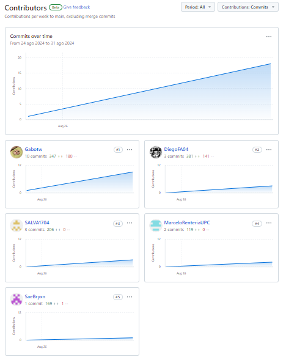
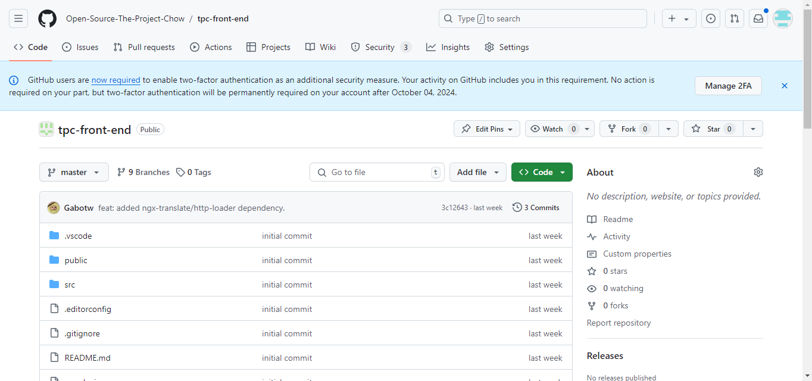

# Capítulo V: Product Implementation, Validation & Deployment

## 5.1. Software Configuration Management

En esta sección como equipo establecimos las decisiones y convenciones que nos permitirán mantener la consistencia durante el ciclo de vida.

### 5.1.1. Software Development Environment Configuration

En la siguiente sección se describe la ruta de referencia de cada uno de los productos de software para que cualquier miembro del equipo pueda desarrollar cada punto del trabajo.

- **UXPressia:** Plataforma que nos permitirá crear los user stories y también realizar múltiples mapas para evaluar sus prioridades. Además, ofrece opciones gráficas para mejorar el aspecto de nuestro trabajo. Puedes acceder a la plataforma en el siguiente enlace: [UXPressia](https://www.uxpressia.com/)
- **Figma:** Herramienta colaborativa que nos permitirá desarrollar los respectivos Wireframes y Mockups de nuestra Landing Page. Se puede acceder a la plataforma en el siguiente enlace: [Figma](https://www.figma.com/).
- **Vertabelo:** Plataforma que nos permitirá crear nuestro Diagrama de Base de Datos. Se puede acceder a la plataforma en el siguiente enlace: [Vertabelo](https://www.vertabelo.com/).
- **LucidChart:** Aplicación web destinada a la elaboración de Wireflows, Lean UX Canvas, User Flows y Diagramas de clases. Se puede acceder a la plataforma en el siguiente enlace: [LucidChart](https://www.lucidchart.com/).
- **GitHub:** Repositorio colaborativo en la nube utilizado para almacenar los avances de nuestro proyecto. Se puede acceder a la plataforma en el siguiente enlace: [Github](https://github.com/).
- **Visual Studio Code:** Entorno de desarrollo utilizado por nuestro equipo para el desarrollo del proyecto en general, incluido el Informe. Se puede acceder a la plataforma en el siguiente enlace: [Visual Studio Code](https://code.visualstudio.com/).
- **GitHub Pages:** Plataforma que permite hacer deployments sencillos y rápidos para nuestras páginas web. Se puede acceder a la plataforma en el siguiente enlace: [Github Pages](https://pages.github.com/).
- **Netlify:** Plataforma que permite hacer deployments de páginas web, y otros servicios relacionados. Se puede acceder a la plataforma en el siguiente enlace: [Netlify](https://www.netlify.com/)

- **HTML5:** Lenguaje para la elaboración de nuestra página web.
- **CSS3:** Tecnología para darle estilos a nuestra página web.
- **JavaScript:** Lenguaje de programación orientado a objetos que nos sirvió para implementar funcionalidades en nuestra Landing Page.
- **TypeScript:** Lenguaje de programación que nos sirvió durante la elaboración del Frontend.

### 5.1.2. Source Code Management

Para gestionar las modificaciones en nuestro proyecto, emplearemos GitHub como plataforma y sistema de control de versiones. A continuación, se detallan los repositorios de GitHub para cada uno de nuestros productos:

- Organización del Equipo: https://github.com/Open-Source-The-Project-Chow
- Repositorio del Informe: https://github.com/Open-Source-The-Project-Chow/Informe-Final
- Repositorio del Landing Page: https://github.com/Open-Source-The-Project-Chow/Landing-page
- Enlace del Landing Page: https://open-source-the-project-chow.github.io/Landing-page/
- Repositorio del Frontend: https://github.com/Open-Source-The-Project-Chow/tpc-front-end
- Enlace del Frontend: https://develop--tpc-front-end-app.netlify.app/
- Enlace del Fake API: https://github.com/Open-Source-The-Project-Chow/fake-api

Para estructurar nuestro control de versiones, implementaremos el modelo GitFlow como nuestro flujo de trabajo estándar. Este modelo se basa en dos ramas principales: main (rama principal) y develop (rama de desarrollo), y varias ramas auxiliares, incluyendo feature, release, y hotfix, cada una con un propósito específico:

#### Ramas Principales:

- Main Branch (Rama Principal): Esta rama contiene siempre el código en producción, es decir, el código que ha sido liberado y que es estable. No se realizan cambios directos en esta rama, excepto para la integración de release branches o hotfix branches.

- Develop Branch (Rama de Desarrollo): Esta rama sirve como base para el desarrollo continuo. Aquí se integran los cambios provenientes de las feature branches. La rama develop contiene la última versión del código con nuevas funcionalidades que aún no han sido liberadas.

- Release Branches: Antes de lanzar una nueva versión, crearemos una rama de release para realizar pruebas finales y correcciones.
- Hotfix Branches: En caso de surgir problemas en el desarrollo, se crearán branches de hotfix para poder solucionarlos sin afectar la rama principal.

#### Ramas Auxiliares:

- Feature Branches: Estas ramas se utilizan para desarrollar nuevas funcionalidades o mejoras específicas. Cada funcionalidad se desarrolla en su propia rama, que se deriva de develop y se fusiona de nuevo en develop una vez que la funcionalidad ha sido completada y probada.

- Release Branches: Estas ramas se utilizan para preparar una nueva versión de producción. Una vez que develop ha alcanzado un estado estable, se crea una release branch para realizar ajustes finales y pruebas antes de fusionarla en main.

- Hotfix Branches: Estas ramas se utilizan para corregir rápidamente problemas en producción. Se derivan de main y, una vez corregido el problema, se fusionan tanto en main como en develop para asegurar que la corrección se mantenga en el desarrollo futuro.

Además, los mensajes de commit seguirán el formato de Conventional Commits, que estandariza los mensajes para que sean claros y útiles. Este formato sigue la estructura:

tipo(<área opcional>): <descripción>

Ejemplos de tipos comunes:

- feat: para nuevas funcionalidades.
- fix: para corrección de errores.
- docs: para cambios en la documentación.
- style: para cambios que no afectan la lógica del código (espacios, formateo, etc.).

### 5.1.3. Source Code Style Guide & Conventions

A continuación, se detallan las referencias y convenciones que adoptaremos para programar en los diferentes lenguajes utilizados en nuestro proyecto:

Utilizaremos las siguientes referencias para establecer nuestras convenciones.
1. **HTML**:
- "HTML Style Guide and Coding Conventions"
- "Google HTML/CSS Style Guide"

2. **CSS**:
- "Google HTML/CSS Style Guide"

3. **JavaScript**:
- "Google JavaScript Style Guide"
- "MDN JavaScript guidelines"
- "W3C JavaScript Style Guide"
- "Angular coding style guide".

4. **Gherkin**:
- "Gherkin Conventions for Readable Specifications".

Es importante destacar que todas las convenciones y referencias mencionadas están en inglés, siguiendo las prácticas comunes en el desarrollo de software. De tal modo que, al seguir estas referencias nos ayudará a mantener un código claro, coherente y fácilmente comprensible para todo el equipo de desarrollo.

### 5.1.4. Software Deployment Configuration

Para desplegar nuestra landing page en la plataforma de GitHub, seguimos los siguientes pasos:

1. Creación del Repositorio Remoto en GitHub:

- Creamos un nuevo repositorio en GitHub de nuestro proyecto, el cual se utilizará para el desarrollo y deployment.

2. Inicialización del Repositorio:

- Se utilza el comando "*git init*" para inicializar el repositorio.

3. Subida de Archivos al Repositorio Remoto:

- Añadimos los archivos de nuestra landing page al repositorio local.
- Subimos los archivos al repositorio de GitHub con el comando "*git push -u origin master*" o sino utilizando Github Desktop.

4. Configuración de GitHub Pages:

- Accedemos a la sección de configuración del repositorio en GitHub y entramos a la sección de Github Pages.

- Seleccionamos la rama de GitHub Pages (main) como fuente para el deployment de nuestra Landing Page

5. Despliegue:

- Accedemos a la URL proporcionada por GitHub Pages para verificar que nuestra landing page se haya desplegado correctamente.

De tal modo, nuestra Landing Page estará inicializada utilizando Github Pages y podrá ser visible para cualquier usuario que tenga el enlace.

Enlace del Landing Page: https://open-source-the-project-chow.github.io/Landing-page/

## 5.2. Landing Page, Services & Applications Implementation

En esta sección se explicará y evidenciará el proceso de implementación, pruebas,
documentación y despliegue del Landing Page.

### 5.2.1. Sprint 1

### 5.2.1.1. Sprint Planning 1

Para este primer sprint nos enfocaremos en los tasks para la
elaboración del Landing Page. Nos dividiremos entre nosotros cada
una de las tareas identificadas para el sprint.
<table>
<tr>
    <th colspan="5">Sprint #</th>
    <th colspan="9">Sprint 1</th>
  </tr>
      <tr>
    <td colspan="13">Sprint Planning Background</td>
  </tr>
  <tr>
    <td colspan="5">Date</td>
    <td colspan="8">2024-08-25</td>
</tr>
  <tr>
    <td colspan="5">Time</td>
    <td colspan="8">10:38 PM</td>
  </tr>
  <tr>
    <td colspan="5">Location</td>
    <td colspan="8">Via Discord y Google Meet</td>
<tr>
    <td colspan="5">Prepared By</td>
    <td colspan="8">Gabriel Garcia</td>
</tr>
<tr>
    <td colspan="5">Attendees (to planning meeting)</td>
    <td colspan="8">Gabriel Garcia, Diego Flores, Salvador Chamorro, Héctor Rentería, Bryan Espejo</td>
</tr>
<tr>
    <td colspan="5">Sprint n – 1 Review Summary</td>
    <td colspan="8">En esta seccion se planteo el desarrollo del landing page para nuestro proyecto llamado CraftSync</td>
</tr>
<tr>
    <td colspan="5">Sprint n – 1 Retrospective Summary</td>
    <td colspan="8">En esta seccion todos los integrantes mencionaron tener aciertos en partes del codigo y en otras partes poder mejorar sus habilidades realizando landing pages</td>
</tr>
<tr>
    <td colspan="13">Sprint Goal & User Stories</td>
</tr>
<tr>
    <td colspan="5">Sprint n Goal</td>
    <td colspan="8">Al acabar el Sprint 1, el despliegue del Landing Page debe contar con formularios de contacto y todas las secciones de información pertinentes.</td>
</tr>
<tr>
    <td colspan="5">Sprint n Velocity</td>
    <td colspan="8">5 story points</td>
</tr>
<tr>
    <td colspan="5">Sum of Story Points</td>
    <td colspan="8">6 Story Points</td>
</tr>
</table>

### 5.2.1.2. Sprint Backlog 1

<table>
<tr>
    <th colspan="3">Sprint #</th>
    <th colspan="10">Sprint 1</th>
  </tr>
      <tr>
    <td colspan="3">User Story</td>
    <td colspan="10">Work-Item/Task</td>
  </tr>
  <tr>
    <td colspan="1">Id</td>
    <td colspan="2">Title</td>
    <td colspan="1">Id</td>
    <td colspan="2">Title</td>
    <td colspan="3">Description</td>
    <td colspan="1"> Estimation</td>
    <td colspan="2">Assigned To</td>
    <td colspan="1">Status(To-do /InProcess /To-Review /Done)</td>
</tr>
  <tr>
    <td colspan="1">US01</td>
    <td colspan="2">Sección About Us</td>
    <td colspan="1">T01</td>
    <td colspan="2">Añadir sección About Us en el Landing Page</td>
    <td colspan="3">Yo, como distribuidor visitante del Landing Page, quiero una sección About Us para informarme sobre la empresa y sus detalles.</td>
    <td colspan="1">1</td>
    <td colspan="2">Diego</td>
    <td colspan="1">Done</td>
  </tr>
  <tr>
    <td colspan="1">US25</td>
    <td colspan="2">Visualización de los servicios disponibles</td>
    <td colspan="1">T02</td>
    <td colspan="2">Añadir sección Services en el Landing Page</td>
    <td colspan="3">Como Artesano/Distribuidor visitante del Landing page de CraftSync, quiero una sección “Services” para informarme sobre los servicios que ofrece la plataforma.</td>
    <td colspan="1">1</td>
    <td colspan="2">Salvador</td>
    <td colspan="1">Done</td>
<tr>
    <td colspan="1">US24</td>
    <td colspan="2">Visualización de lista de tipos de suscripción</td>
    <td colspan="1">T03</td>
    <td colspan="2">Añadir sección Plans en el Landing Page</td>
    <td colspan="3">Como Artesano/Distribuidor visitante del Landing page de CraftSync, quiero visitar la lista de tipos de suscripción para seleccionar alguno.</td>
    <td colspan="1">1</td>
    <td colspan="2">Marcelo</td>
    <td colspan="1">Done</td>
</tr>
<tr>
    <td colspan="1">US23</td>
    <td colspan="2">Visualización de la sección Contact Us</td>
    <td colspan="1">T04</td>
    <td colspan="2">Añadir sección Contact Us al Landing Page</td>
    <td colspan="3">Como Artesano/Distribuidor visitante del Landing page de CraftSync, quiero una sección “Contact us” para solicitar información acerca de la plataforma</td>
    <td colspan="1">1</td>
    <td colspan="2">Gabriel</td>
    <td colspan="1">Done</td>
</tr>
<tr>
    <td colspan="1">US22</td>
    <td colspan="2">Visualización de los desarrolladores</td>
    <td colspan="1">T05</td>
    <td colspan="2">Añadir sección Creators al Landing Page</td>
    <td colspan="3">Como Artesano/Distribuidor visitante del Landing page de CraftSync, quiero una sección “Creadores” para informarme sobre los desarrolladores de la plataforma.</td>
    <td colspan="1">1</td>
    <td colspan="2">Bryan</td>
    <td colspan="1">Done</td>
</tr>
<tr>
    <td colspan="1">US02</td>
    <td colspan="2">Selector de Idioma</td>
    <td colspan="1">T06</td>
    <td colspan="2">Añadir un botón que cambie el idioma del texto mostrado</td>
    <td colspan="3">Yo, como distribuidor visitante del Landing Page, quiero un selector de idioma para leer el contenido en mi idioma de preferencia.</td>
    <td colspan="1">1</td>
    <td colspan="2">Marcelo</td>
    <td colspan="1">InProcess</td>
</tr>
</table>

### 5.2.1.3. Development Evidence for Sprint Review

<table>
    <tr>
        <th colspan="2">Repository</th>
        <th colspan="2">Branch</th>
        <th colspan="2">Commit Id</th>
        <th colspan="2">Commit Message</th>
        <th colspan="2">Commit Message Body</th>
        <th colspan="2">Commited on (Date)</th>
    </tr>
        <tr>
        <td colspan="2">Open-Source-The-Project-Chow/Landing-page</td>
        <td colspan="2">Main</td>
        <td colspan="2">f5d9fcc58f6fd2d8427bdba752fd785f6320917c</td>
        <td colspan="2">Initial commit</td>
        <td colspan="2">-</td>
        <td colspan="2">25/08/2024</td>
    </tr>
        <tr>
        <td colspan="2">Open-Source-The-Project-Chow/Landing-page</td>
        <td colspan="2">Main</td>
        <td colspan="2">b7b42a92091922d250317487e5a217839520b21b</td>
        <td colspan="2">feat: added contact us section.</td>
        <td colspan="2">-</td>
        <td colspan="2">02/09/2024</td>
    </tr>
     <tr>
        <td colspan="2">Open-Source-The-Project-Chow/Landing-page</td>
        <td colspan="2">Main</td>
        <td colspan="2">c4d528fcb2b49e0139ee2c102ca42c6ed43ff6de</td>
        <td colspan="2">feat: added contact us section styles.</td>
        <td colspan="2">-</td>
        <td colspan="2">02/09/2024</td>
    </tr>
    <tr>
        <td colspan="2">Open-Source-The-Project-Chow/Landing-page</td>
        <td colspan="2">Main</td>
        <td colspan="2">f03d4381e72b5b5e63ca81f27092c64ac0ddec8e</td>
        <td colspan="2">feat(header): added navbar.</td>
        <td colspan="2">-</td>
        <td colspan="2">03/09/2024</td>
    </tr>
    <tr>
        <td colspan="2">Open-Source-The-Project-Chow/Landing-page</td>
        <td colspan="2">Main</td>
        <td colspan="2">be8e8eda97562ec0d04fed20d8b6fe4ed9e396a1</td>
        <td colspan="2">feat(header): added javascript function for the menu.</td>
        <td colspan="2">-</td>
        <td colspan="2">03/09/2024</td>
    </tr>
    <tr>
        <td colspan="2">Open-Source-The-Project-Chow/Landing-page</td>
        <td colspan="2">Main</td>
        <td colspan="2">5b06567cb71a165535b3a7345a5668f4d9ff10c9</td>
        <td colspan="2">faet(header): added background image and logo.</td>
        <td colspan="2">-</td>
        <td colspan="2">03/09/2024</td>
    </tr>
    <tr>
        <td colspan="2">Open-Source-The-Project-Chow/Landing-page</td>
        <td colspan="2">Main</td>
        <td colspan="2">7d0f7d76293d10f9daa4a95e791fa06544714cd2</td>
        <td colspan="2">feat(plans): Added Plans section index.</td>
        <td colspan="2">-</td>
        <td colspan="2">04/09/2024</td>
    </tr>
    <tr>
        <td colspan="2">Open-Source-The-Project-Chow/Landing-page</td>
        <td colspan="2">Main</td>
        <td colspan="2">b217183d00b244b72869bee16853fe1ba8d2f48f</td>
        <td colspan="2">feat(plans): Added Plans section styles.</td>
        <td colspan="2">-</td>
        <td colspan="2">04/09/2024</td>
    </tr>
    <tr>
        <td colspan="2">Open-Source-The-Project-Chow/Landing-page</td>
        <td colspan="2">Main</td>
        <td colspan="2">77672962d0d4d5825b6adcfb5fe5362b2620c7e1</td>
        <td colspan="2">feat(services): Added services section</td>
        <td colspan="2">-</td>
        <td colspan="2">04/09/2024</td>
    </tr>
    <tr>
        <td colspan="2">Open-Source-The-Project-Chow/Landing-page</td>
        <td colspan="2">Main</td>
        <td colspan="2">7d4fb5e6d73ba415a58159c94196f6f8a9d64a3c</td>
        <td colspan="2">feat(services): Added services section styles</td>
        <td colspan="2">-</td>
        <td colspan="2">04/09/2024</td>
    </tr>
    <tr>
        <td colspan="2">Open-Source-The-Project-Chow/Landing-page</td>
        <td colspan="2">Main</td>
        <td colspan="2">b22e13a9389f6db6a1753d2d69d3a98f695bcf98</td>
        <td colspan="2">feat(services):added images</td>
        <td colspan="2">-</td>
        <td colspan="2">04/09/2024</td>
    </tr>
    <tr>
        <td colspan="2">Open-Source-The-Project-Chow/Landing-page</td>
        <td colspan="2">Main</td>
        <td colspan="2">0669b4ce80e7f6593c6729f24fbd46459a74e0cc</td>
        <td colspan="2">feat: added section index and styels</td>
        <td colspan="2">-</td>
        <td colspan="2">04/09/2024</td>
    </tr>
    <tr>
        <td colspan="2">Open-Source-The-Project-Chow/Landing-page</td>
        <td colspan="2">Main</td>
        <td colspan="2">1eeb8e46faac2db4b075e2313327fdd02a112eca</td>
        <td colspan="2">fix: fixed little mistakes.</td>
        <td colspan="2">-</td>
        <td colspan="2">05/09/2024</td>
    </tr>
    <tr>
        <td colspan="2">Open-Source-The-Project-Chow/Landing-page</td>
        <td colspan="2">Main</td>
        <td colspan="2">c9a095f5d0fb73dfc77705c65b51dab1db795b63</td>
        <td colspan="2">feat: added footer section.</td>
        <td colspan="2">-</td>
        <td colspan="2">05/09/2024</td>
    </tr>
    <tr>
        <td colspan="2">Open-Source-The-Project-Chow/Landing-page</td>
        <td colspan="2">Main</td>
        <td colspan="2">f203b4c4f5b0ad52cd0e475eb64753bca289c656</td>
        <td colspan="2">feat: added footer styles.</td>
        <td colspan="2">-</td>
        <td colspan="2">05/09/2024</td>
    </tr>
    <tr>
        <td colspan="2">Open-Source-The-Project-Chow/Landing-page</td>
        <td colspan="2">Main</td>
        <td colspan="2">9e3782330ac3a7a08dd2c3b4e2c85e9435f42712</td>
        <td colspan="2">fix: fixed mistake points.</td>
        <td colspan="2">-</td>
        <td colspan="2">05/09/2024</td>
    </tr>
    <tr>
        <td colspan="2">Open-Source-The-Project-Chow/Landing-page</td>
        <td colspan="2">Main</td>
        <td colspan="2">358ac140118a051d77bf0e8d42b5bfdec54233b7</td>
        <td colspan="2">fix: fixed bad calling to image.</td>
        <td colspan="2">-</td>
        <td colspan="2">05/09/2024</td>
    </tr>
</table>

### 5.2.1.4. Testing Suite Evidence for Sprint Review

En este sprint, no se desarrollaron Web Services, por lo que no hubo ningpun Unit Testing relacionado a estos.

### 5.2.1.5. Execution Evidence for Sprint Review

Para esta primera entrega, nuestro equipo a conseguido elaborar la Landing Page del proyecto "CraftSync". De tal modo, se podrá visualizar la información necesaria de lo que ofrece nuestro proyecto.

**Sección de Inicio**: Se implementó el Header y About Us de nuestra Landing Page.

**Sección de Servicios**: Se implementó la sección de los servicios ofrecidos.

**Sección de Planes**: Se implementó la sección de ver los tipos de suscripción.

**Sección de Contacto**:  la sección de contacto para facilitar la comunicación con los usuarios.

**Sección de Creadores**: Se agregaron secciones de información sobre los creadores del proyecto

**Sección de Footer**: Se añadió un footer para la navegación y contacto.

### 5.2.1.6. Services Documentation Evidence for Sprint Review

### 5.2.1.7. Software Deployment Evidence for Sprint Review

Para el despliegue del Landing Page, hemos utilizado la herramienta de Github Pages para poder hacer un deployment. Para eso, hemos creado un repositorio donde hemos colocado el código de desarrollo de nuestra Landing Page.

Una vez creado el repositorio, entraremos a configuración del repositorio y escogemos el apartado de Pages. Se coloca la información necesaria, como la fuente del branch a utilizar para realizar el deployment. Luego de eso, Github Pages nos brindará el link y desplegará nuestra landing page en la Web.

### 5.2.1.8. Team Collaboration Insights during Sprint

Para el desarrollo de este primer sprint, todos los miembros del equipo desarrollaron y colaboraron de manera activa y continua. De tal modo, se muestra como evidencia los insights de cada miembro del equipo.

Commits:

Analiticas de Colaboración:

### 5.2.2. Sprint 2

### 5.2.2.1. Sprint Planning 2

Para este segundo sprint nos enfocaremos en los tasks para la
primera versión del Frontend Web Application. Nos dividiremos entre nosotros cada
una de las tareas identificadas para el sprint.
<table>
<tr>
    <th colspan="5">Sprint #</th>
    <th colspan="9">Sprint 2</th>
  </tr>
      <tr>
    <td colspan="13">Sprint Planning Background</td>
  </tr>
  <tr>
    <td colspan="5">Date</td>
    <td colspan="8">2024-09-15</td>
</tr>
  <tr>
    <td colspan="5">Time</td>
    <td colspan="8">03:42 PM</td>
  </tr>
  <tr>
    <td colspan="5">Location</td>
    <td colspan="8">Via Discord</td>
<tr>
    <td colspan="5">Prepared By</td>
    <td colspan="8">Marcelo Rentería</td>
</tr>
<tr>
    <td colspan="5">Attendees (to planning meeting)</td>
    <td colspan="8">Gabriel Garcia, Diego Flores, Salvador Chamorro, Marcelo Rentería, Bryan Espejo</td>
</tr>
<tr>
    <td colspan="5">Sprint n – 2 Review Summary</td>
    <td colspan="8">En esta seccion se planteó el desarrollo inicial del Frontend Web App para nuestro proyecto llamado CraftSync</td>
</tr>
<tr>
    <td colspan="5">Sprint n – 2 Retrospective Summary</td>
    <td colspan="8">En esta seccion todos los integrantes mencionaron tener aciertos en partes del codigo, aunque no se lograron a implementar todas las funcionalidades necesarias.</td>
</tr>
<tr>
    <td colspan="13">Sprint Goal & User Stories</td>
</tr>
<tr>
    <td colspan="5">Sprint n Goal</td>
    <td colspan="8">Al acabar el Sprint 2, la plataforma de Frontend Web Application deberá contar con las funciones de los Bounded Context de Foro, Perfil, Pedido e Inventario, con un Landing Page actualizado que se conecte via Call-To-Action a la plataforma.</td>
</tr>
<tr>
    <td colspan="5">Sprint n Velocity</td>
    <td colspan="8">15 story points</td>
</tr>
<tr>
    <td colspan="5">Sum of Story Points</td>
    <td colspan="8">23 Story Points</td>
</tr>
</table>

### 5.2.2.2. Sprint Backlog 2

<table>
<tr>
    <th colspan="3">Sprint #</th>
    <th colspan="10">Sprint 1</th>
  </tr>
      <tr>
    <td colspan="3">User Story</td>
    <td colspan="10">Work-Item/Task</td>
  </tr>
  <tr>
    <td colspan="1">Id</td>
    <td colspan="2">Title</td>
    <td colspan="1">Id</td>
    <td colspan="2">Title</td>
    <td colspan="3">Description</td>
    <td colspan="1"> Estimation</td>
    <td colspan="2">Assigned To</td>
    <td colspan="1">Status(To-do /InProcess /To-Review /Done)</td>
</tr>
  <tr>
    <td colspan="1">US07</td>
    <td colspan="2">Visualización de Pedidos</td>
    <td colspan="1">T01</td>
    <td colspan="2">Crear entidad de Pedidos</td>
    <td colspan="3">Yo, como desarrollador, quiero una entidad de Pedidos para relacionarla con las funciones del Frontend.</td>
    <td colspan="1">1</td>
    <td colspan="2">Bryan</td>
    <td colspan="1">Done</td>
  </tr>
<tr>
    <td colspan="1"></td>
    <td colspan="2"></td>
    <td colspan="1">T02</td>
    <td colspan="2">Crear servicio de Pedidos</td>
    <td colspan="3">Yo, como desarrollador, quiero un servicio de Pedidos para conectar con el Fake-API.</td>
    <td colspan="1">1</td>
    <td colspan="2">Bryan</td>
    <td colspan="1">Done</td>
  </tr>
<tr>
    <td colspan="1"></td>
    <td colspan="2"></td>
    <td colspan="1">T03</td>
    <td colspan="2">Crear componente de Lista de Pedidos</td>
    <td colspan="3">Yo, como desarrollador, quiero un componente de lista de Pedidos para implementar el comportamiento de esta.</td>
    <td colspan="1">3</td>
    <td colspan="2">Bryan</td>
    <td colspan="1">Done</td>
  </tr>
<tr>
    <td colspan="1"></td>
    <td colspan="2"></td>
    <td colspan="1">T04</td>
    <td colspan="2">Diseñar página de Pedidos</td>
    <td colspan="3">Yo, como artesano, quiero una página de Pedidos para ver los Pedidos asignados.</td>
    <td colspan="1">5</td>
    <td colspan="2">Bryan</td>
    <td colspan="1">Done</td>
  </tr>
<tr>
    <td colspan="1"></td>
    <td colspan="2"></td>
    <td colspan="1">T05</td>
    <td colspan="2">Conectar Fake API</td>
    <td colspan="3">Yo, como desarrollador, quiero conectar el Frontend con el Fake API, para comprobar las acciones CRUD.</td>
    <td colspan="1">3</td>
    <td colspan="2">Bryan</td>
    <td colspan="1">To-Do</td>
  </tr>
<tr>
    <td colspan="1"></td>
    <td colspan="2"></td>
    <td colspan="1">T06</td>
    <td colspan="2">Conectar enrutamiento</td>
    <td colspan="3">Yo, como desarrollador, quiero conectar el routerlink con la página de lista de pedidos, para hacerla accesible.</td>
    <td colspan="1">1</td>
    <td colspan="2">Bryan</td>
    <td colspan="1">Done</td>
  </tr>
  <tr>
    <td colspan="1">US05</td>
    <td colspan="2">Actualizar Progreso</td>
    <td colspan="1">T01</td>
    <td colspan="2">Crear entidad de Pedidos</td>
    <td colspan="3">Yo, como desarrollador, quiero una entidad de Pedidos para relacionarla con las funciones del Frontend.</td>
    <td colspan="1">1</td>
    <td colspan="2">Bryan</td>
    <td colspan="1">Done</td>
  </tr>
<tr>
    <td colspan="1"></td>
    <td colspan="2"></td>
    <td colspan="1">T02</td>
    <td colspan="2">Crear servicio de Pedidos</td>
    <td colspan="3">Yo, como desarrollador, quiero un servicio de Pedidos para conectar con el Fake-API.</td>
    <td colspan="1">1</td>
    <td colspan="2">Bryan</td>
    <td colspan="1">Done</td>
  </tr>
<tr>
    <td colspan="1"></td>
    <td colspan="2"></td>
    <td colspan="1">T03</td>
    <td colspan="2">Crear componente de Pedido</td>
    <td colspan="3">Yo, como desarrollador, quiero un componente de Pedidos para implementar las funciones de interacción.</td>
    <td colspan="1">5</td>
    <td colspan="2">Bryan</td>
    <td colspan="1">Done</td>
  </tr>
<tr>
    <td colspan="1"></td>
    <td colspan="2"></td>
    <td colspan="1">T04</td>
    <td colspan="2">Diseñar página de Pedido</td>
    <td colspan="3">Yo, como artesano, quiero una página de un Pedido en particular para interactuar con él.</td>
    <td colspan="1">3</td>
    <td colspan="2">Bryan</td>
    <td colspan="1">InProcess</td>
  </tr>
<tr>
    <td colspan="1"></td>
    <td colspan="2"></td>
    <td colspan="1">T05</td>
    <td colspan="2">Conectar Fake API</td>
    <td colspan="3">Yo, como desarrollador, quiero conectar el Frontend con el Fake API, para comprobar las acciones CRUD.</td>
    <td colspan="1">3</td>
    <td colspan="2">Bryan</td>
    <td colspan="1">To-Do</td>
  </tr>
    <tr>
    <td colspan="1"></td>
    <td colspan="2"></td>
    <td colspan="1">T06</td>
    <td colspan="2">Conectar enrutamiento</td>
    <td colspan="3">Yo, como desarrollador, quiero conectar el routerlink con la página de pedido, para hacerla accesible.</td>
    <td colspan="1">1</td>
    <td colspan="2">Bryan</td>
    <td colspan="1">InProcess</td>
  </tr>
    <tr>
    <td colspan="1">US11</td>
    <td colspan="2">Visualización de la sección de inventarios</td>
    <td colspan="1">T01</td>
    <td colspan="2">Crear entidad de Materiales</td>
    <td colspan="3">Yo, como desarrollador, quiero una entidad de Materiales para relacionarla con las funciones del Frontend.</td>
    <td colspan="1">1</td>
    <td colspan="2">Diego</td>
    <td colspan="1">Done</td>
  </tr>
<tr>
    <td colspan="1"></td>
    <td colspan="2"></td>
    <td colspan="1">T02</td>
    <td colspan="2">Crear servicio de Materiales</td>
    <td colspan="3">Yo, como desarrollador, quiero un servicio de Materiales para conectar con el Fake-API.</td>
    <td colspan="1">1</td>
    <td colspan="2">Diego</td>
    <td colspan="1">Done</td>
  </tr>
<tr>
    <td colspan="1"></td>
    <td colspan="2"></td>
    <td colspan="1">T03</td>
    <td colspan="2">Crear componente de Materiales</td>
    <td colspan="3">Yo, como desarrollador, quiero un componente de Materiales para implementar su comportamiento.</td>
    <td colspan="1">3</td>
    <td colspan="2">Diego</td>
    <td colspan="1">Done</td>
  </tr>
<tr>
    <td colspan="1"></td>
    <td colspan="2"></td>
    <td colspan="1">T04</td>
    <td colspan="2">Diseñar página de Inventario</td>
    <td colspan="3">Yo, como artesano, quiero una página de Inventario para ver los Materiales.</td>
    <td colspan="1">3</td>
    <td colspan="2">Diego</td>
    <td colspan="1">Done</td>
  </tr>
<tr>
    <td colspan="1"></td>
    <td colspan="2"></td>
    <td colspan="1">T05</td>
    <td colspan="2">Conectar Fake API</td>
    <td colspan="3">Yo, como desarrollador, quiero conectar el Frontend con el Fake API, para comprobar las acciones CRUD.</td>
    <td colspan="1">3</td>
    <td colspan="2">Diego</td>
    <td colspan="1">Done</td>
  </tr>
    <tr>
    <td colspan="1"></td>
    <td colspan="2"></td>
    <td colspan="1">T06</td>
    <td colspan="2">Conectar enrutamiento</td>
    <td colspan="3">Yo, como desarrollador, quiero conectar el routerlink con la página de Inventario, para hacerla accesible.</td>
    <td colspan="1">1</td>
    <td colspan="2">Diego</td>
    <td colspan="1">Done</td>
  </tr>
    <tr>
    <td colspan="1">US12</td>
    <td colspan="2">Crear inventario</td>
    <td colspan="1">T01</td>
    <td colspan="2">Crear entidad de Inventario</td>
    <td colspan="3">Yo, como desarrollador, quiero una entidad de Inventario para relacionarla con las funciones del Frontend.</td>
    <td colspan="1">1</td>
    <td colspan="2">Diego</td>
    <td colspan="1">To-Do</td>
  </tr>
<tr>
    <td colspan="1"></td>
    <td colspan="2"></td>
    <td colspan="1">T02</td>
    <td colspan="2">Crear servicio de Inventario</td>
    <td colspan="3">Yo, como desarrollador, quiero un servicio de Inventario para conectar con el Fake-API.</td>
    <td colspan="1">1</td>
    <td colspan="2">Diego</td>
    <td colspan="1">To-Do</td>
  </tr>
<tr>
    <td colspan="1"></td>
    <td colspan="2"></td>
    <td colspan="1">T03</td>
    <td colspan="2">Crear componente de Inventario</td>
    <td colspan="3">Yo, como desarrollador, quiero un componente de Inventario para implementar su comportamiento.</td>
    <td colspan="1">3</td>
    <td colspan="2">Diego</td>
    <td colspan="1">InProcess</td>
  </tr>
<tr>
    <td colspan="1"></td>
    <td colspan="2"></td>
    <td colspan="1">T04</td>
    <td colspan="2">Diseñar página de Inventario</td>
    <td colspan="3">Yo, como artesano, quiero una página de Inventario para ver los Inventarios</td>
    <td colspan="1">3</td>
    <td colspan="2">Diego</td>
    <td colspan="1">Done</td>
  </tr>
<tr>
    <td colspan="1"></td>
    <td colspan="2"></td>
    <td colspan="1">T05</td>
    <td colspan="2">Conectar Fake API</td>
    <td colspan="3">Yo, como desarrollador, quiero conectar el Frontend con el Fake API, para comprobar las acciones CRUD.</td>
    <td colspan="1">3</td>
    <td colspan="2">Diego</td>
    <td colspan="1">To-Do</td>
  </tr>
    <tr>
    <td colspan="1"></td>
    <td colspan="2"></td>
    <td colspan="1">T06</td>
    <td colspan="2">Conectar enrutamiento</td>
    <td colspan="3">Yo, como desarrollador, quiero conectar el routerlink con la página de Inventario, para hacerla accesible.</td>
    <td colspan="1">1</td>
    <td colspan="2">Diego</td>
    <td colspan="1">Done</td>
  </tr>
    <tr>
    <td colspan="1">US17</td>
    <td colspan="2">Visualización de la sección de foro</td>
    <td colspan="1">T01</td>
    <td colspan="2">Crear entidad de Publicación</td>
    <td colspan="3">Yo, como desarrollador, quiero una entidad de Publicación para relacionarla con las funciones del Frontend.</td>
    <td colspan="1">1</td>
    <td colspan="2">Gabriel</td>
    <td colspan="1">Done</td>
  </tr>
<tr>
    <td colspan="1"></td>
    <td colspan="2"></td>
    <td colspan="1">T02</td>
    <td colspan="2">Crear servicio de Publicación</td>
    <td colspan="3">Yo, como desarrollador, quiero un servicio de Publicación para conectar con el Fake-API.</td>
    <td colspan="1">1</td>
    <td colspan="2">Gabriel</td>
    <td colspan="1">Done</td>
  </tr>
<tr>
    <td colspan="1"></td>
    <td colspan="2"></td>
    <td colspan="1">T03</td>
    <td colspan="2">Crear componente de Publicación</td>
    <td colspan="3">Yo, como desarrollador, quiero un componente de Publicación para implementar su comportamiento.</td>
    <td colspan="1">3</td>
    <td colspan="2">Gabriel</td>
    <td colspan="1">Done</td>
  </tr>
<tr>
    <td colspan="1"></td>
    <td colspan="2"></td>
    <td colspan="1">T04</td>
    <td colspan="2">Diseñar página de Publicación</td>
    <td colspan="3">Yo, como artesano, quiero una página de Publicación para ver las publicaciones</td>
    <td colspan="1">3</td>
    <td colspan="2">Gabriel</td>
    <td colspan="1">Done</td>
  </tr>
<tr>
    <td colspan="1"></td>
    <td colspan="2"></td>
    <td colspan="1">T05</td>
    <td colspan="2">Conectar Fake API</td>
    <td colspan="3">Yo, como desarrollador, quiero conectar el Frontend con el Fake API, para comprobar las acciones CRUD.</td>
    <td colspan="1">3</td>
    <td colspan="2">Gabriel</td>
    <td colspan="1">Done</td>
  </tr>
    <tr>
    <td colspan="1"></td>
    <td colspan="2"></td>
    <td colspan="1">T06</td>
    <td colspan="2">Conectar enrutamiento</td>
    <td colspan="3">Yo, como desarrollador, quiero conectar el routerlink con la página de Inventario, para hacerla accesible.</td>
    <td colspan="1">1</td>
    <td colspan="2">Gabriel</td>
    <td colspan="1">Done</td>
  </tr>
    <tr>
    <td colspan="1">US18</td>
    <td colspan="2">Crear publicación</td>
    <td colspan="1">T01</td>
    <td colspan="2">Crear entidad de Publicación</td>
    <td colspan="3">Yo, como desarrollador, quiero una entidad de Publicación para relacionarla con las funciones del Frontend.</td>
    <td colspan="1">1</td>
    <td colspan="2">Gabriel</td>
    <td colspan="1">Done</td>
  </tr>
<tr>
    <td colspan="1"></td>
    <td colspan="2"></td>
    <td colspan="1">T02</td>
    <td colspan="2">Crear servicio de Publicación</td>
    <td colspan="3">Yo, como desarrollador, quiero un servicio de Publicación para conectar con el Fake-API.</td>
    <td colspan="1">1</td>
    <td colspan="2">Gabriel</td>
    <td colspan="1">Done</td>
  </tr>
<tr>
    <td colspan="1"></td>
    <td colspan="2"></td>
    <td colspan="1">T03</td>
    <td colspan="2">Crear componente de Crear Publicación</td>
    <td colspan="3">Yo, como desarrollador, quiero un componente de Crear Publicación para implementar su comportamiento.</td>
    <td colspan="1">3</td>
    <td colspan="2">Gabriel</td>
    <td colspan="1">InProcess</td>
  </tr>
<tr>
    <td colspan="1"></td>
    <td colspan="2"></td>
    <td colspan="1">T04</td>
    <td colspan="2">Diseñar Diálogo de Crear Publicación</td>
    <td colspan="3">Yo, como artesano, quiero un diálogo de Crear Publicación para añadir una publicación.</td>
    <td colspan="1">3</td>
    <td colspan="2">Gabriel</td>
    <td colspan="1">Done</td>
  </tr>
<tr>
    <td colspan="1"></td>
    <td colspan="2"></td>
    <td colspan="1">T05</td>
    <td colspan="2">Conectar Fake API</td>
    <td colspan="3">Yo, como desarrollador, quiero conectar el Frontend con el Fake API, para comprobar las acciones CRUD.</td>
    <td colspan="1">3</td>
    <td colspan="2">Gabriel</td>
    <td colspan="1">To-Do</td>
  </tr>
    <tr>
    <td colspan="1"></td>
    <td colspan="2"></td>
    <td colspan="1">T06</td>
    <td colspan="2">Conectar enrutamiento</td>
    <td colspan="3">Yo, como desarrollador, quiero conectar el routerlink con la página de Inventario, para hacerla accesible.</td>
    <td colspan="1">1</td>
    <td colspan="2">Gabriel</td>
    <td colspan="1">Done</td>
  </tr>
    <tr>
    <td colspan="1">US06</td>
    <td colspan="2">Visualización de perfil de usuario propio.</td>
    <td colspan="1">T01</td>
    <td colspan="2">Crear entidad de Perfil</td>
    <td colspan="3">Yo, como desarrollador, quiero una entidad de Perfil para relacionarla con las funciones del Frontend.</td>
    <td colspan="1">1</td>
    <td colspan="2">Marcelo</td>
    <td colspan="1">Done</td>
  </tr>
<tr>
    <td colspan="1"></td>
    <td colspan="2"></td>
    <td colspan="1">T02</td>
    <td colspan="2">Crear servicio de Perfil</td>
    <td colspan="3">Yo, como desarrollador, quiero un servicio de Perfil para conectar con el Fake-API.</td>
    <td colspan="1">1</td>
    <td colspan="2">Marcelo</td>
    <td colspan="1">Done</td>
  </tr>
<tr>
    <td colspan="1"></td>
    <td colspan="2"></td>
    <td colspan="1">T03</td>
    <td colspan="2">Crear componente de Perfil</td>
    <td colspan="3">Yo, como desarrollador, quiero un componente de Perfil para implementar su comportamiento.</td>
    <td colspan="1">3</td>
    <td colspan="2">Marcelo</td>
    <td colspan="1">To-Review</td>
  </tr>
<tr>
    <td colspan="1"></td>
    <td colspan="2"></td>
    <td colspan="1">T04</td>
    <td colspan="2">Diseñar Página de Perfil</td>
    <td colspan="3">Yo, como artesano, quiero una página de Perfil para ver mi Perfil</td>
    <td colspan="1">3</td>
    <td colspan="2">Marcelo</td>
    <td colspan="1">Done</td>
  </tr>
<tr>
    <td colspan="1"></td>
    <td colspan="2"></td>
    <td colspan="1">T05</td>
    <td colspan="2">Conectar Fake API</td>
    <td colspan="3">Yo, como desarrollador, quiero conectar el Frontend con el Fake API, para comprobar las acciones CRUD.</td>
    <td colspan="1">3</td>
    <td colspan="2">Marcelo</td>
    <td colspan="1">InProcess</td>
  </tr>
    <tr>
    <td colspan="1"></td>
    <td colspan="2"></td>
    <td colspan="1">T06</td>
    <td colspan="2">Conectar enrutamiento</td>
    <td colspan="3">Yo, como desarrollador, quiero conectar el routerlink con la página de Inventario, para hacerla accesible.</td>
    <td colspan="1">1</td>
    <td colspan="2">Marcelo</td>
    <td colspan="1">Done</td>
  </tr>
    <tr>
    <td colspan="1">US26</td>
    <td colspan="2">Manejo de Distribución de Pedidos</td>
    <td colspan="1">T01</td>
    <td colspan="2">Crear entidad de Pedido</td>
    <td colspan="3">Yo, como desarrollador, quiero una entidad de Pedido para relacionarla con las funciones del Frontend.</td>
    <td colspan="1">1</td>
    <td colspan="2">Salvador</td>
    <td colspan="1">Done</td>
  </tr>
<tr>
    <td colspan="1"></td>
    <td colspan="2"></td>
    <td colspan="1">T02</td>
    <td colspan="2">Crear servicio de Pedido</td>
    <td colspan="3">Yo, como desarrollador, quiero un servicio de Pedido para conectar con el Fake-API.</td>
    <td colspan="1">1</td>
    <td colspan="2">Salvador</td>
    <td colspan="1">Done</td>
  </tr>
<tr>
    <td colspan="1"></td>
    <td colspan="2"></td>
    <td colspan="1">T03</td>
    <td colspan="2">Crear componente de Distribución</td>
    <td colspan="3">Yo, como desarrollador, quiero un componente de Distribución para implementar su comportamiento.</td>
    <td colspan="1">3</td>
    <td colspan="2">Salvador</td>
    <td colspan="1">Done</td>
  </tr>
<tr>
    <td colspan="1"></td>
    <td colspan="2"></td>
    <td colspan="1">T04</td>
    <td colspan="2">Diseñar página de Distribución</td>
    <td colspan="3">Yo, como distribuidor, quiero una página de Distribución para ver la Distribución de Pedidos</td>
    <td colspan="1">3</td>
    <td colspan="2">Salvador</td>
    <td colspan="1">Done</td>
  </tr>
<tr>
    <td colspan="1"></td>
    <td colspan="2"></td>
    <td colspan="1">T05</td>
    <td colspan="2">Conectar Fake API</td>
    <td colspan="3">Yo, como desarrollador, quiero conectar el Frontend con el Fake API, para comprobar las acciones CRUD.</td>
    <td colspan="1">3</td>
    <td colspan="2">Salvador</td>
    <td colspan="1">To-Review</td>
  </tr>
    <tr>
    <td colspan="1"></td>
    <td colspan="2"></td>
    <td colspan="1">T06</td>
    <td colspan="2">Conectar enrutamiento</td>
    <td colspan="3">Yo, como desarrollador, quiero conectar el routerlink con la página de Inventario, para hacerla accesible.</td>
    <td colspan="1">1</td>
    <td colspan="2">Salvador</td>
    <td colspan="1">To-Review</td>
  </tr>
</table>

### 5.2.2.3. Development Evidence for Sprint Review

<table>
    <tr>
        <th colspan="2">Repository</th>
        <th colspan="2">Branch</th>
        <th colspan="2">Commit Id</th>
        <th colspan="2">Commit Message</th>
        <th colspan="2">Commit Message Body</th>
        <th colspan="2">Commited on (Date)</th>
    </tr>
        <tr>
        <td colspan="2">Open-Source-The-Project-Chow/tpc-front-end</td>
        <td colspan="2">Main</td>
        <td colspan="2">f5d9fcc58f6fd2d8427bdba752fd785f6320917c</td>
        <td colspan="2">initial commit</td>
        <td colspan="2">-</td>
        <td colspan="2">17/09/2024</td>
    </tr>
        <tr>
        <td colspan="2">Open-Source-The-Project-Chow/tpc-front-end</td>
        <td colspan="2">Main</td>
        <td colspan="2">6b930c22d5f7668dd7343713725c06504b3a8eb7</td>
        <td colspan="2">chore: initial commit.</td>
        <td colspan="2">-</td>
        <td colspan="2">17/09/2024</td>
    </tr>
    <tr>
        <td colspan="2">Open-Source-The-Project-Chow/tpc-front-end</td>
        <td colspan="2">Main</td>
        <td colspan="2">3c1264309b437713cf5aa2445e5cef050f9a2e15</td>
        <td colspan="2">feat: added ngx-translate/http-loader dependency.</td>
        <td colspan="2">-</td>
        <td colspan="2">17/09/2024</td>
    </tr>
    <tr>
        <td colspan="2">Open-Source-The-Project-Chow/tpc-front-end</td>
        <td colspan="2">develop</td>
        <td colspan="2">4e51d664a38814b7a4357f22927cd300c506b909</td>
        <td colspan="2">feat(i18n): add internationalization support dependencies and configuration.</td>
        <td colspan="2">-</td>
        <td colspan="2">17/09/2024</td>
    </tr>
    <tr>
        <td colspan="2">Open-Source-The-Project-Chow/tpc-front-end</td>
        <td colspan="2">develop</td>
        <td colspan="2">7df0c9043034392c013c0ff602075dd648d038d3</td>
        <td colspan="2">feat(fake-api): add dependency and configuration files to implement a fake api.</td>
        <td colspan="2">-</td>
        <td colspan="2">17/09/2024</td>
    </tr>
    <tr>
        <td colspan="2">Open-Source-The-Project-Chow/tpc-front-end</td>
        <td colspan="2">develop</td>
        <td colspan="2">d95be401e1d9a763fd3504cd13ad932d3447b943</td>
        <td colspan="2">chore: add base form component with common error handling behavior.</td>
        <td colspan="2">-</td>
        <td colspan="2">17/09/2024</td>
    </tr>
    <tr>
        <td colspan="2">Open-Source-The-Project-Chow/tpc-front-end</td>
        <td colspan="2">develop</td>
        <td colspan="2">d29ec45a67854036dae824d2eec60bc8879fe219</td>
        <td colspan="2">chore: add environment variable configuration files.</td>
        <td colspan="2">-</td>
        <td colspan="2">17/09/2024</td>
    </tr>
    <tr>
        <td colspan="2">Open-Source-The-Project-Chow/tpc-front-end</td>
        <td colspan="2">develop</td>
        <td colspan="2">91877876b08e71df836c3d56574783b1c758fdb5</td>
        <td colspan="2">chore: add base service with common behavior.</td>
        <td colspan="2">-</td>
        <td colspan="2">17/09/2024</td>
    </tr>
    <tr>
        <td colspan="2">Open-Source-The-Project-Chow/tpc-front-end</td>
        <td colspan="2">develop</td>
        <td colspan="2">e5e31d96505bd9bb22e5a35875089384da24a48e</td>
        <td colspan="2">feat(posts): add post entity.</td>
        <td colspan="2">-</td>
        <td colspan="2">17/09/2024</td>
    </tr>
    <tr>
        <td colspan="2">Open-Source-The-Project-Chow/tpc-front-end</td>
        <td colspan="2">develop</td>
        <td colspan="2">f39bf3a4b2f168d490ac855312318c059104b70f</td>
        <td colspan="2">feat(posts): add post service client.</td>
        <td colspan="2">-</td>
        <td colspan="2">17/09/2024</td>
    </tr>
    <tr>
        <td colspan="2">Open-Source-The-Project-Chow/tpc-front-end</td>
        <td colspan="2">develop</td>
        <td colspan="2">9a5f3096210c810537c85b4732de68e7e76392b1</td>
        <td colspan="2">feat(page-not-found): add page not found component..</td>
        <td colspan="2">-</td>
        <td colspan="2">17/09/2024</td>
    </tr>
    <tr>
        <td colspan="2">Open-Source-The-Project-Chow/tpc-front-end</td>
        <td colspan="2">develop</td>
        <td colspan="2">666dd752caa734cda08fcc81089a44b69c214a0e</td>
        <td colspan="2">feat(post-create): add post create component.</td>
        <td colspan="2">-</td>
        <td colspan="2">17/09/2024</td>
    </tr>
    <tr>
        <td colspan="2">Open-Source-The-Project-Chow/tpc-front-end</td>
        <td colspan="2">develop</td>
        <td colspan="2">e71b14435edc42206911d43e8c2502eae36bc436</td>
        <td colspan="2">feat(post-management): add post management component.</td>
        <td colspan="2">-</td>
        <td colspan="2">17/09/2024</td>
    </tr>
    <tr>
        <td colspan="2">Open-Source-The-Project-Chow/tpc-front-end</td>
        <td colspan="2">develop</td>
        <td colspan="2">1ca96072b78fda3f6c9fba956daca0cd88d6629d</td>
        <td colspan="2">feat(routes): add routes configuration.</td>
        <td colspan="2">-</td>
        <td colspan="2">17/09/2024</td>
    </tr>
    <tr>
        <td colspan="2">Open-Source-The-Project-Chow/tpc-front-end</td>
        <td colspan="2">develop</td>
        <td colspan="2">1369ca5bb9af2c3c513087e08fd3e51cc3baceec</td>
        <td colspan="2">feat: add style and format page.</td>
        <td colspan="2">-</td>
        <td colspan="2">17/09/2024</td>
    </tr>
    <tr>
        <td colspan="2">Open-Source-The-Project-Chow/tpc-front-end</td>
        <td colspan="2">develop</td>
        <td colspan="2">6f595d279ae39fa3d499222418ee5c8508b3490e</td>
        <td colspan="2">chore: add dependency.</td>
        <td colspan="2">-</td>
        <td colspan="2">17/09/2024</td>
    </tr>
    <tr>
        <td colspan="2">Open-Source-The-Project-Chow/tpc-front-end</td>
        <td colspan="2">develop</td>
        <td colspan="2">9719079b5b8601f7e8e6db31c755dafece68496a</td>
        <td colspan="2">feat: add post item component.</td>
        <td colspan="2">-</td>
        <td colspan="2">18/09/2024</td>
    </tr>
    <tr>
        <td colspan="2">Open-Source-The-Project-Chow/tpc-front-end</td>
        <td colspan="2">develop</td>
        <td colspan="2">e636fd9b8e910ab6c2121efb83b5d7b55e32d467</td>
        <td colspan="2">fix: fix small bugs.</td>
        <td colspan="2">-</td>
        <td colspan="2">18/09/2024</td>
    </tr>
    <tr>
        <td colspan="2">Open-Source-The-Project-Chow/tpc-front-end</td>
        <td colspan="2">develop</td>
        <td colspan="2">1b91ef05489d3cd05e6cfdc7445f1f400e0ab851</td>
        <td colspan="2">fix: fix small bugs like unnecessary code.</td>
        <td colspan="2">-</td>
        <td colspan="2">18/09/2024</td>
    </tr>
    <tr>
        <td colspan="2">Open-Source-The-Project-Chow/tpc-front-end</td>
        <td colspan="2">develop</td>
        <td colspan="2">882d7359ddfbe0068919569673ff83add00e48b2</td>
        <td colspan="2">feat(post-management): update post management logic.</td>
        <td colspan="2">-</td>
        <td colspan="2">18/09/2024</td>
    </tr>
    <tr>
        <td colspan="2">Open-Source-The-Project-Chow/tpc-front-end</td>
        <td colspan="2">develop</td>
        <td colspan="2">cb1856c2e67cd7f5abef137442f9214146a6afdd</td>
        <td colspan="2">feat(post-management): update post management styles and structure.</td>
        <td colspan="2">-</td>
        <td colspan="2">20/09/2024</td>
    </tr>
    <tr>
        <td colspan="2">Open-Source-The-Project-Chow/tpc-front-end</td>
        <td colspan="2">develop</td>
        <td colspan="2">fbc6a1cc08a8bdf6069fea6303b1dd6e1777dbcd</td>
        <td colspan="2">feat(post-item): add new format to view the cards.</td>
        <td colspan="2">-</td>
        <td colspan="2">20/09/2024</td>
    </tr>
    <tr>
        <td colspan="2">Open-Source-The-Project-Chow/tpc-front-end</td>
        <td colspan="2">develop</td>
        <td colspan="2">01b14212f68b08d3ace243ad1307ad0112fdd345</td>
        <td colspan="2">feat(post-entity): update fake api and post entity.</td>
        <td colspan="2">-</td>
        <td colspan="2">20/09/2024</td>
    </tr>
    <tr>
        <td colspan="2">Open-Source-The-Project-Chow/tpc-front-end</td>
        <td colspan="2">develop</td>
        <td colspan="2">9c03afb3fa030ed698f36d42fd3f83e1baa4f423</td>
        <td colspan="2">feat(filter-search): add filter-search section.</td>
        <td colspan="2">-</td>
        <td colspan="2">20/09/2024</td>
    </tr>
    <tr>
        <td colspan="2">Open-Source-The-Project-Chow/tpc-front-end</td>
        <td colspan="2">develop</td>
        <td colspan="2">a335069b742084e3f9f55d039c0496a02ce836bb</td>
        <td colspan="2">feat(post-create): update post create component.</td>
        <td colspan="2">-</td>
        <td colspan="2">20/09/2024</td>
    </tr>
    <tr>
        <td colspan="2">Open-Source-The-Project-Chow/tpc-front-end</td>
        <td colspan="2">develop</td>
        <td colspan="2">18942bc9b46ab0b11721af419ab75cda6db39a84</td>
        <td colspan="2">feat(post-view): added post view component.</td>
        <td colspan="2">-</td>
        <td colspan="2">20/09/2024</td>
    </tr>
    <tr>
        <td colspan="2">Open-Source-The-Project-Chow/tpc-front-end</td>
        <td colspan="2">develop</td>
        <td colspan="2">076f85f37798845169a7bcdbef255abdf8e8007e</td>
        <td colspan="2">feat(post-management): added search by filters component.</td>
        <td colspan="2">-</td>
        <td colspan="2">20/09/2024</td>
    </tr>
    <tr>
        <td colspan="2">Open-Source-The-Project-Chow/tpc-front-end</td>
        <td colspan="2">develop</td>
        <td colspan="2">5e4cb4cb4eb0d9fbc77464de1029c2d11ffef340</td>
        <td colspan="2">feat(post-create): update post create component.</td>
        <td colspan="2">-</td>
        <td colspan="2">20/09/2024</td>
    </tr>
    <tr>
        <td colspan="2">Open-Source-The-Project-Chow/tpc-front-end</td>
        <td colspan="2">develop</td>
        <td colspan="2">92b0830ae34d280f30563147080bf046238d9c4f</td>
        <td colspan="2">feat(post-item): added post create button on component.</td>
        <td colspan="2">-</td>
        <td colspan="2">20/09/2024</td>
    </tr>
    <tr>
        <td colspan="2">Open-Source-The-Project-Chow/tpc-front-end</td>
        <td colspan="2">develop</td>
        <td colspan="2">d96464742c78f6f1ac927ad087ad371f95e91e4d</td>
        <td colspan="2">feat(db): update database.json.</td>
        <td colspan="2">-</td>
        <td colspan="2">20/09/2024</td>
    </tr>
    <tr>
        <td colspan="2">Open-Source-The-Project-Chow/tpc-front-end</td>
        <td colspan="2">develop</td>
        <td colspan="2">e288ba797d4634f7db8928c4d6ec011cac0fdef7</td>
        <td colspan="2">feat(inventory): added json server dependency.</td>
        <td colspan="2">-</td>
        <td colspan="2">23/09/2024</td>
    </tr>
    <tr>
        <td colspan="2">Open-Source-The-Project-Chow/tpc-front-end</td>
        <td colspan="2">develop</td>
        <td colspan="2">e67912303d11fa1ece9cfca0da082421b9476c73</td>
        <td colspan="2">feat(inventory): added material entity.</td>
        <td colspan="2">-</td>
        <td colspan="2">23/09/2024</td>
    </tr>
    <tr>
        <td colspan="2">Open-Source-The-Project-Chow/tpc-front-end</td>
        <td colspan="2">develop</td>
        <td colspan="2">0abae29b9f720f17491b614ed59498ca11e14fea</td>
        <td colspan="2">feat(inventory): updated material entity.</td>
        <td colspan="2">-</td>
        <td colspan="2">23/09/2024</td>
    </tr>
    <tr>
        <td colspan="2">Open-Source-The-Project-Chow/tpc-front-end</td>
        <td colspan="2">develop</td>
        <td colspan="2">373fb02b29df5b868a3c017494bdf425ae5edf22</td>
        <td colspan="2">feat(inventory): added inventory service.</td>
        <td colspan="2">-</td>
        <td colspan="2">23/09/2024</td>
    </tr>
    <tr>
        <td colspan="2">Open-Source-The-Project-Chow/tpc-front-end</td>
        <td colspan="2">develop</td>
        <td colspan="2">468baed62887a7df92747352783de81d6d98f835</td>
        <td colspan="2">feat(inventory): added fake online server path.</td>
        <td colspan="2">-</td>
        <td colspan="2">23/09/2024</td>
    </tr>
    <tr>
        <td colspan="2">Open-Source-The-Project-Chow/tpc-front-end</td>
        <td colspan="2">develop</td>
        <td colspan="2">304799d9305fc0ae291ebfec38cfbf4879372fce</td>
        <td colspan="2">feat(inventory): added material item component.</td>
        <td colspan="2">-</td>
        <td colspan="2">23/09/2024</td>
    </tr>
    <tr>
        <td colspan="2">Open-Source-The-Project-Chow/tpc-front-end</td>
        <td colspan="2">develop</td>
        <td colspan="2">1b51b1bc78ed5a4ca8122cfc1dd545a8066fe20d</td>
        <td colspan="2">feat(inventory): added material list component.</td>
        <td colspan="2">-</td>
        <td colspan="2">23/09/2024</td>
    </tr>
    <tr>
        <td colspan="2">Open-Source-The-Project-Chow/tpc-front-end</td>
        <td colspan="2">develop</td>
        <td colspan="2">dd2b20d47ef456d4d93be1881b3e148560c4ab97</td>
        <td colspan="2">feat(inventory): added material service.</td>
        <td colspan="2">-</td>
        <td colspan="2">23/09/2024</td>
    </tr>
    <tr>
        <td colspan="2">Open-Source-The-Project-Chow/tpc-front-end</td>
        <td colspan="2">develop</td>
        <td colspan="2">2a7d06fdee107dc81aa9082e5f96e3d76089fa4f</td>
        <td colspan="2">feat(profile): Added profile entity.</td>
        <td colspan="2">-</td>
        <td colspan="2">23/09/2024</td>
    </tr>
    <tr>
        <td colspan="2">Open-Source-The-Project-Chow/tpc-front-end</td>
        <td colspan="2">develop</td>
        <td colspan="2">d2e8750b43f33c3620a49da8a4e15162af0df7c7</td>
        <td colspan="2">feat(profile): Added profile service.</td>
        <td colspan="2">-</td>
        <td colspan="2">23/09/2024</td>
    </tr>
    <tr>
        <td colspan="2">Open-Source-The-Project-Chow/tpc-front-end</td>
        <td colspan="2">develop</td>
        <td colspan="2">efac2fe33dad72d9db1f17bd12921a9770b4b00e</td>
        <td colspan="2">feat(profile): Added profile component.</td>
        <td colspan="2">-</td>
        <td colspan="2">23/09/2024</td>
    </tr>
    <tr>
        <td colspan="2">Open-Source-The-Project-Chow/tpc-front-end</td>
        <td colspan="2">develop</td>
        <td colspan="2">784a4014498204db81ac70ccf94860247a267151</td>
        <td colspan="2">feat(profile): Added subscriptions component and routes.</td>
        <td colspan="2">-</td>
        <td colspan="2">23/09/2024</td>
    </tr>
    <tr>
        <td colspan="2">Open-Source-The-Project-Chow/tpc-front-end</td>
        <td colspan="2">develop</td>
        <td colspan="2">c7a0a2cf3e8de02f16d9528f52c074d0e5682a46</td>
        <td colspan="2">feat(inventory): correctly re added angular material.</td>
        <td colspan="2">-</td>
        <td colspan="2">23/09/2024</td>
    </tr>
    <tr>
        <td colspan="2">Open-Source-The-Project-Chow/tpc-front-end</td>
        <td colspan="2">develop</td>
        <td colspan="2">f939a90807b5f066784d28b5efc337f81b273ed9</td>
        <td colspan="2">feat(inventory): added material management page component.</td>
        <td colspan="2">-</td>
        <td colspan="2">23/09/2024</td>
    </tr>
    <tr>
        <td colspan="2">Open-Source-The-Project-Chow/tpc-front-end</td>
        <td colspan="2">develop</td>
        <td colspan="2">1eecabd614dd91917c616726018a2447559e2ed6</td>
        <td colspan="2">feat(inventory): added material management page component.</td>
        <td colspan="2">-</td>
        <td colspan="2">23/09/2024</td>
    </tr>
    <tr>
        <td colspan="2">Open-Source-The-Project-Chow/tpc-front-end</td>
        <td colspan="2">develop</td>
        <td colspan="2">c86e7315c41f1c1faffbd580147509e2c6efa3ce</td>
        <td colspan="2">feat(inventory): updated routes config.</td>
        <td colspan="2">-</td>
        <td colspan="2">23/09/2024</td>
    </tr>
    <tr>
        <td colspan="2">Open-Source-The-Project-Chow/tpc-front-end</td>
        <td colspan="2">develop</td>
        <td colspan="2">fb706085f124681e265fea3a8a8aa43063029288</td>
        <td colspan="2">feat(orders-d): added order-d entity</td>
        <td colspan="2">-</td>
        <td colspan="2">23/09/2024</td>
    </tr>
    <tr>
        <td colspan="2">Open-Source-The-Project-Chow/tpc-front-end</td>
        <td colspan="2">develop</td>
        <td colspan="2">6e37e62a6e39993d27b825bd95df267c8350f439</td>
        <td colspan="2">feat(orders-d): added order-d service</td>
        <td colspan="2">-</td>
        <td colspan="2">23/09/2024</td>
    </tr>
    <tr>
        <td colspan="2">Open-Source-The-Project-Chow/tpc-front-end</td>
        <td colspan="2">develop</td>
        <td colspan="2">1696078fe16c9c8a215e127fef08503026d7952d</td>
        <td colspan="2">feat(orders-d): added order-distributor-comment component</td>
        <td colspan="2">-</td>
        <td colspan="2">23/09/2024</td>
    </tr>
    <tr>
        <td colspan="2">Open-Source-The-Project-Chow/tpc-front-end</td>
        <td colspan="2">develop</td>
        <td colspan="2">7c249c1e92d72fec6d5db676a5f25def63b1a335</td>
        <td colspan="2">feat(orders-d): added order-distributor-page component</td>
        <td colspan="2">-</td>
        <td colspan="2">23/09/2024</td>
    </tr>
    <tr>
        <td colspan="2">Open-Source-The-Project-Chow/tpc-front-end</td>
        <td colspan="2">develop</td>
        <td colspan="2">bbddf5333e7000880ac57fd9086460c16fdb2dce</td>
        <td colspan="2">feat(routes): updated routes</td>
        <td colspan="2">-</td>
        <td colspan="2">23/09/2024</td>
    </tr>
    <tr>
        <td colspan="2">Open-Source-The-Project-Chow/tpc-front-end</td>
        <td colspan="2">develop</td>
        <td colspan="2">b2d99c173a7d825e9774abb3096ed7c88bc6c260</td>
        <td colspan="2">feat(routes): update routes to include new component paths</td>
        <td colspan="2">-</td>
        <td colspan="2">23/09/2024</td>
    </tr>
    <tr>
        <td colspan="2">Open-Source-The-Project-Chow/tpc-front-end</td>
        <td colspan="2">develop</td>
        <td colspan="2">8617a0637827a42dbf3d3cbac5ca6a56f57a9d60</td>
        <td colspan="2">feat(UI): implement product list and search filter components with UI enhancements</td>
        <td colspan="2">-</td>
        <td colspan="2">23/09/2024</td>
    </tr>
    <tr>
        <td colspan="2">Open-Source-The-Project-Chow/tpc-front-end</td>
        <td colspan="2">develop</td>
        <td colspan="2">2898ab35409f09ead2e81361d517dc0d97372ac6</td>
        <td colspan="2">fix: fixed mistake connections.</td>
        <td colspan="2">-</td>
        <td colspan="2">23/09/2024</td>
    </tr>
    <tr>
        <td colspan="2">Open-Source-The-Project-Chow/tpc-front-end</td>
        <td colspan="2">develop</td>
        <td colspan="2">25d5c874a7766cf82f1edec7f4d1b150e1562378</td>
        <td colspan="2">fix: fixed last mistakes.</td>
        <td colspan="2">-</td>
        <td colspan="2">24/09/2024</td>
    </tr>
    <tr>
        <td colspan="2">Open-Source-The-Project-Chow/tpc-front-end</td>
        <td colspan="2">develop</td>
        <td colspan="2">e10661656df30de64d5636fb9e133aef3dd0ee5e</td>
        <td colspan="2">fix: fixed last mistakes.</td>
        <td colspan="2">-</td>
        <td colspan="2">24/09/2024</td>
    </tr>
</table>

### 5.2.2.4. Testing Suite Evidence for Sprint Review

En este sprint, no se desarrollaron Web Services, por lo que no hubo ningún Unit Testing relacionado a estos.

### 5.2.2.5. Execution Evidence for Sprint Review

Para esta primera entrega, nuestro equipo elaboró la primera versión del Frontend Web App del proyecto "CraftSync". De tal modo, se podrá visualizar una versión preliminar de las funcionalidades del proyecto.

**Sección de Lista de Pedidos**: Se implementó la lista de Pedidos del Artesano.

**Sección de Inventario**: Se implementó la lista de Materiales.

**Sección de Foro**: Se implementó la lista de Publicaciones.

**Sección de Crear Publicación**: Se implementó la creación de una caja de diálogo para crear la Publicación.

**Sección de Publicación**: Se implementó la vista de Publicación.

**Sección de Perfil**: Se implementó parcialmente la vista del Perfil de Artesano.

### 5.2.2.6. Services Documentation Evidence for Sprint Review

En este sprint, no se desarrollaron Web Services.

### 5.2.2.7. Software Deployment Evidence for Sprint Review

Para el despliegue del Frontend Web app, hemos utilizado la herramienta de Netlify, vincúlandola con nuestro repositorio de GitHub para poder hacer un deployment. Para eso, hemos creado un repositorio donde hemos colocado el código de desarrollo de nuestra Landing Page.

Una vez creado el repositorio, entraremos a Netlify, vinculamos el repositorio y lo configuramos. Se coloca la información necesaria, como la fuente del branch a utilizar para realizar el deployment. Luego de eso, Netlify nos confirmará el despliegue, al que podremos ingresar.

### 5.2.2.8. Team Collaboration Insights during Sprint

Para el desarrollo de este segundo sprint, todos los miembros del equipo desarrollaron y colaboraron de manera activa y continua. De tal modo, se muestra como evidencia los insights de cada miembro del equipo.

Commits:

Analiticas de Colaboración:

### 5.2.3. Sprint 3

### 5.2.2.1. Sprint Planning 3

Para este tercer sprint nos enfocaremos en los tasks para la
segunda versión del Frontend Web Application, y la primera versión del Backedn Web Application. Nos dividiremos entre nosotros cada
una de las tareas identificadas para el sprint.
<table>
<tr>
    <th colspan="5">Sprint #</th>
    <th colspan="9">Sprint 3</th>
  </tr>
      <tr>
    <td colspan="13">Sprint Planning Background</td>
  </tr>
  <tr>
    <td colspan="5">Date</td>
    <td colspan="8">2024-10-16</td>
</tr>
  <tr>
    <td colspan="5">Time</td>
    <td colspan="8">11:42 PM</td>
  </tr>
  <tr>
    <td colspan="5">Location</td>
    <td colspan="8">Aula B-606, UPC San Isidro</td>
<tr>
    <td colspan="5">Prepared By</td>
    <td colspan="8">Marcelo Rentería</td>
</tr>
<tr>
    <td colspan="5">Attendees (to planning meeting)</td>
    <td colspan="8">Gabriel Garcia, Diego Flores, Salvador Chamorro, Marcelo Rentería, Bryan Espejo</td>
</tr>
<tr>
    <td colspan="5">Sprint n – 3 Review Summary</td>
    <td colspan="8">En esta sección se planteó el desarrollo inicial del Backend Web App, y mejora del Frontend Web App para nuestro proyecto llamado CraftSync</td>
</tr>
<tr>
    <td colspan="5">Sprint n – 3 Retrospective Summary</td>
    <td colspan="8"></td>
</tr>
<tr>
    <td colspan="13">Sprint Goal & User Stories</td>
</tr>
<tr>
    <td colspan="5">Sprint n Goal</td>
    <td colspan="8">Al acabar el Sprint 3, la plataforma de Backend Web Application deberá contar con los endpoints relacionados a los Bounded Context de Foro, Perfil, Pedido e Inventario, desplegados apropiadamente para su uso. Aparte, el Frontend Web Application contará con funciones agregadas para los Bounded Context mencionados.</td>
</tr>
<tr>
    <td colspan="5">Sprint n Velocity</td>
    <td colspan="8">15 story points</td>
</tr>
<tr>
    <td colspan="5">Sum of Story Points</td>
    <td colspan="8">23 Story Points</td>
</tr>
</table>

# Conclusiones
- La aplicación permitirá a los artesanos gestionar eficientemente sus pedidos, materiales y procesos de producción, optimizando su flujo de trabajo. Podrán organizar sus inventarios de manera efectiva mediante un sistema de estanterías y actualizar el progreso de sus pedidos, lo que fomenta la transparencia y la mejora de la planificación.
- Los distribuidores tendrán visibilidad en tiempo real del estado de los pedidos que realizan a los artesanos, lo que facilita el control del progreso y los plazos de entrega, promoviendo una mayor confianza y satisfacción en la relación comercial.
- La herramienta de gestión de inventarios facilita la administración de los materiales y recursos que los artesanos utilizan en sus talleres. Esto permitirá un mejor control del stock, la reducción de desperdicios, y la planificación anticipada de compras de insumos necesarios para futuros pedidos.
- Dado que este proyecto es una iniciativa completamente nueva, hay muchas oportunidades para refinar el producto a través de la retroalimentación de usuarios y la experimentación con nuevas características. El uso de métricas clave y el análisis del comportamiento del usuario permitirá ajustar y mejorar la solución de manera continua.

# Bibliografía
- Conne, M(2024). _The Markdown Guide_. MarkdownGuide. Recuperado de: https://www.markdownguide.org/

- Gothelf, J (2016). _Lean UX, 2nd Edition_. O'reilly. Recuperado de: https://learning.oreilly.com/library/view/lean-ux-2nd/9781491953594/foreword01.html

- Material 3 Design Kit | Figma. (s. f.). Figma. https://www.figma.com/community/file/1035203688168086460/material-3-design-kit

- Kane, J. (2013). Manual de tipografía: Nueva edición. Editorial GG.

# Anexos
Vídeo TB1: https://upcedupe-my.sharepoint.com/:v:/g/personal/u201914367_upc_edu_pe/EWuqLFS88whMoMunE2gQ810B0-5uV8xr3xaeM1rgjdQpvg 
Vídeo TP: https://upcedupe-my.sharepoint.com/:v:/g/personal/u202216558_upc_edu_pe/EUuPTRMQ7cNPrw6odyrcgI0BTeMHg6H9V03t68XRzCt1NQ?e=SH5mna
